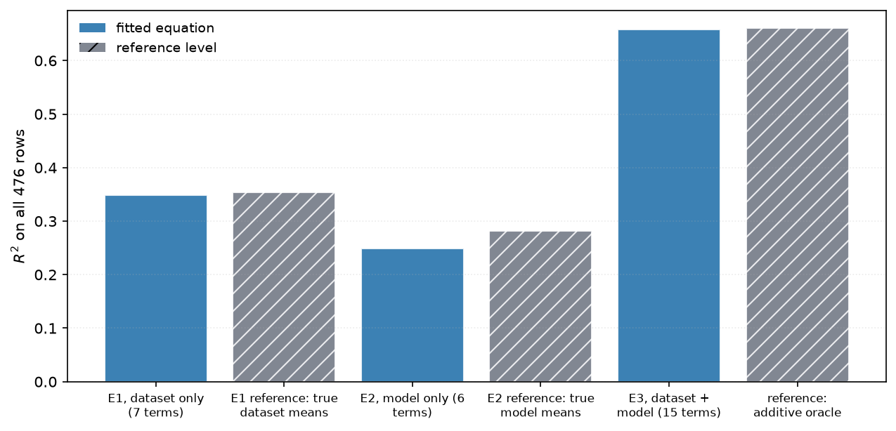

#  ml-meta-perf

**ml-meta-perf** fits short, readable equations that predict the **Matthews Correlation
Coefficient** a classifier will reach on a dataset, from meta-features of the dataset and
of the model:

```
MCC = w1*t1 + w2*t2 + ... + wk*tk
```

Each `t` is a simple expression over one to three raw features — `f`, `log(f)`, `1/f`,
`f^2`, `f1/f2`, `f1*f2`, `(f1+f2)/f3` — and each `w` is a real number in the features' own
units, so the printed equation evaluates as written.

The project trades accuracy for explainability on purpose. Opaque regressors reach higher
R² on this kind of meta-data but nothing can be read off them; the point here is an
equation a practitioner can inspect, argue with, and derive guidance from.

> **Status:** research prototype for an academic study. 20 datasets × 25 models = 476 rows,
> which is small. Every number is reported both in-sample and under leave-one-out
> cross-validation, because at this size the two differ a lot.

## Headline results

| | R² on all 476 rows |
|---|---|
| E1 — dataset features only, 7 terms | 0.349 |
| *ceiling: the true dataset means* | *0.354* |
| E2 — model features only, 6 terms | 0.248 |
| *ceiling: the true model means* | *0.282* |
| **E3 — dataset + model, 16 terms** | **0.665** |
| *additive oracle* | *0.6605* |
| *additive + rank-1 interaction* | *0.7828* |

All three are fitted on the same 476 rows by the same function and scored under the same
two protocols, so the gaps between them measure the features and nothing else.

> **Updated 2026-09-05.** Two changes moved every number on this page. The model half of the
> meta-data was replaced — four measured columns that varied with the dataset gave way to five
> asserted mechanism ordinals — and cross-validation now fits the equation **once** and refits
> only its weights per fold, rather than re-running term selection inside every fold. E3 went
> from 20 terms at 0.613 / 0.474 / 0.428 to **16 terms at 0.665 / 0.627 / 0.622**. See
> [chapter 4](assets/docs/05-evaluation.md) for the protocol and
> [chapter 1](assets/docs/01-dataset.md) for the features.

| | in-sample | LOO-dataset | LOO-model |
|---|---|---|---|
| E1 | 0.349 | 0.341 | 0.306 |
| E2 | 0.248 | 0.185 | 0.228 |
| **E3** | **0.665** | **0.627** | **0.622** |

The three equations differ only in which features they may draw on — **E1** sees the
dataset, **E2** sees the model, **E3** sees both — so the gaps between them measure what
each half of the meta-data is worth.

Their R² values share a scale but not a ceiling: E1 predicts one value per dataset, so
0.354 is the most it could ever reach. The comparable quantity is how much of its own
ceiling each one captures — **98% for the dataset features, 96% for the model features**.

Reaching parity on the model side took columns the corpus does not contain. As collected, its
model descriptors were counts of capacity and cost and reached only **63%** of their ceiling;
three of them varied with the dataset as well as the learner. They are replaced by five
**asserted** ordinals — a capability ladder over the ten learner families, and four gradings
of mechanism: how a learner randomises, what loss it minimises, how much of the input
distribution it models, and how it is fitted. None is observable in a training run; all are
read off published descriptions of the algorithms. What they cannot do is describe a method
nobody has classified — see [chapter 8](assets/docs/07-limitations.md).



Four findings the documentation develops:

- **One equation, refit — not one search per fold.** The equation's form is the claim; the
  folds recalibrate its constants and test whether the claim survives unseen data. Re-running
  term selection inside every fold answers a different question, and answering it as the first
  made transfer swing by 0.3 when the length changed by two. See
  [chapter 4](assets/docs/05-evaluation.md).
- **The corpus describes datasets far better than models, and the fix comes from outside
  it.** As collected, its model descriptors reach 63% of their ceiling against the dataset
  side's 98%. Five asserted ordinals take the model side to 96%. See
  [chapter 6](assets/docs/04-equation.md).
- **One interaction component is worth +0.122 R²** and the equation captures none of it.
  Only about **+0.018** of that is reachable from meta-features on both sides, and the
  bottleneck is the model side. See [chapter 5](assets/docs/04-equation.md).
- **Better model descriptors are now worth at most +0.017 leave-one-dataset-out R²** —
  measured by replacing them with model identity itself, the best any descriptor set could do.
  That number was **+0.106** before the model side was replaced, so the direction that used to
  hold all the remaining room is largely closed. See
  [chapter 9](assets/docs/07-limitations.md).
- **Mixed dataset×model terms carry the equation.** 9 of 16 terms use features from both
  groups and drive **56%** of the output variance; dataset-only terms drive 41% and
  model-only terms 3%. "Which model suits which data" is where the signal is, not "how
  hard is this data" or "how good is this model". See
  [chapter 7](assets/docs/06-practices.md).
- **Ten best practices from the literature, weighed against the corpus** — 8 supported,
  1 qualified, 1 untestable here. The strongest: tree-based families average MCC **0.927** against
  **0.660** for neural ones on the datasets where every model ran, with plain MLPs and DNNs
  last of ten families at 0.454. See [chapter 10](assets/docs/10-report.md).

## Work in progress

`main` is what this README describes. Active development is on
**`feature/descriptor-selection`**, which is looking for a better `data.MODEL_FEATURES` and
adding two practical evaluations — a binary above/below-threshold decision and a per-dataset
ranking of models. That work has its own entry point: **[`TODO.md`](TODO.md)**, whose
"Start here" section is written to bring a cold reader up to speed.

Two things there that matter to anyone reading this file's numbers:

- The feature replacement and the protocol change described above are **merged**; this README
  and `assets/docs/` describe the current state.
- What remains open is recorded in `TODO.md`: chiefly whether the study's claim is at learner
  *family* resolution or individual *model* resolution, which decides whether two of the six
  model features earn their place.

## Documentation

The rationale, methodology and full results live in
**[`assets/docs/`](assets/docs/index.md)**, written at the level of detail a paper needs
and carrying the generated figures.

| | | modules |
|---|---|---|
| 1 | [The problem and the data](assets/docs/01-dataset.md) | `ml_meta_perf.data` |
| 2 | [Equation form and term vocabulary](assets/docs/02-additive-model.md) | `ml_meta_perf.terms`, `ml_meta_perf.model` |
| 3 | [Search and fitting](assets/docs/03-term-selection.md) | `ml_meta_perf.fit`, `ml_meta_perf.analysis`, `ml_meta_perf.selection` |
| 4 | [Evaluation methodology](assets/docs/05-evaluation.md) | `ml_meta_perf.validate`, `ml_meta_perf.stats` |
| 5 | [Oracles and ceilings](assets/docs/04-equation.md) | `ml_meta_perf.validate` |
| 6 | [Results](assets/docs/04-equation.md) | `ml_meta_perf.experiment` |
| 7 | [From equation to evidence to practice](assets/docs/06-practices.md) | `ml_meta_perf.practices`, `ml_meta_perf.attribution`, `ml_meta_perf.guidance` |
| 8 | [Limitations](assets/docs/07-limitations.md) | — |
| 9 | [Model identity: the bound on better descriptors](assets/docs/07-limitations.md) | `ml_meta_perf.identity` — measured, **not part of the study** |
| 10 | [Generated report](assets/docs/10-report.md) | `ml_meta_perf.report`, `ml_meta_perf.guidance` — **written by the code, not by hand** |

Related work and positioning: **[chapter 0](assets/docs/00-related-work.md)**.

The API reference is generated from the module docstrings with `pdoc` and published to
GitHub Pages by `.github/workflows/docs.yml`; each module links back to the chapter
covering it.

## Installation

Python 3.12+. Runtime dependencies are **polars**, **numpy**, **matplotlib** and
**kneeliverse**.

```bash
python3 -m venv venv
venv/bin/pip install -e .
```

## Running it

**One command runs every phase**: screening, fitting E1/E3 and the two controls,
cross-validating under both protocols, extracting the practices, writing the figures, and
generating the report.

```bash
venv/bin/ml-meta-perf          # or: PYTHONPATH=src venv/bin/python -m ml_meta_perf
```

That takes about 25 seconds, reproduces every number in this README, and writes:

| | |
|---|---|
| [`assets/docs/10-report.md`](assets/docs/10-report.md) | the generated report — equation, term analysis, practices |
| `results/e1.json`, `e2.json`, `e3.json` | the fitted equations, reloadable |
| `results/*.csv` | 17 tables — curves, baselines, oracles, stability, practices |
| `assets/figures/*.png`, `*.pdf` | the 10 figures, raster and vector |

Everything printed and written is derived from the run. **The report is generated by
`ml_meta_perf.report`, not written by hand.** It ranks terms by standardised weight, writes a
sentence per major term, groups terms into the blocks that move together, and reports which
features and which grammar operations the search actually used — so a flat equation with no
dominant term is still readable, at a larger unit than one term.

Every phase can be skipped and every destination redirected, so the same entry point
serves a full study, a numbers-only run and a smoke test:

```bash
ml-meta-perf --no-figures                        # tables and report only
ml-meta-perf --quiet --no-tables --no-report     # figures only
ml-meta-perf --quick --output /tmp/check         # seconds, not minutes: wiring, not numbers
ml-meta-perf --output results --report report.md --figures figures
```

`ml-meta-perf --help` lists all of them.

**One note on threading.** The inner loop is ~87k solves of matrices no larger than 32×32,
far below the size where BLAS parallelism pays: threading buys no wall time and burns 3.5×
the CPU spinning. Setting `OPENBLAS_NUM_THREADS=1` costs nothing and saves the CPU; it is
left to the caller rather than forced from inside a library.

### Parameters

Every knob that was tuned during the study is a flag, and the defaults are the tuned
values, so a bare run is the reported study.

```bash
PYTHONPATH=src venv/bin/python -m ml_meta_perf --data mine.csv --output runs/mine
```

| flag | default | what it does |
|---|---|---|
| `--data` | the shipped corpus | the meta-dataset to fit |
| `--output` | `results` | where the equations and CSV tables go |
| `--figures` | `assets/figures` | where the figures go |
| `--report` | `assets/docs/10-report.md` | where the generated report goes |
| `--terms` | 24 | terms in the published E3 equation |
| `--max-terms` | 32 | longest equation the search explores (drives the curve) |
| `--penalty` | 5.0 | ridge penalty on standardised terms |
| `--arity` | 3 | raw features allowed per term — see [chapter 2](assets/docs/02-additive-model.md) |
| `--pool` | 600 | terms surviving screening into the beam |
| `--beam` | 6 | beam width |
| `--zscore` | 3.0 | largest standard score a term may reach before it is rejected as a spike |
| `--phase` | all | `screen`, `equations`, `validation`, `practices`, `figures`, `report`; repeatable |
| `--quick` | off | a reduced configuration for smoke-testing; **not** the study |
| `--no-figures`, `--no-tables`, `--no-report`, `--quiet` | off | skip an output |

```bash
# a shorter, more heavily shrunk equation, no figures
PYTHONPATH=src venv/bin/python -m ml_meta_perf --terms 12 --penalty 20 --no-figures

# four-feature terms: better fit, much worse transfer (chapter 2 measures this)
PYTHONPATH=src venv/bin/python -m ml_meta_perf --arity 4 --pool 2000 --output runs/arity4

# just the screening table
PYTHONPATH=src venv/bin/python -m ml_meta_perf --phase screen --no-figures
```

## Using it as a library

```python
from ml_meta_perf import DATASET_FEATURES, MODEL_FEATURES, build_library, columns_as_arrays, fit, load, target

frame = load()
columns = columns_as_arrays(frame, DATASET_FEATURES + MODEL_FEATURES)
library = build_library(DATASET_FEATURES, MODEL_FEATURES, columns)

equation = fit(library, target(frame), max_terms=14, penalty=20.0).best()

print(equation)                    # human-readable, with standardised betas
print(equation.to_latex())         # for the paper
equation.save("e2.json")           # round-trips exactly
predictions = equation.predict(columns)
```

Extracting guidance and figures from a fitted equation:

```python
from ml_meta_perf.practices import best_practices, render
from ml_meta_perf.plots import practice_effects

practices = best_practices(equation, columns)     # pass a stability table to rate them
print(render(practices))
practice_effects(practices, "practice_effects.png")
```

## Figures

`--figures <dir>` writes 10 figures, each as a PNG and a PDF on a transparent background. **None carries a title or an annotation** — they are
made for LaTeX `figure` environments where the caption does that work, and text baked into
a PNG cannot be restyled or translated. `ml_meta_perf.figures.captions()` returns a suggested
caption per file, including the disclosures deliberately kept out of the images.

## Layout

```
src/ml_meta_perf/
    data.py         loading, schema validation, aggregation, feature glossary
    terms.py        the term vocabulary and its admissibility rules
    stats.py        pearson, spearman, ranks, R2/MAE/RMSE/SMAPE (no scipy)
    analysis.py     correlation screening, redundancy clustering
    fit.py          standardisation, ridge solve, beam search, refinement
    model.py        the Equation object: predict, render, serialise
    validate.py     leave-one-group-out protocols, baselines, oracles
    selection.py    knee detection and Pareto fronts over equation length
    attribution.py  per-term effects, group shares, variance decomposition
    practices.py    per-feature associations measured from a fitted equation
    guidance.py     literature best practices, weighed against what the study measured
    plots.py        the figures (matplotlib, Agg, headless, no embedded text)
    figures.py      the figure set and suggested LaTeX captions
    report.py       the generated report: term importance and written analysis
    identity.py     per-model effects, measuring the ceiling on model descriptors
    experiment.py   the end-to-end study and its tuned configurations
    cli.py          the argparse pipeline: `ml-meta-perf`, `python -m ml_meta_perf`
    meta_dataset.csv  the corpus: 476 rows, shipped with the package
assets/docs/        the study chapters
assets/figures/     generated figures
results/            generated equations, tables and report.md
tests/              unittest suite
.github/workflows/  CI on 3.12 and 3.14, and the published API reference
```

## Development

`.pre-commit-config.yaml` is the gate and `.github/workflows/main.yml` runs the same four
checks on Python 3.12 and 3.14, reading their settings from `pyproject.toml` so the two
cannot drift apart.

```bash
venv/bin/pip install ruff basedpyright vulture pre-commit pdoc
venv/bin/pre-commit install
venv/bin/pre-commit run --all-files   # ruff, basedpyright, vulture, unittest
```

## Citation

See [`CITATION.cff`](CITATION.cff).

## License

MIT — see [`LICENSE`](LICENSE).
