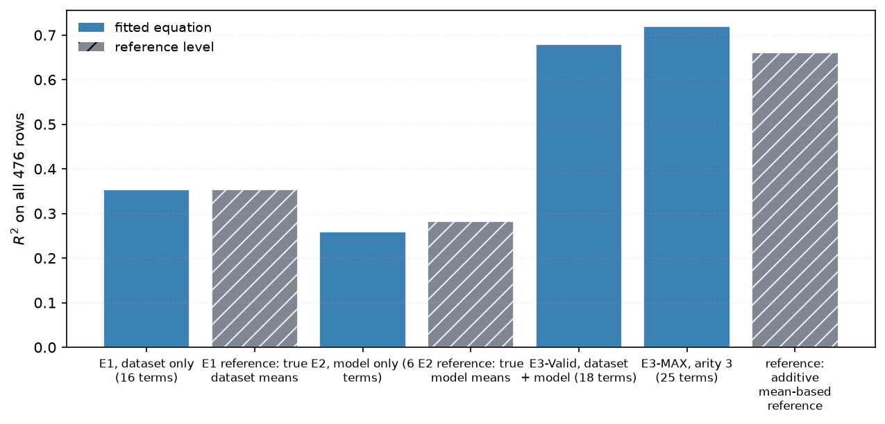

#  ml-meta-perf

**ml-meta-perf** fits short, readable equations that predict the **Matthews Correlation
Coefficient** a classifier will reach on a dataset, from meta-features of the dataset and
of the model:

```
MCC = w1*t1 + w2*t2 + ... + wk*tk
```

In the retained grammars, each `t` is a simple expression over one to three raw features — `f`, `log(f)`, `1/f`,
`f^2`, `f1/f2`, `f1*f2`, `(f1+f2)/f3` — and each `w` is a real number in the features' own
units, so the printed equation evaluates as written.

The project prioritises a readable equation and tests whether that transparency costs transfer
accuracy. Opaque regressors fit these meta-data more closely in-sample, but none beats the
equation when both the dataset and model are held out. The result is an equation a practitioner
can inspect, challenge, and use to derive guidance.

> **Status:** research prototype for an academic study. The corpus contains 476 observed pairs
> from a grid of 20 datasets and 25 models, which is small. The headline equation scores are
> reported both in-sample and under leave-one-out cross-validation because the two differ a lot
> at this size.

## Headline results

| | in-sample | LOO-dataset | LOO-model |
|---|---|---|---|
| E1 — dataset features only, 16 terms | 0.354 | 0.349 | 0.300 |
| E2 — model features only, 6 terms | 0.259 | 0.197 | 0.237 |
| **E3-Valid — both, 18 terms** | **0.679** | **0.652** | **0.615** |
| E3-MAX — capability bound, 25 terms | 0.719 | 0.691 | 0.655 |

The three primary equations differ only in which features they may draw on — **E1** sees the
dataset, **E2** sees the model, and **E3-Valid** sees both. All three are fitted on the same 476 rows
by the same function, from one configuration, and scored on the same 476 rows under the same
four protocols, so the gaps between them measure the features and nothing else.

**Their R² values share a scale but not a ceiling, and this is the most common way to
misread the table.** E1 predicts one value per dataset, so 0.354 — the variance of the true
per-dataset means — is the most it could *ever* reach, however good its terms were. E1 at
0.354 is not "much worse than E3"; it is finished. The comparable quantity is the fraction
of its own ceiling each equation attains:

| | reached | its ceiling | fraction |
|---|---|---|---|
| E1 (dataset features) | 0.354 | 0.354 | **100%** |
| E2 (model features) | 0.259 | 0.282 | **92%** |
| E3-Valid (both) | 0.679 | *see below* | — |

E3-Valid has no ceiling of that kind, because it is not constant within either group. The two
levels it can be read against are both reached or passed, and that is the result:

| level | R² | what it bounds |
|---|---|---|
| all 73 single-feature terms | 0.6321 | the best a sum of per-feature functions can do |
| additive oracle | 0.6605 | the best a per-dataset value **plus** a per-model value can do |
| **E3-Valid, 18 terms** | **0.6787** | — |
| E3-MAX, 25 terms | 0.7194 | capability bound |

Both reference levels describe predictors that never combine a dataset feature with a model
one. E3-Valid passes both references. Its mixed terms are evidence that dataset×model
*interaction* is what the equation captures.

**E3-Valid and E3-MAX have separate roles.** E3-Valid is the readable 18-term equation selected
immediately before the Combined-R² curve reaches a sustained plateau. E3-MAX is the 25-term
capability bound selected by the best four-protocol R² floor.



### What the documentation develops

- **One equation, refit — not one search per fold.** The equation's form is the claim; the
  folds recalibrate its constants and test whether the claim survives unseen data. Re-running
  term selection inside every fold answers a different question, and answering it as the
  first made transfer swing by 0.3 when the length changed by two.
  [Chapter 5](assets/docs/05-evaluation.md).
- **The corpus describes datasets far better than models.** As collected, its model
  descriptors reached 63% of their ceiling against the dataset side's 99%. Replacing them
  with a capability ordinal over the ten learner families and four mechanism gradings —
  all *asserted*, read from published descriptions rather than observed in a training run —
  takes the model side to 92%. What they cannot do is describe a method nobody has
  classified. [chapter 1](assets/docs/01-dataset.md).
- **Mixed dataset×model terms carry the equation.** 10 of 18 terms use features from both
  groups and carry **36.7%** of the absolute standardised weight mass; dataset-only terms carry
  56.1% and model-only terms 7.2%. "Which model suits which data" is where the signal is, not "how hard
  is this data" or "how good is this model". [Chapter 6](assets/docs/06-practices.md).
- **No single meta-feature carries it either.** The strongest, `eq_num_attr`, reaches
  R² 0.142 alone; taking one best admissible term per feature is worth about +0.085 over the
  admissible raw-term fit. There is no headline driver to quote, which is why the equation needs many
  terms rather than two. [Chapter 4](assets/docs/04-equation.md).
- **One interaction component is worth +0.122 R², and the equation reaches about a third of
  it** — alignment 0.37 in-sample and 0.33 out of fold, measured by stripping the additive
  part from both the truth and the prediction and correlating what is left. A free per-model
  level and slope raise leave-one-dataset-out R² from 0.652 to 0.707, locating the remaining
  headroom on the model side. [Chapter 4](assets/docs/04-equation.md).
- **Ten best practices from the literature, weighed against the corpus** — 8 supported,
  1 qualified, 1 untestable here. The strongest: tree-based families average MCC **0.927**
  against **0.660** for neural ones on the datasets where every model ran, with plain MLPs
  and DNNs last of ten families at 0.454. [chapter 6](assets/docs/06-practices.md).

> **Status:** research prototype for an academic study. With only 476 rows, the headline
> equation scores are reported both in-sample and under held-out cross-validation because the
> two differ substantially. The search settings were recalibrated after correcting the processing-unit
> column; the retained parameters, descriptor subset, equation length and grammar all come
> from that corrected-corpus sweep.

## Documentation

The rationale, methodology and full results live in
**[`assets/docs/`](assets/docs/index.md)**, written as a paper and carrying the generated
figures.

| | | modules |
|---|---|---|
| 0 | [Related work and positioning](assets/docs/00-related-work.md) | — |
| 1 | [The dataset](assets/docs/01-dataset.md) | `ml_meta_perf.data` |
| 2 | [The additive model](assets/docs/02-additive-model.md) | `ml_meta_perf.terms`, `ml_meta_perf.model` |
| 3 | [Term generation and selection](assets/docs/03-term-selection.md) | `ml_meta_perf.search`, `ml_meta_perf.fit`, `ml_meta_perf.analysis`, `ml_meta_perf.selection` |
| 4 | [The equation](assets/docs/04-equation.md) | `ml_meta_perf.experiment`, `ml_meta_perf.validate` |
| 5 | [Evaluation](assets/docs/05-evaluation.md) | `ml_meta_perf.validate`, `ml_meta_perf.stats` |
| 6 | [Best practices against the equation](assets/docs/06-practices.md) | `ml_meta_perf.practices`, `ml_meta_perf.attribution`, `ml_meta_perf.guidance` |

Each chapter is self-contained: it ends with its own limitations, and chapters 4, 5 and 6
close with a **generated section** that `ml_meta_perf.report` rewrites on every run. Prose
above the marker is hand-written and describes the method; everything below it is computed
from the fitted equation, so no chapter can carry a stale table.

The API reference is generated from the module docstrings with `pdoc` and published to
GitHub Pages by `.github/workflows/docs.yml`; each module links back to the chapter
covering it.

## Installation

Python 3.12+. Runtime dependencies are **Polars**, **NumPy**, **Matplotlib**,
**scikit-learn**, and **joblib**.

scikit-learn is there for one thing: the opaque-regressor comparison in
[chapter 5](assets/docs/05-evaluation.md), which prices the other side of the trade this
study is making. It brings SciPy with it, which the project refused for a long time on size
grounds — `ml_meta_perf.stats` exists because four statistics were not worth the dependency,
and that reasoning still holds for those four. What changed the answer is that the comparison
the chapters lean on hardest was measured once by hand and reproducible by nobody. An
unreproducible headline is a worse cost than a large wheel.

```bash
python3.12 -m venv venv
venv/bin/python -m pip install -r requirements-reproducibility.txt
```

On Windows PowerShell, create the environment with `py -3.12 -m venv venv` and use
`venv\Scripts\python.exe` or `venv\Scripts\pre-commit.exe` in place of the corresponding
`venv/bin/` command.

`requirements-reproducibility.txt` freezes the complete runtime used for the reference run.
For normal development, `venv/bin/python -m pip install -e .` installs the supported dependency
ranges declared by the package.

## Meta-Dataset Generation

The package ships the generated corpus at
[`src/ml_meta_perf/meta_dataset.csv`](src/ml_meta_perf/meta_dataset.csv). The scripts and
configuration needed to rebuild that corpus live in
[`meta_dataset_pipeline/`](meta_dataset_pipeline/).

The meta-dataset pipeline has additional dependencies, including `pymfe` and the tabular
model libraries used during the original model-evaluation stages. Install them explicitly:

```bash
venv/bin/python -m pip install -r requirements-meta-dataset.txt
```

On Windows PowerShell:

```powershell
venv\Scripts\python.exe -m pip install -r requirements-meta-dataset.txt
```

That folder is intentionally separate from the package code:

- `meta_dataset_pipeline/` contains the raw-corpus stages and can regenerate a candidate
  corpus at `meta_dataset_pipeline/results/meta_dataset.csv`;
- `src/ml_meta_perf/data.py` loads and validates the published corpus schema;
- `src/ml_meta_perf/meta_dataset.csv` is the versioned corpus consumed by the library and
  command-line tool, and is updated only when the regenerated corpus is accepted.

See [`meta_dataset_pipeline/README.md`](meta_dataset_pipeline/README.md) for the stage
order, local token configuration, ignored raw dataset files, and instructions for comparing
or publishing a regenerated corpus.

## Running it

**One command runs every phase**: screening, searching the grammars, fitting E1, E2 and both
E3s, cross-validating under all four protocols, pricing the opaque comparison, extracting the
practices, writing the figures, and splicing the generated sections into the chapters.

```bash
venv/bin/ml-meta-perf          # or: PYTHONPATH=src venv/bin/python -m ml_meta_perf
```

That takes about six minutes on the reference Windows environment — nearly all of it the opaque-regressor comparison, which
refits a random forest once per held-out group and then once per *cell* for the
doubly held-out cell protocol, 522 fits in all. The equation half of the pipeline is 14 seconds.
It reproduces every number in this README, and writes:

| | |
|---|---|
| [`assets/docs/`](assets/docs/index.md) | the index and chapters 1, 3, 4, 5 and 6 — their generated sections rewritten in place |
| `results/e1.json`, `e2.json`, `e3.json` | the fitted equations, reloadable |
| `results/*.csv` | the study's tables — curves, baselines, oracles, stability, practices |
| `assets/figures/*.png`, `*.pdf` | the figure set, raster and vector, numbered in the order the study presents it |

Everything printed and written is derived from the run. **The report is generated by
`ml_meta_perf.report`, not written by hand.** It ranks terms by standardised weight, writes a
sentence per major term, groups terms into the blocks that move together, and reports which
features and which grammar operations the search actually used — so a flat equation with no
dominant term is still readable, at a larger unit than one term.

Every phase can be skipped and every destination redirected, so the same entry point
serves a full study and a numbers-only run:

```bash
ml-meta-perf --no-figures                        # tables and report only
ml-meta-perf --quiet --no-tables --no-report     # figures only
ml-meta-perf --output results --docs assets/docs --figures figures
```

`ml-meta-perf --help` lists all of them. There is no smoke-test flag: `--quick` was a preset
of three flags that already exist, and it quietly reached two things they did not, which is
how it came to advertise "seconds" while still paying for the full opaque comparison. The
wiring check is `python -m unittest discover -s tests`, which takes about a minute and checks more.

The retained E3 settings can be recalibrated with a separate, resumable Slurm search. It
reuses the historical composite objective for the broad sweep, applies the expensive
doubly held-out protocol only to a diverse shortlist, and produces a shared-base
E3-Valid/E3-MAX pair for review. E3-Valid uses the retained Combined-R² plateau rule. See
[the configuration-search guide](CONFIGURATION_SEARCH.md) for the complete grid, selection
rule and cluster instructions.

**One note on threading.** The inner loop is ~87k solves of matrices no larger than 32×32,
far below the size where BLAS parallelism pays: threading buys no wall time and burns 3.5×
the CPU spinning. Setting `OPENBLAS_NUM_THREADS=1` costs nothing and saves the CPU; it is
left to the caller rather than forced from inside a library.

### Parameters

The ordinary experiment exposes its general search controls as flags. The defaults retain
the sweep's shared numerical settings, while the selected descriptor subset and E3-Valid
plateau rule are pinned in the study configuration. The separate recalibration command
exposes those choices; see the [configuration-search guide](CONFIGURATION_SEARCH.md).

```bash
PYTHONPATH=src venv/bin/python -m ml_meta_perf --data mine.csv \
  --output runs/mine --figures runs/mine/figures --no-report
```

| flag | default | what it does |
|---|---|---|
| `--data` | the shipped corpus | the meta-dataset to fit |
| `--output` | `results` | where the equations and CSV tables go |
| `--figures` | `assets/figures` | where the figures go |
| `--docs` | `assets/docs` | chapter directory whose generated sections are rewritten |
| `--max-terms` | 25 | longest equation the search explores (drives the curve) |
| `--penalty` | 1.0 | ridge penalty on standardised terms |
| `--arity` | 2 and 3 | raw features allowed per term; **repeatable**, and the set given is searched — see [chapter 2](assets/docs/02-additive-model.md#the-arity-is-searched-not-set) |
| `--pool` | 600 | terms surviving screening into the beam |
| `--beam` | 6 | beam width |
| `--zscore` | 5.0 | largest standard score a term may reach before it is rejected as a spike |
| `--phase` | all | `screen`, `equations`, `validation`, `practices`, `figures`, `report`; repeatable |
| `--no-figures`, `--no-tables`, `--no-report`, `--quiet` | off | skip an output |

```bash
# a shorter search and a heavier ridge, no figures. The published length is not a flag:
# it is derived from the equation's own curve, so shortening the search is how you bound it
PYTHONPATH=src venv/bin/python -m ml_meta_perf --max-terms 8 --penalty 50 \
  --output runs/short --no-figures --no-report

# search one grammar instead of two, and a recorded negative: four-feature terms fit better
# and transfer much worse (chapter 2 measures this)
PYTHONPATH=src venv/bin/python -m ml_meta_perf --arity 4 --pool 2000 \
  --output runs/arity4 --figures runs/arity4/figures --no-report

# just the screening table
PYTHONPATH=src venv/bin/python -m ml_meta_perf --phase screen \
  --output runs/screen --no-figures --no-report
```

## Using it as a library

```python
from ml_meta_perf import DATASET_FEATURES, MODEL_FEATURES, build_library, columns_as_arrays, load, search, target

frame = load()
columns = columns_as_arrays(frame, DATASET_FEATURES + MODEL_FEATURES)
library = build_library(DATASET_FEATURES, MODEL_FEATURES, columns)

equation = search(library, target(frame), max_terms=25, penalty=1.0).best()

print(equation)                    # human-readable, with standardised betas
print(equation.to_latex())         # for the paper
equation.save("e3.json")           # round-trips exactly
predictions = equation.predict(columns)
```

Extracting guidance and figures from a fitted equation:

```python
from ml_meta_perf.practices import best_practices, render
from ml_meta_perf.plots import practice_effects

practices = best_practices(equation, columns)     # pass a stability table to rate them
print(render(practices))
practice_effects(practices, "practice_effects.png")
```

## Figures

`--figures <dir>` writes the figure set, each as a PNG and a PDF on a transparent
background. **Files are numbered by their position in the set** — `01_equation_comparison.png`,
`02_term_count_curve.png` and so on — so a figure can be named by its number in a review or a
caption. `ml_meta_perf.figures.FIGURE_ORDER` is the single place that order is written down,
and `generate` refuses to write a set that does not match it. **None carries a title or an
annotation** — they are
made for LaTeX `figure` environments where the caption does that work, and text baked into
a PNG cannot be restyled or translated. `ml_meta_perf.figures.captions()` returns a suggested
caption per file, including the disclosures deliberately kept out of the images.

## Layout

```
src/ml_meta_perf/
    data.py         loading, schema validation, aggregation, feature glossary
    terms.py        the term vocabulary and its admissibility rules
    stats.py        pearson, spearman, ranks, R2/MAE/RMSE/SMAPE, written out
    opaque.py       the opaque-regressor comparison (scikit-learn), same protocols
    analysis.py     correlation screening, redundancy clustering
    search.py       screening, beam search, refinement, pruning
    fit.py          standardisation, the ridge solve, and reading weights back out
    model.py        the Equation object: predict, render, serialise
    validate.py     leave-one-group-out protocols, baselines, oracles
    selection.py    E3 plateau selection and equation-length diagnostics
    attribution.py  per-term effects, group shares, variance decomposition
    practices.py    per-feature associations measured from a fitted equation
    guidance.py     literature best practices, weighed against what the study measured
    plots.py        the figures (Matplotlib, Agg, headless, no embedded text)
    figures.py      the figure set and suggested LaTeX captions
    report.py       the generated report: term importance and written analysis
    identity.py     per-model effects, measuring the ceiling on model descriptors
    experiment.py   the end-to-end study and its retained search configuration
    cli.py          the argparse pipeline: `ml-meta-perf`, `python -m ml_meta_perf`
    meta_dataset.csv  the corpus, shipped with the package
assets/docs/        the study chapters, hand-written with generated sections spliced in
assets/figures/     generated figures
results/            generated equations and tables
scripts/            Slurm jobs and reproducible search-report utilities
meta_dataset_pipeline/  raw-corpus pipeline used to regenerate meta_dataset.csv
tests/              unittest suite
.github/workflows/  CI on 3.12 and 3.14, and the published API reference
requirements-reproducibility.txt  exact reference runtime
requirements-meta-dataset.txt     dependencies for regenerating the shipped corpus
```

## Development

`.pre-commit-config.yaml` is the gate and `.github/workflows/main.yml` runs the same four
checks on Python 3.12 and 3.14, reading their settings from `pyproject.toml`. The hooks use
a pre-commit-managed environment, so the installed Git hook runs on both Windows and Linux.

```bash
python3 -m venv venv
venv/bin/pip install -r requirements.txt
venv/bin/pre-commit install
venv/bin/pre-commit run --all-files   # ruff, basedpyright, vulture, unittest
```

`requirements.txt` installs the project editable and pins pre-commit plus the three static-analysis
tools; the latter match the versions CI installs. `pyproject.toml` defines the supported runtime dependency ranges;
`requirements-reproducibility.txt` freezes the complete environment used for the reference
experiment.

## Citation

See [`CITATION.cff`](CITATION.cff).

## License

MIT — see [`LICENSE`](LICENSE).
