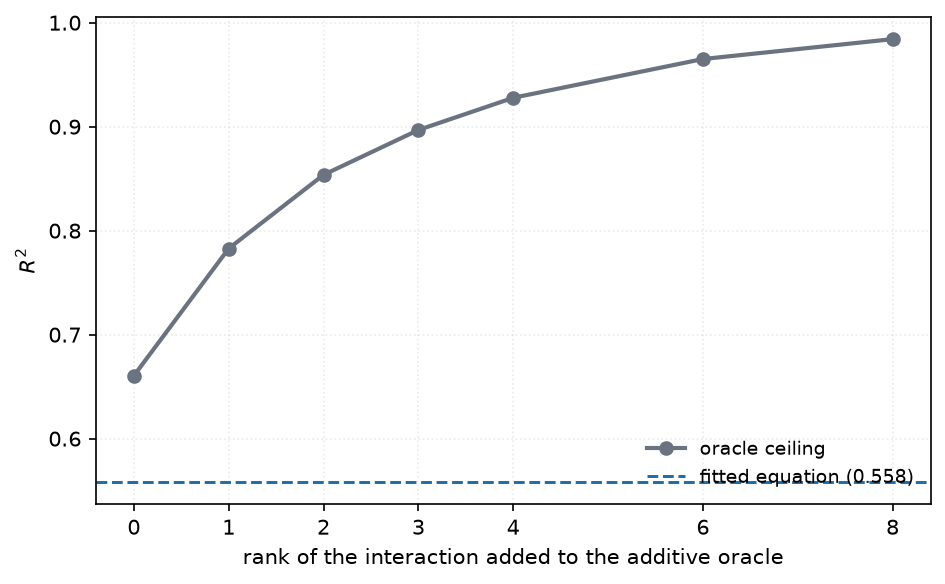

#  metafit

**metafit** fits short, readable equations that predict the **Matthews Correlation
Coefficient** a classifier will reach on a dataset, from meta-features of the dataset
and of the model:

```
MCC = w1*t1 + w2*t2 + ... + wk*tk
```

where each `t` is a simple expression over one to three raw features — `f`, `log(f)`,
`1/f`, `f^2`, `f1/f2`, `f1*f2`, `(f1+f2)/f3` — and each `w` is a real number in the
features' own units, so the printed equation can be evaluated as written.

The project trades accuracy for explainability on purpose. Opaque regressors reach far
higher R² on this kind of meta-data, but nothing can be read off them; the point here is
an equation a practitioner can inspect, argue with, and derive guidance from.

> **Status:** research prototype for an academic study. The meta-dataset has 20 datasets
> and 25 models (476 rows), which is small. Every number below is reported both in-sample
> and under leave-one-out cross-validation, because on data this size the two differ a lot.

## The equations

The study is built around a deliberate contrast.

**E1 — dataset features only.** Every model evaluated on a given dataset shares one
feature vector, so many MCC values map to a single input and least squares necessarily
lands on the per-dataset mean. That is not a defect to be fixed; it is the control. E1
measures how much of MCC is explained by *the data alone*.

**E2 — dataset + model features.** One input, one output. E2 can express variation
*within* a dataset, which is exactly what E1 structurally cannot do.

The gap between them is the evidence that capturing model capability matters.

**EM — model features only.** The mirror of E1, added to settle whether model choice
outweighs dataset difficulty. There are only five model features and one is constant per
model, so EM is short by necessity rather than by design — which turns out to be the
finding rather than a limitation.

## Results

### E1 vs E2, scored on the same 476 rows

R² depends on the variance in its denominator, so E1's own number (computed over 20
dataset means) and E2's (computed over 476 rows) are not comparable. Evaluating both
equations on every row puts them on one scale:

| | R² | MAE | Spearman |
|---|---|---|---|
| E1 (dataset only, 5 terms) | 0.337 | 0.215 | 0.640 |
| *E1's hard ceiling — the true dataset means* | *0.354* | *0.204* | *0.653* |
| EM (model only, 9 terms) | 0.164 | 0.251 | 0.356 |
| *EM's hard ceiling — the true model means* | *0.282* | *0.226* | *0.487* |
| **E2 (dataset + model, 14 terms)** | **0.558** | **0.167** | **0.775** |
| *additive oracle — true dataset + model effects* | *0.661* | *0.145* | *0.810* |


E1 is capped at **0.354** no matter how good the dataset equation becomes, because
per-dataset means explain only 35.4% of the total variance in MCC. E2 reaches 0.556.
Model features are not a refinement here — they are most of the *gain*.

### Does model choice matter more than the dataset?

Not on this meta-dataset — but the reason is more interesting than the answer.

| | variance of MCC explained |
|---|---|
| knowing only which **dataset** it is | **0.354** |
| knowing only which **model** it is | **0.282** |

Dataset difficulty is the larger effect, and the equations widen the gap rather than
closing it. The dataset-only equation reaches **0.337 of its 0.354 ceiling — 95%**. The
model-only equation reaches **0.164 of its 0.282 ceiling — 58%**.

So the honest reading is: **the meta-features describe datasets far better than they
describe models.** Twelve dataset meta-features nearly exhaust what dataset identity can
explain; five model features capture barely half of what model identity can. The
remaining 42% of model capability is real and simply not written down anywhere in this
data — the strongest argument in the study for richer model descriptors.

Two things create the opposite impression, and both are artifacts worth knowing about:

- The **correlation screening table is within-dataset centred**, which removes dataset
  variance *by construction*. Only model terms can score well there. It is a diagnostic
  for model effects, not a statement of relative importance.
- **Model features carry more in combination than alone.** Adding them to E1 is worth
  +0.219 R² (0.337 → 0.556), well beyond the 0.164 they achieve by themselves. The
  surplus is dataset×model interaction, which is why 8 of the 16 terms in the
  accuracy-leaning equation are mixed.

### The oracle ladder — a better ceiling

The additive oracle is not the only reference available, and on its own it is a weak one.
Its residual is a (dataset × model) matrix of *interactions*, and interaction matrices are
usually dominated by a few components. Decomposing that residual by SVD and adding its
leading components back gives a ladder of ceilings — the AMMI model (additive main
effects, multiplicative interaction) long used for genotype-by-environment trials, which
is structurally the same problem:

| interaction rank | R² | gain |
|---|---|---|
| 0 (additive oracle) | 0.6605 | — |
| 1 | **0.7828** | **+0.122** |
| 2 | 0.8537 | +0.071 |
| 3 | 0.8968 | +0.043 |
| 4 | 0.9278 | +0.031 |
| 8 | 0.9842 | +0.019 |
| 20 (full) | 1.0000 | — |



**The first interaction component alone is worth +0.122 R².** That is more than the
difference between a 2-term and a 12-term equation, and E2 captures essentially none of
it — 0.556 sits below even rank 0. So the headline number is not limited by term
engineering within the additive family; it is limited by there being one strong
interaction pattern in this data that the equation never reaches.

That is the single most actionable result for future work here.

### What the additive oracle does and does not bound

Give a model the **exact** per-dataset and per-model mean MCC — taken from the labels
themselves — and let it add them: R² = **0.6605**. It uses no features and predicts
nothing; it is an algebraic reference, not a model.

It bounds a **two-way additive** form, `grand mean + dataset effect + model effect`. It
does **not** bound E2. Half of E2's terms are *mixed* — products and ratios pairing a
dataset feature with a model feature — and those express exactly the dataset×model
interaction the two-way form cannot. Given enough terms, E2 crosses it:

| terms | in-sample R² | LOO-dataset R² |
|---|---|---|
| 24 | 0.653 | 0.280 |
| 28 | **0.661** | **-0.283** |
| 32 | **0.663** | **-0.591** |

But look at the second column. E2 passes the oracle at exactly the point its
cross-validated score collapses. The crossing is not interaction being captured, it is
interaction being invented — and the oracle turns out to mark, quite closely, the level
past which apparent gains stop transferring at all. That makes it a useful line to draw
even though it is not a hard ceiling.

### On their own scales

| | terms | in-sample R² | LOO-dataset R² | LOO-model R² |
|---|---|---|---|---|
| E1 (20 dataset means) | 5 | **0.953** | 0.506 | — |
| EM (476 rows) | 9 | 0.164 | 0.055 | — |
| E2 (476 rows) | 14 | **0.558** | **0.443** | 0.456 |

### Accuracy versus number of terms

The explainability trade, made explicit rather than settled by taste. The term budget runs
to **32**, well above the 17 available features, since terms are combinations of one to
three features rather than features themselves.

Three rules pick a length, and the study reports all three rather than asserting one.
Knee detection uses [kneeliverse](https://github.com/mariolpantunes/knee)'s `autoelbow`,
which takes no threshold or smoothing window, so the answer is a property of the curve
rather than of a parameter chosen to produce it:

| rule | terms | in-sample R² | LOO-dataset R² |
|---|---|---|---|
| knee of the in-sample curve | **8** | 0.533 | 0.303 |
| knee of the cross-validated curve | **12** | 0.556 | 0.371 |
| best cross-validated | **14** | 0.558 | 0.443 |

Both Pareto fronts are reported. Over (length, LOO-dataset R²) the front is **2, 4, 8, 10,
12, 14** — no equation longer than 14 terms is worth its length on transfer. Over
(length, in-sample R²) *every* length is on the front, because fit is monotone in terms
and so nothing is ever dominated. That is exactly why the in-sample curve cannot choose a
length on its own and the knee detector is needed for it.

**Does it plateau?** Yes, and the budget was pushed to 64 to check. The default
configuration gains 0.003 R² between 24 and 64 terms (0.5673 → 0.5704) — flat. The
accuracy-leaning one keeps creeping in-sample (0.653 → 0.668) while its
leave-one-dataset-out R² falls to between -0.3 and -0.7, so the creep is entirely
overfitting. The sweep stops at 32 because nothing past it is real.

E2:

The term budget runs to **20**, above the 17 available features — terms are combinations
of one to three features, so the feature count is not the limit.

| terms | in-sample R² | LOO-dataset R² |
|---|---|---|
| 2 | 0.353 | 0.199 |
| 4 | 0.467 | 0.288 |
| 6 | 0.502 | 0.232 |
| 8 | 0.533 | 0.303 |
| 10 | 0.550 | 0.327 |
| 12 | 0.556 | 0.371 |
| **14** | **0.558** | **0.443** |
| 16 | 0.562 | 0.436 |
| 18 | 0.564 | 0.423 |
| 20 | 0.566 | 0.406 |

**Fourteen terms is the headline**, and two independent metrics agree on it: it is both
the maximum of leave-one-dataset-out R² (0.443) and the minimum of leave-one-dataset-out
MAE (0.1884). Past 14 the in-sample curve is flat — 14 to 32 buys 0.010 R² — while
transfer gets slightly *worse*.


Every curve carries all four series: in-sample and both cross-validation protocols for the
default configuration, plus the accuracy-leaning configuration's in-sample line. The gap
between the blue and violet lines is what the looser tuning buys on fit; the gap between
either and the red line is what it costs on transfer.

### The accuracy-leaning configuration

`DEFAULT_E2` and `ACCURATE_E2` are the *same equation family* — same term vocabulary, same
beam search, same solver. They differ in two tuning knobs:

| | `max_abs_zscore` | `penalty` | headline terms |
|---|---|---|---|
| `DEFAULT_E2` | 3.0 (tighter term filter, 172-term library) | 20 (more shrinkage) | 14 |
| `ACCURATE_E2` | 4.0 (looser filter, 360-term library) | 1 (almost none) | 20 |

A looser filter admits more terms to choose from and less shrinkage lets their weights
grow, so the equation fits the observed rows harder. It trades the other way:

| terms | in-sample R² | LOO-dataset R² | LOO-model R² |
|---|---|---|---|
| 12 | 0.584 | 0.270 | 0.472 |
| 16 | 0.619 | 0.320 | 0.493 |
| 18 | 0.640 | 0.341 | — |
| **20** | **0.647** | 0.287 | **0.533** |

**This clears 0.6 from 14 terms onward**, and at the full 20-term budget reaches 0.647
against the 0.6605 additive ceiling — **98% of what any additive equation can achieve**.
It gives up leave-one-dataset-out R² (0.29 vs 0.37) but is clearly better on
leave-one-model-out (0.53 vs 0.46).

Both configurations are fitted and reported by every run of the study, so the two sit
side by side in the output rather than one being quoted from the README.

### The fitted equations

E1, on the 20 dataset means:

```
MCC = +1.21681
      -0.160398   * [log(eq_num_attr)] * [log(nr_class)]
      -0.0601461  * ([nr_cor_attr] + [log(ns_ratio)]) / [log(nr_class)]
      -0.0286345  * ([log(class_ent)] + [log(gravity)]) / [log(nr_attr)]
      +0.00728631 * [log(eq_num_attr)] * [log(inst_to_attr)]
      +0.000217397* [log(inst_to_attr)] * [nr_norm]
```

E2, on all 476 rows (14 terms):

```
MCC = +0.950554
      -0.130089   * [log(eq_num_attr)] * [log(nr_class)]
      -0.0372985  * [log(gravity)] / [log(Training Operations)]
      -0.177795   * [nr_cor_attr] * [nr_norm]
      +0.0496212  * [log(Processing Units Number)] * [Robust to Outliers]
      -0.0327811  * ([log(eq_num_attr)] + [log(ns_ratio)]) / [log(nr_class)]
      +0.0946915  * sqrt(Prediction Operations)
      +0.0112845  * ([nr_bin] + [nr_norm]) / [log(nr_attr)]
      +0.0158504  * Training Operations
      -0.0335735  * [log(Prediction Operations)] * [Robust to Outliers]
      -0.0244605  * [log(inst_to_attr)] / [log(Processing Units Number)]
      +0.000902822* [log(inst_to_attr)] * [nr_norm]
      +0.103897   * [nr_cor_attr] * [log(Training Operations)]
```

Predictions are clipped to [-1, 1]: a linear form has no idea MCC stops at 1.0, and 17%
of the meta-dataset sits exactly there.


### Where the equation fails


The axes span 0 to 1 rather than MCC's theoretical [-1, 1]. Two kinds of failure sit at
the low end, and neither carries linear structure for the diagonal to be read against:

- **38 rows at exactly MCC = 0.0** — degenerate predictors, chance-level or single-class
  output.
- **One negative row**, NSL-KDD/SGD at -0.29: a model that converged *anti-correlated*
  with the labels, worse than guessing. A legitimate measurement, kept in the data; it
  falls outside the axes. `plots.count_below_floor()` returns the number for a caption —
  the figure carries no text of its own.

The scatter shows the equation's clearest weakness. Predictions never fall below **0.17**,
while those 38 zeros form a column of points hanging well above the diagonal on the left.
**E2 cannot identify the cases where a model will simply fail on a dataset.** It is a
usable estimator in the range where models work and a poor detector of the range where
they do not, which is worth stating plainly before anyone uses it to screen candidates.

## Extracted practices

This is what the accuracy was traded for. Each statement is derived from the fitted
equation by evaluating every term over the real data, summing contributions per raw
feature, and measuring how much predicted MCC moves between that feature's lowest and
highest decile. Direction comes from the rank correlation between the feature and the MCC
it drives — not from the sign of a weight, which is wrong the moment a feature appears in
more than one term or inside a denominator.

| # | practice | confidence |
|---|---|---|
| 1 | Higher **effective feature count** went with **lower** MCC (≈0.53 MCC) | moderate |
| 2 | Higher **gravity** (majority/minority centre separation) went with **lower** MCC (≈0.42) | strong |
| 3 | Higher **model capacity** (log processing units) went with **higher** MCC (≈0.27) | moderate |
| 4 | Higher **number of attributes** went with **higher** MCC (≈0.23) | moderate |
| 5 | Higher **number of binary attributes** went with **higher** MCC (≈0.22) | moderate |
| 6 | Higher **inference cost** (log operations) went with **higher** MCC (≈0.20) | strong |
| 7 | Higher **training cost** (log operations) went with **higher** MCC (≈0.16) | moderate |
| 8 | Higher **built-in robustness to outliers** went with **higher** MCC (≈0.13) | strong |
| 9 | Higher **proportion of correlated attributes** went with **higher** MCC (≈0.04) | weak |


Read as: *pick a bigger, more expensive, outlier-robust model; expect trouble on data with
a high effective feature count and well-separated class centres.*

**How these are filtered.** A feature is reported only if it moves MCC by ≥0.02, its
relationship is monotone enough for a directional sentence (|ρ| ≥ 0.15), and its terms
survived ≥50% of the leave-one-dataset-out folds. `confidence` combines effect size with
that fold-stability. Features failing any test are dropped rather than hedged.

**What these are not.** Associations measured across 20 datasets, not causal claims.
"Higher training cost went with higher MCC" does not mean padding a model with FLOPs
raises MCC; it means the models that scored well here were the expensive ones. The
`gravity` result is the one to treat most carefully — the direction is stable and strong,
but it is a single term doing the work.

## Two things worth knowing before trusting any number like this

### Validation protocol changes the answer by more than the model does

Dataset features are constant across a dataset's 25 rows. A random k-fold split therefore
puts the same dataset on both sides of the fold, and the equation recognises the dataset
instead of generalising to it. The **same equation**, three protocols:

| protocol | R² | MAE |
|---|---|---|
| random 10-fold | **0.514** | 0.169 |
| leave-one-dataset-out | **0.371** | 0.199 |
| leave-one-model-out | **0.455** | 0.191 |


A reported R² near 0.5 on this data may be describing the split, not the model. This is
why leave-one-*group*-out is the only protocol `metafit` reports as a headline.

### Flexible models do *worse* here, not better

Standard regressors on the same raw features, under the same protocols:

| model | in-sample R² | LOO-dataset R² | LOO-model R² |
|---|---|---|---|
| RidgeCV (linear, all 17 features) | 0.418 | **-2.002** | 0.328 |
| RandomForest (300 trees) | **0.910** | **0.067** | 0.465 |
| GradientBoosting | 0.820 | 0.049 | 0.354 |
| **metafit E2 (12-term equation)** | 0.556 | **0.371** | 0.455 |

Read the RandomForest row across: **0.910 in-sample, 0.067 on an unseen dataset.** With
20 dataset groups a forest memorises dataset identity almost perfectly and then transfers
worse than a 12-term equation. The equation's own gap — 0.556 to 0.371 — is a fraction of
that.

This is also the likely provenance of the R² ≈ 0.9 figures reported for opaque
meta-models in the literature: an in-sample or randomly-split forest reproduces them
exactly, and the same forest is near-useless on a dataset it has not seen. The sparse
equation is not a concession to interpretability on this data — it is the better
predictor.

> Measured with scikit-learn during exploration. It is **not** a dependency: the equation
> pipeline needs polars and numpy only, and the additive oracle already supplies the
> ceiling the study is argued against. Reproducing this table needs
> `pip install scikit-learn` and a few lines against `metafit.validate.leave_one_group_out`.

## Baselines

An equation only earns its place by beating the obvious alternatives:

| baseline | R² | MAE |
|---|---|---|
| global mean (loo-dataset) | -0.040 | 0.293 |
| per-model mean (loo-dataset) | 0.201 | 0.238 |
| global mean (loo-model) | -0.024 | 0.290 |
| per-dataset mean (loo-model) | 0.296 | 0.213 |

E2 beats all four on its respective protocol. **One honest caveat:** for *ranking* models
on a new dataset, the trivial "average MCC of this model elsewhere" baseline achieves a
higher mean per-dataset Spearman (0.70) than E2 (0.61), at comparable top-1 regret.
E2 wins on predicting the MCC *value*; it does not dominate on ranking.

## Figures

Eleven figures are written by `--figures <dir>`. **None carries a title or an
annotation** — they are made for LaTeX `figure` environments where the caption does that
work, and text baked into a PNG cannot be restyled or translated by the document.
`metafit.figures.captions()` returns a suggested caption per file, including the
disclosures deliberately kept out of the images (such as how many points fall outside the
scatter's axes).

What is left in each figure is what a caption cannot replace: axis labels, tick labels
and legends. Reference levels are drawn as labelled lines rather than described, so the
additive ceiling appears as a line in the legend rather than as floating text.

| figure | shows |
|---|---|
| `equation_comparison` | every equation against the ceiling that bounds it |
| `term_count_curve` | accuracy vs length, both protocols, both configurations |
| `term_count_curve_e1` | the same for E1, on 20 dataset means |
| `predicted_vs_actual` | the scatter, with a rug for the target's marginal distribution |
| `term_effects` | what each term is worth in MCC units |
| `practice_effects` | per-feature effects, shaded by confidence |
| `term_stability` | how often each term survived the folds |
| `protocol_comparison` | the leakage figure |
| `contribution_shares` | which feature groups drive the equation |
| `identity_ceilings` | variance explained by dataset vs model identity |
| `per_group_quality` | rank correlation and regret per held-out dataset |

## Method

**1. Correlation screening.** Every candidate term is scored by Pearson *and* Spearman
correlation against MCC. The two disagree informatively: when they agree the relation is
linear and a plain `f` is the right term; when Spearman is clearly larger the relation is
monotone but curved, which is the signal that a log, an inverse or a ratio will pay for
itself. Terms are additionally scored *within* group — both the term and the target are
centred inside each dataset first — so a term is credited only for variance that dataset
identity does not already explain.

**2. Term library.** Unary transforms over each feature, plus ratios, products and
`(f1+f2)/f3` combinations. Composite terms are built over log-compressed operands
wherever the feature is strictly positive, since `gravity` alone spans 1.6 to 1e16.

**3. Denominator eligibility, decided before any term is built.** Division is the only
operation in the vocabulary that can manufacture a column no linear solver can use, so
eligibility is decided per feature up front rather than by screening terms afterwards. A
feature may be divided by only if some form of it — `log(f)` preferred, else `f` — keeps
`max|d| / min|d| <= 20`. Bounding the *dynamic range* is the criterion that matches the
failure; merely requiring `min|d| > 0` would admit a divisor spanning three orders of
magnitude, which hands one row the term's entire variance. Products are unconditional;
only ratios are gated. See below for what this is worth.

**Normalisation.** Terms are standardised (per-term mean and standard deviation, learned
on training rows only) before selection and fitting, then the standardisation is folded
back into the weights so the published equation reads in raw feature units. This matters:
raw term scales here span four orders of magnitude (std 1.3e-2 to 1.5e+2).

**4. Subset selection by beam search — the weights are solved, not searched.** These are
two separate problems and only one of them is hard:

- *Given a set of terms, what are the best weights?* A linear problem, solved exactly by
  `numpy.linalg.solve` on the ridge normal equations. No iteration, no evolution. This is
  a strict advantage over genetic programming, which has to search for its coefficients.
- *Which k of ~360 candidate terms?* Combinatorial, and not something a linear solver can
  answer. Handing every term to `lstsq` at once gives in-sample R² 0.656 and
  leave-one-dataset-out R² of **-5.94**; the 12-term selected equation gets 0.371.

Beam search answers the second question, calling the exact solver as its scoring
function. A beam rather than greedy descent because greedy commits to its first term
permanently, which on a collinear library is often wrong; plus a collinearity guard and a
swap-based refinement pass. Because the beam records its best subset at every size, one
search yields the whole term-count curve.

**5. Validation.** Leave-one-dataset-out and leave-one-model-out. Term *selection* runs
inside each fold, not once outside it — screening against the full target and then
cross-validating only the weights is a standard way to leak the held-out fold.

### Why denominators are gated at generation time

Allowing unrestricted division raises in-sample R² to 0.611 and drives leave-one-dataset-out
R² to **-1.7**.

Several features contain exact zeros (`nr_norm`, `nr_bin`, `nr_outliers`) and `log(f)`
hits zero whenever `f` reaches 1. Ratios dividing by these produce terms whose entire
variance is one spike. Standardisation hides the problem while fitting — the spike simply
becomes the scale — but the term explodes on a held-out dataset outside the training
range. A near-constant term causes a different failure: folding the standardisation back
into raw units divides its weight by a negligible spread, which once produced a
coefficient of `-1.5e9` against an intercept of `+1.5e9`. Correct arithmetic, unreadable
equation.

These are prevented structurally — the terms are never generated — rather than screened
out after the fact. `is_admissible` remains as a cheap numerical backstop for libraries
assembled by hand, but nothing `build_library` produces depends on it. The practical
difference shows at loose stability caps, where post-hoc screening still let unstable
terms through: at `max_abs_zscore=6` the worst leave-one-dataset-out R² across the sweep
improved from **-1.66** to **-0.39** once the rule became structural.

### Normalisation, and what it does and does not affect

Term scales span 1.3e-2 to 1.5e+2 (a ratio of 1.2e4), so this is not a cosmetic question:

| | standardised | raw |
|---|---|---|
| same 12 terms, penalty = 0 | 0.569611 | 0.569611 |
| same 12 terms, penalty = 20 | 0.556 | 0.559 |
| same 12 terms, penalty = 200 | 0.461 | 0.503 |
| **terms chosen by the search** | **0/12 overlap between the two** | |

Ordinary least squares is exactly scale-invariant, so with no penalty the two agree to
six decimals. Standardisation matters for the other two things the pipeline does: the
ridge penalty is one number applied to every weight and is only meaningful when terms
share a scale, and selection compares candidates by correlation with the current
residual — on raw scales that comparison is dominated by whichever term happens to be
largest. On this data the two designs select **completely disjoint** sets of 12 terms.

## Installation

Requires Python 3.12+. Dependencies are **polars**, **numpy** and **matplotlib**.

```bash
python3 -m venv venv
venv/bin/pip install -r requirements-dev.txt
```

## Usage

Reproduce the whole study:

```bash
PYTHONPATH=src venv/bin/python -m metafit
```

```bash
PYTHONPATH=src venv/bin/python -m metafit --save results          # write e1.json / e2.json
PYTHONPATH=src venv/bin/python -m metafit --figures assets/figures  # write the figure set
PYTHONPATH=src venv/bin/python -m metafit --quick                 # smoke run, not the study
```

As a library:

```python
from metafit import DATASET_FEATURES, MODEL_FEATURES, build_library, columns_as_arrays, fit, load, target

frame = load()
columns = columns_as_arrays(frame, DATASET_FEATURES + MODEL_FEATURES)
library = build_library(DATASET_FEATURES, MODEL_FEATURES, columns)

result = fit(library, target(frame), max_terms=12, penalty=20.0)
equation = result.best()

print(equation)                    # human-readable
print(equation.to_latex())         # for the paper
equation.save("e2.json")           # round-trips exactly
predictions = equation.predict(columns)
```

Extracting guidance and figures from a fitted equation:

```python
from metafit.practices import best_practices, render
from metafit.plots import practice_effects

practices = best_practices(equation, columns)      # pass a stability table to rate them
print(render(practices))
practice_effects(practices, "practice_effects.png")
```

## Layout

```
src/metafit/
    data.py         loading, schema validation, per-dataset aggregation
    terms.py        the term vocabulary and its stability filters
    stats.py        pearson, spearman, rank data, R2/MAE/RMSE (no scipy)
    analysis.py     correlation screening, redundancy clustering
    fit.py          standardisation, ridge solve, beam search, refinement
    model.py        the Equation object: predict, render, serialise
    validate.py     leave-one-group-out protocols, baselines, oracles
    attribution.py  per-term effects, group shares, variance decomposition
    practices.py    turning a fitted equation into written guidance
    plots.py        the figures (matplotlib, Agg backend, headless)
    figures.py      generates the whole figure set from a report
    experiment.py   the end-to-end study and its tuned configurations
    cli.py          python -m metafit
data/               meta_dataset.csv
assets/figures/     generated figures
tests/              189 unittest tests
examples/           runnable entry point
```

## Development

`ci.sh` runs the full gate; `.pre-commit-config.yaml` runs the same checks at commit time.

```bash
./ci.sh                        # unittest, coverage, ruff, basedpyright, vulture
venv/bin/pre-commit install
```

## Limitations

- 20 datasets and 25 models is small. Leave-one-dataset-out R² varies by ±0.07 between
  adjacent term counts from fold noise alone; the curve should be read, not one cell.
- All datasets are networking/IoT/security tabular benchmarks. The equations should not
  be assumed to transfer to other domains.
- The additive form cannot express dataset×model interaction beyond what the supplied
  terms encode; the 0.661 oracle bounds the whole approach.
- E1's leave-one-dataset-out numbers rest on 20 points and are correspondingly unstable
  (negative at 1-2 terms, 0.51 at 5).

## Citation

See `CITATION.cff`. Related work and how this positions against it: `RESEARCH.md`.

## License

MIT — see `LICENSE`.
