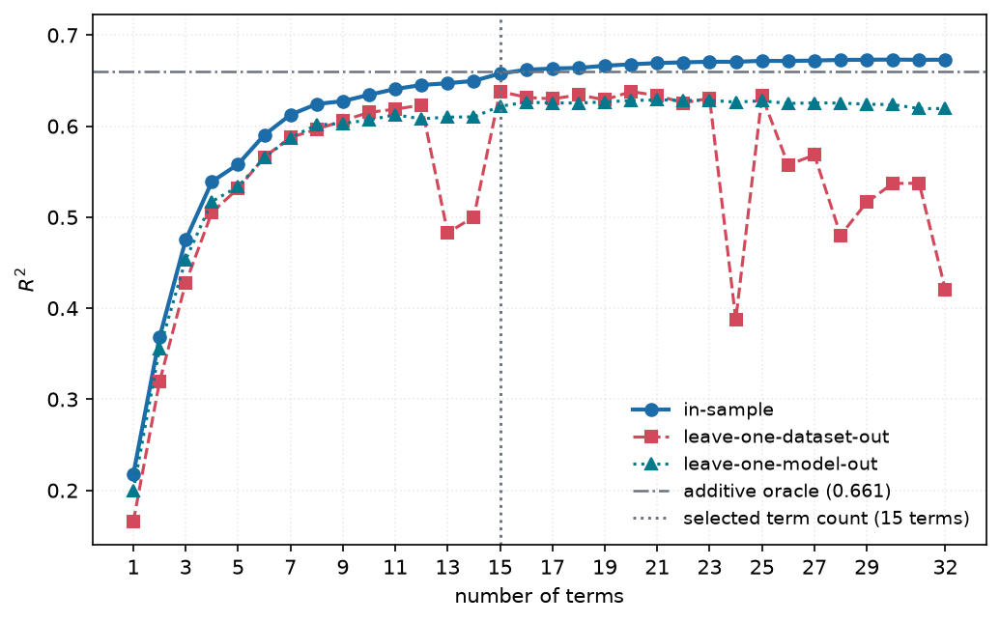

# 3. Search and fitting

*Implemented in `metafit.fit`, `metafit.analysis` and `metafit.selection`.*

Two problems are involved and only one of them is hard.

| problem | nature | method |
|---|---|---|
| Given a set of terms, what are the best weights? | linear | `numpy.linalg.solve` on the ridge normal equations — **exact, no iteration** |
| Which $k$ of ~360 candidate terms? | combinatorial | beam search with local refinement |

Handing every term to `lstsq` at once gives in-sample R² 0.656 and leave-one-dataset-out
R² of **-5.94**; the 14-term selected equation gets 0.443. The solver is not the hard
part.

## Stage 1 — correlation screening

Every candidate term is scored by **Pearson and Spearman** correlation against MCC. The
two disagree informatively:

- when they agree, the relation is linear and a plain `f` is the right term;
- when Spearman is clearly the larger, the relation is monotone but curved, which is the
  signal that a log, an inverse or a ratio will pay for itself.

`metafit.fit.transform_gap` is exactly $|\rho_s| - |\rho_p|$, and `guided_screen` ranks by
the stronger of the two while applying a small penalty to terms that are only monotone,
because linear terms read more simply. Near-duplicates of an already-kept term are
dropped so the beam does not spend its width on variations of one idea.

### Within-group screening

`metafit.analysis.screen` additionally centres **both the term and the target inside each
group** before correlating. A term is then credited only for variance that group identity
does not already explain.

This column is a diagnostic, not a ranking of importance, and misreading it is easy: it
removes dataset variance *by construction*, so only model-feature terms can score well
there. It answers "does this term explain anything *within* a dataset", which is the right
question for model effects and the wrong one for comparing dataset against model
importance.

## Stage 2 — beam search over subsets

Greedy forward selection commits to its first term permanently, and on a collinear
library that first commitment is often wrong. A beam keeps several partial equations
alive.

At each size the search:

1. scores every pooled candidate by its correlation with the current residual;
2. rejects candidates whose absolute correlation with an already-chosen term exceeds
   **0.95** — the collinearity guard, and what keeps the printed equation readable;
3. evaluates the best `candidates` extensions of each beam member with an exact ridge
   solve;
4. keeps the `beam_width` best by residual sum of squares;
5. refines the leader by **single-term swaps** until no swap improves it.

Because the beam records its best subset at **every** size, one search yields the whole
accuracy-versus-length curve, and a cross-validated sweep over lengths costs one search
per fold rather than one per length.

## The ridge solve

For a centred, standardised design, centring both sides removes the intercept from the
system, so no penalty is ever applied to it — shrinking an intercept toward zero would
bias every prediction toward MCC = 0, a value this data goes nowhere near.

$$(G + \lambda I)\,w = b, \qquad G = Z^\top Z, \quad b = Z^\top (y - \bar{y})$$

The residual sum of squares uses an identity rather than a second quadratic form. Since
$(G + \lambda I) w = b$ implies $w^\top G w = w^\top b - \lambda w^\top w$,

$$\mathrm{RSS} = \|y - \bar y\|^2 - 2 w^\top b + w^\top G w = \|y - \bar y\|^2 - w^\top b - \lambda w^\top w$$

which removes a matrix-vector product from the inner loop. The test suite checks the
identity against the literal definition across penalties and subset sizes.

### Cost

Every candidate refit is a $k \times k$ solve against a precomputed Gram matrix rather
than a least-squares call against the full design. A full 32-term leave-one-dataset-out
sweep runs in **15 seconds**, down from 39 after three optimisations that changed no
result (`np.ix_` called once rather than twice, the penalty added along a diagonal rather
than via `penalty * np.eye(k)`, and the RSS identity above), plus memoisation of subsets
and a vectorised collinearity mask.

## Negative result: the search is already converged

Accuracy is **not** limited by search strength. Sweeping beam width, candidate pool and
refinement rounds over an order of magnitude each:

| setting | beam | candidates | rounds | in-sample (k=14) | in-sample (k=20) |
|---|---|---|---|---|---|
| baseline | 6 | 24 | 2 | 0.5582 | 0.5662 |
| wide beam | 16 | 24 | 2 | 0.5582 | 0.5663 |
| more candidates | 6 | 64 | 2 | 0.5582 | 0.5661 |
| more rounds | 6 | 24 | 6 | 0.5582 | 0.5662 |
| maximal | 48 | 96 | 10 | 0.5582 | 0.5663 |

(default library; the wider library gains ~0.01 non-monotonically, which is search noise
rather than systematic improvement.)

Spending eight times the compute changes the fourth decimal place. Together with the
negative result on a richer vocabulary ([chapter 2](02-equation-form.md)), this locates
the limit in the model *form*, not in the optimiser.

**Per-length penalty tuning** was also tested: choosing $\lambda$ separately for each $k$
lifts leave-one-dataset-out R² at $k=14$ from 0.4429 to 0.4456. A gain of 0.003 does not
justify the extra configuration surface, and one global penalty is retained.

## An alternative that was built and measured: agglomerative construction

`metafit.construct` implements a different way of finding terms, structurally identical to
**hierarchical clustering**. Every feature starts as a singleton, straightened by whichever
transform makes it most linear in MCC. At each step the pair whose merge — under one of the
grammar's operations — becomes most linear in MCC is joined; features no merge improves are
left isolated; the process stops when no merge helps, so depth is discovered rather than
imposed.

The linkage criterion is **linearity**, because linearity is what the downstream model can
actually use: an equation is a weighted sum, so a term linear in MCC contributes perfectly
with weight 1, while a term that is monotone but curved contributes badly at any weight.

Three variants were measured against the enumerated library, with construction rebuilt
inside every fold (it consumes the target, so anything else would rig the comparison).

### It finds terms enumeration misses

| library | in-sample k=4 | k=14 | k=20 |
|---|---|---|---|
| enumerated (172 terms) | 0.4666 | 0.5582 | 0.5662 |
| **enumerated ∪ agglomerated** | **0.4935** | **0.5606** | **0.5690** |

The gain is largest at **short** equations — +0.027 R² at four terms — which is the
interpretability regime that matters most. The reason is specific: enumeration fixes
composite operands to `log` or `id`, while agglomeration picks the transform per operand by
linearity, so it can build `[sqrt(ns_ratio)] / [log(Processing Units Number)]` where
enumeration cannot.

### Target-free pairing adds nothing

Pairing features by their correlation with *each other* rather than with the target
(`structural_terms`) would avoid the per-fold cost entirely. It contributes nothing: at a
0.7 correlation threshold the union library is **172 terms, unchanged**. Every term it
proposes is already in the enumerated library.

That is a fact about the size of this problem rather than about the idea. With 17 features,
exhaustive depth-2 enumeration is *complete*, so any pair-selection heuristic can only
return a subset of it. Selection heuristics start to pay when the space is too large to
enumerate, which at 17 features it is not.

### Every increase in expressiveness costs transfer

| library | in-sample (k=14) | LOO-dataset (k=14) |
|---|---|---|
| enumerated (172) | 0.5582 | **+0.4429** |
| ∪ agglomerated | 0.5606 | +0.3759 |
| ∪ all-transform composites (427) | **0.5768** | +0.2942 |
| richer unary vocabulary | 0.5582 | +0.4196 |

Enumerating composites over *every* transform-atom rather than just the log/id compression
— 2336 additional terms — buys the best in-sample figures anywhere in this study (0.5893 at
20 terms) and drops leave-one-dataset-out from 0.443 to 0.294.

Four independent expansions of the library, all pointing the same way. Taken with the
negative results on search strength and on unary vocabulary, the conclusion is that
**library expressiveness on 20 datasets is already at or past its useful limit**. The
binding constraint is the sample, not the search.

The module ships, tested, because the alternative is worth documenting and the finding is
worth reproducing. It is **not** wired into the default pipeline.

## Stage 3 — choosing the number of terms

Picking the bend of the curve by eye is the kind of judgement this project exists to
remove from its results, so it is delegated to a detector.
[kneeliverse](https://github.com/mariolpantunes/knee)'s `autoelbow` takes no threshold,
sensitivity or smoothing window, so the chosen length is a property of the curve rather
than of a parameter chosen to produce a preferred answer.

Three rules are reported rather than one:

| rule | terms | in-sample R² | LOO-dataset R² |
|---|---|---|---|
| knee of the in-sample curve | 8 | 0.533 | 0.303 |
| knee of the cross-validated curve | 12 | 0.556 | 0.371 |
| **best cross-validated** | **14** | **0.558** | **0.443** |

Fourteen is the headline, and two independent metrics agree on it: it is both the maximum
of leave-one-dataset-out R² and the minimum of leave-one-dataset-out MAE (0.1884).

Both **Pareto fronts** are also reported. Over (length, LOO-dataset R²) the front is 2, 4,
8, 10, 12, 14 — nothing longer than 14 terms earns its length on transfer. Over (length,
in-sample R²) *every* length is on the front, because fit is monotone in terms and so
nothing is ever dominated. That is precisely why the in-sample curve cannot choose a
length by itself and the knee detector exists for it.

