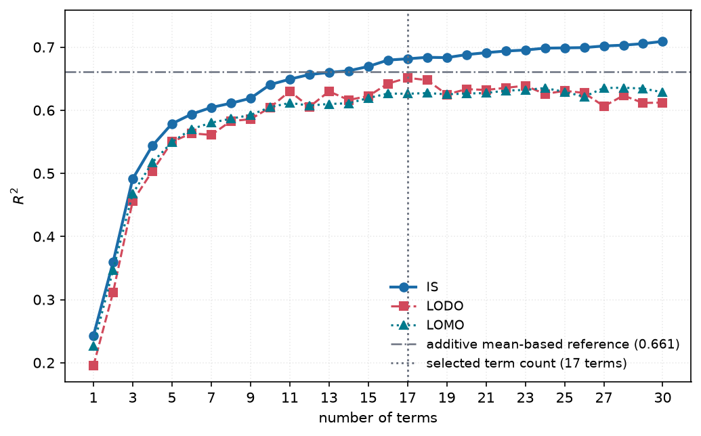

# 3. Term generation and selection

*Implemented in `ml_meta_perf.search`, `ml_meta_perf.fit`, `ml_meta_perf.analysis` and `ml_meta_perf.selection`.*

The abbreviations used in this chapter are Matthews Correlation Coefficient (**MCC**),
residual sum of squares (**RSS**), Linear Algebra PACKage (**LAPACK**), Basic Linear Algebra
Subprograms (**BLAS**), central processing unit (**CPU**), coefficient of determination
(**R²**), in-sample (**IS**), leave-one-dataset-out (**LODO**), leave-one-model-out
(**LOMO**), and doubly held out (**DHO**). Memory and interface abbreviations are megabyte (**MB**), kilobyte (**KB**),
level-1 cache (**L1**), and the 64-bit-integer BLAS interface (**ILP64**).
The equation labels are **E3-Valid** (the plateau-selected dataset-and-model equation) and
**E3-MAX** (the maximum-capability dataset-and-model equation).

Two problems are involved and only one of them is hard.

| problem | nature | method |
|---|---|---|
| Given a set of terms, what are the best weights? | linear | `numpy.linalg.solve` on the ridge normal equations — **exact, no iteration** |
| Which $k$ of a few hundred candidate terms? | combinatorial | beam search with local refinement |

Handing every term to `lstsq` at once fits *better* under IS than the published equation and
transfers catastrophically — the generated section at the foot of this chapter measures both,
against the published equation, on this run. The solver is not the hard part; the sample size
is, and everything below is about spending it well.

## Stage 1 — correlation screening

Every candidate term is scored by **Pearson and Spearman** correlation against MCC. The
two disagree informatively:

- when they agree, the relation is linear and a plain `f` is the right term;
- when Spearman is clearly the larger, the relation is monotone but curved, which is the
  signal that a log, an inverse or a ratio will pay for itself.

`ml_meta_perf.search.transform_gap` is exactly $|\rho_s| - |\rho_p|$, and `guided_screen` ranks by
the stronger of the two while applying a small penalty to terms that are only monotone,
because linear terms read more simply. Near-duplicates of an already-kept term are
dropped so the beam does not spend its width on variations of one idea.

### Within-group screening

`ml_meta_perf.analysis.screen` additionally centres **both the term and the target inside each
group** before correlating. A term is then credited only for variance that group identity
does not already explain.

This column is a diagnostic, not a ranking of importance, and misreading it is easy: it
removes dataset variance *by construction*, so only model-feature terms can score well
there. It answers "does this term explain anything *within* a dataset", which is the right
question for model effects and the wrong one for comparing dataset against model
importance.

## Stage 2 — beam search over subsets

Greedy forward selection commits to its first term permanently, and on a collinear
library that first commitment is often wrong. A beam keeps several partial equations
alive.

At each size the search:

1. scores every pooled candidate by its correlation with the current residual;
2. rejects candidates whose absolute correlation with an already-chosen term exceeds
   **0.95** — the collinearity guard, and what keeps the printed equation readable;
3. evaluates the best `candidates` extensions of each beam member with an exact ridge
   solve;
4. keeps the `beam_width` best by residual sum of squares;
5. refines the leader by **single-term swaps** until no swap improves it.

Because the beam records its best subset at **every** size, one search yields the whole
accuracy-versus-length curve, and a cross-validated sweep over lengths costs one search
per fold rather than one per length.

## The ridge solve

For a centred, standardised design, centring both sides removes the intercept from the
system, so no penalty is ever applied to it — shrinking an intercept toward zero would
bias every prediction toward MCC = 0, a value this data goes nowhere near.

$$(G + \lambda I)\,w = b, \qquad G = Z^\top Z, \quad b = Z^\top (y - \bar{y})$$

The residual sum of squares uses an identity rather than a second quadratic form. Since
$(G + \lambda I) w = b$ implies $w^\top G w = w^\top b - \lambda w^\top w$,

$$\mathrm{RSS} = \|y - \bar y\|^2 - 2 w^\top b + w^\top G w = \|y - \bar y\|^2 - w^\top b - \lambda w^\top w$$

which removes a matrix-vector product from the inner loop. The test suite checks the
identity against the literal definition across penalties and subset sizes.

### Cost

Every candidate refit is a $k \times k$ solve against a precomputed Gram matrix rather
than a least-squares call against the full design. Everything this study fits — the term
sweeps, four equations across two grammars, and all four protocols including the
DHO cell — runs in tens of seconds on the reference environment, and every
optimisation that got it there was verified to leave the outputs unchanged.

A full `python -m ml_meta_perf` takes about six minutes on the reference Windows environment;
most of that time is the opaque comparison in
[chapter 5](05-evaluation.md#what-an-opaque-model-reaches-and-does-not):
three scikit-learn regressors refitted once per observed cell, 476 times each. That the
priced *alternative* to a readable equation costs an order of magnitude more than the
equation is not the point of this section, but it is not nothing either.

| change | what it does | effect |
|---|---|---|
| Gram-matrix arithmetic | a $k\times k$ solve instead of a least-squares call | the design |
| the RSS identity above | removes a matrix-vector product from the inner loop | |
| `np.ix_` replaced by a direct broadcast reshape | skips dtype checks already known to hold | 1.8× on the indexing |
| penalty folded into the full Gram diagonal once | removes a copy and an index array per solve | |
| memoised subsets, vectorised collinearity mask | | 39s → 15s per sweep |
| **stacked solves** | a beam step's candidates go to LAPACK as one `(n, k, k)` array | **1.16M solve calls → 87k** |
| **target ranked once per screen** | Spearman's expensive half hoisted out of the candidate loop | 52k rank calls → 29k |

The last two are the current ones. At $k \le 32$ NumPy's per-call wrapper — dtype
promotion, array coercion, the errstate context manager — costs several times the LAPACK
call it guards, so batching the candidates of one beam step into a single stacked solve is
worth 2–10× depending on $k$ while running the identical routine per slice. What remains
in the profile is the arithmetic itself: gathering the $(n, k, k)$ submatrices and the
solves, in that order. There is no Python-level hotspot left above 20%.

### One BLAS thread, deliberately

The solver underneath is whatever LAPACK NumPy was built against — for the wheels used
here, the OpenBLAS build that NumPy vendors (`numpy.libs/libscipy_openblas64_*.so`, built
`MAX_THREADS=64`). **That is a bundled shared library, not the installed SciPy package.**
The project receives SciPy transitively through scikit-learn, while its small internal
statistics remain implemented in `ml_meta_perf.stats`.

OpenBLAS threads by default, and on this workload the threads do nothing but spin:

| `OPENBLAS_NUM_THREADS` | wall | CPU |
|---|---|---|
| **1** | **24.7 s** | **24.7 s** |
| 2 | 24.8 s | 33.9 s |
| 4 | 24.7 s | 52.1 s |
| 8 | 25.3 s | 87.7 s |

A 32×32 solve is far below the size where BLAS parallelism pays, so eight threads buy no
wall time and burn 3.5× the CPU, so `OPENBLAS_NUM_THREADS=1` is worth setting in the environment before a run. It is left to the caller: a library that silently pins a global thread count is a library that surprises whoever imports it.

It has to be pinned on the command line rather than inside the package: `python -m ml_meta_perf`
imports `ml-meta-perf`, and therefore NumPy, and therefore OpenBLAS, *before* `__main__` runs,
and OpenBLAS reads the variable when it loads. Anyone timing this study by calling
`python -m ml_meta_perf` directly will see the same 25 seconds against five times the CPU.

### Using the host's BLAS instead of the wheel's

`pip install numpy` installs a wheel that **vendors its own OpenBLAS** — a 25 MB
`numpy.libs/libscipy_openblas64_*.so`, built ILP64 with prefixed symbols. It is linked at
build time and there is no runtime switch, so a different BLAS means rebuilding NumPy:

```bash
venv/bin/pip install --no-binary numpy --force-reinstall numpy \
  -Csetup-args=-Dblas=openblas -Csetup-args=-Dlapack=openblas
```

That needs the BLAS development files (an `openblas.pc` for pkg-config, plus the headers),
a C compiler and `ninja`. It takes about two minutes the first time on 16 cores; pip caches
the built wheel, so recreating the venv afterwards reuses it and costs seconds.
`venv/bin/pip install --force-reinstall numpy` goes back to the wheel. **Any later
`pip install` that resolves NumPy will silently replace a source build with the wheel
again**, since `pyproject.toml` asks only for `numpy>=2.0.0`. The rebuild is deliberately
optional: requiring a compiler and BLAS headers is a heavier ask than the rest of this
project makes, and it changes speed rather than results.

Why do it at all: the wheel's build is chosen for portability rather than for the host. On
the machine these numbers were taken it selects the `Haswell` kernel on a Zen 5 CPU, while
the system build selects `Zen`. Whether that matters is a property of the host, and here it
is not measurable:

| | wall | CPU | results |
|---|---|---|---|
| vendored OpenBLAS (Haswell kernel) | 24.4 s | 27.9 s | — |
| system OpenBLAS (Zen kernel) | 24.6 s | 28.0 s | **byte-identical** |

Every output table produced in that benchmark was unchanged across the swap, which is the
check that matters more than the timing: a different BLAS can round differently, and
different rounding could in principle change which term the beam selects. It does not here.

Head to head on `dgesv` at the sizes this study actually uses, timed with
[exectimeit](https://github.com/mariolpantunes/exectimeit) — which fits
$T_k = k \cdot t_{\text{exec}} + t_{\text{overhead}}$ and takes the slope, so the timer's
own overhead is removed rather than averaged over:

| n | vendored (Haswell) | system (Zen) |
|---|---|---|
| 8 | 7.88 ± 0.74 µs | 7.92 ± 0.46 µs |
| 16 | 9.72 ± 0.89 µs | 9.46 ± 1.05 µs |
| 24 | 12.52 ± 1.50 µs | 12.58 ± 1.51 µs |
| 32 | 16.68 ± 3.19 µs | 16.90 ± 2.22 µs |

Every difference is inside two standard errors. A plain timing loop had reported a
consistent 5–6% gap at n = 24 and 32 which **vanished** once the measurement was done
properly — which is the argument for measuring it this way rather than with a stopwatch
around a loop. The mechanism agrees: a 32×32 system is 8 KB and sits in L1, so there is no
cache behaviour for a tuned kernel to improve. A better-tuned BLAS pays on large matrix
products, and this study never forms one.

## Is the search the limitation? No

Accuracy is **not** limited by search strength. Sweeping beam width, candidate pool and
refinement rounds over an order of magnitude each:

| setting | beam | candidates | rounds | IS (k=14) | IS (k=20) |
|---|---|---|---|---|---|
| baseline | 6 | 24 | 2 | 0.5582 | 0.5662 |
| wide beam | 16 | 24 | 2 | 0.5582 | 0.5663 |
| more candidates | 6 | 64 | 2 | 0.5582 | 0.5661 |
| more rounds | 6 | 24 | 6 | 0.5582 | 0.5662 |
| maximal | 48 | 96 | 10 | 0.5582 | 0.5663 |

<sub>Default library. The wider library gains ~0.01 non-monotonically, which is search noise
rather than systematic improvement. **Measured before the 2026-09-05 protocol change**, so
these are re-selecting numbers and are not comparable with any current figure — the
IS column here is not the IS column of chapter 5. What the table supports is a
statement about *differences between search settings*, and those are internally consistent
because every row was measured the same way.</sub>

Spending eight times the compute changes the fourth decimal place. Together with the
negative result on a richer vocabulary ([chapter 2](02-additive-model.md)), this locates
the limit in the model *form*, not in the optimiser.

**Per-length penalty tuning** was also tested: choosing $\lambda$ separately for each $k$
lifted LODO R² at $k=14$ from 0.4429 to 0.4456 — again on the pre-2026-09-05
re-selecting protocol, so read the *gain* and not the level. A gain of 0.003 does not justify
the extra configuration surface, and one global penalty is retained.

## Stage 3 — choosing the number of terms

More terms fit better and read worse. **One rule chooses the length of every published
equation** — E1, E2 and E3-Valid alike — so that, like the features and the configuration, the
way the length was picked is not something that differs between them. It is
`selection.plateau_knee`, and it reads the complete cross-validated curve in three steps.

### Which evidence the rule reads

**The worst protocol at each length.** IS R² is monotone in the number of terms, so it
cannot express the trade between fit and length by itself; any single held-out curve can be
flattered by the protocol it happens to be. The rule reads the **floor** — the minimum R² over
IS, LODO, LOMO and DHO at each length (`selection.floor_curve`) — so a length is only as good
as the protocol it does worst on, which is almost always DHO: the cell where neither the
dataset nor the model has been seen, the question the study is for.

**Smoothed, because single lengths are noisy.** Adjacent lengths differ by 0.03 to 0.05 on
this curve, and not because of the length. LODO has genuine craters — lengths where the held-out
number collapses while its neighbours are untouched, because one held-out dataset sits outside
the convex hull of the other nineteen in term space, where a linear equation extrapolates
without limit and `validate._clip_to_training` pins the fold to its training floor. The mirror
image, a single lucky length, is just as common. Either would choose the length if the rule
read the raw curve, so it reads a **running median over three lengths**
(`selection.smoothed`): a median ignores one outlying length where a mean would spread it onto
its neighbours. The generated section below identifies the current curve's deepest crater and
what the smoothing does to it.

### Where the returns stop

**Knees propose, the plateau decides.** multi-Kneedle — from the
[`kneeliverse`](https://github.com/mariolpantunes/knee) library — is run on the smoothed curve's
Pareto front (the lengths that improve on every shorter one) and proposes the lengths where its
rate of improvement bends (`selection.knee_lengths`). A knee alone is not enough: the first
bend comes five to nine terms in, well before the curve levels off, and every equation there
is measurably worse than the ones after it. The rule therefore takes **the first proposed
length after which the smoothed floor gains at most `delta` over the next `window` lengths** —
the start of the first sustained plateau, the shortest equation that has stopped improving.
The smoothed maximum is always a candidate too, since nothing after it gains; when every knee
is still followed by real gains, the plateau starts there. `delta`, `window` and the smoothing
width are hyperparameters in `config/study.json`, stated rather than implied — the generated
configuration table below lists them — and the generated section reports which knees this run
proposed and which one it took.

A rule that looked only at a threshold on raw steps — the "first gain below 0.001" rule this
replaced — reads noise: a threshold far below the length-to-length variation stops wherever
the noise happens to dip. A rule that looked only at knees stops too early. Together they find
where the curve actually levels off.

### Which lengths the curve is reported at

**Every length from 1 to `max_terms`**, on a uniform grid. A non-uniform grid can skip the
beginning or end of a plateau and change the selected point, and any rule reading a sparse
curve is partly reading the grid. Reporting every length costs nothing, because the beam
search already builds the whole path. The horizon, `search.max_terms`, lies past the readable
range, so that a plateau starting near the readable limit still has a full window ahead of it.



The craters are visible in that figure. They are a real property of LODO on twenty groups and
they belong on the plot.

### E3-MAX, the bound

E3-MAX answers a separate capability question: how far the additive form reaches if it is
not asked to stay readable. It is the same configuration under the wider grammar
(`selection.capability_arity`, ratio-of-sums terms), at the **raw** maximum of its floor
(`selection.floor_argmax`) — no smoothing and no complexity penalty, because a bound should not
be discounted for being long. A maximum at the horizon means the bound belongs to the horizon,
and the generated summary flags it. E3-MAX is reported as a bound and is not used for the
downstream prediction and model-ranking results.

### How the configuration itself was chosen

The rule chooses a length *given* a configuration; the configuration is chosen by the same
criterion. `ml-meta-perf-search` fits E3 once for every point of the grid in
`config/study.json`'s `sweep` section (stability cap × ridge penalty × arity), applies the rule
to each, and keeps the configurations whose chosen equation is readable (`sweep.readable_terms`
terms at most). Among those, configurations whose smoothed floor is within `sweep.band` of the
best are indistinguishable on R² —
neighbouring configurations differ by less than neighbouring lengths do — and the one whose
doubly-held-out predictions **rank the models best** (mean average precision over the twenty
datasets) is proposed. Ranking decides because it is what the equation is for, and because it
separates configurations R² cannot: at the same floor, ranking precision varies widely from
one configuration to the next. The sweep writes every candidate's scores and a proposal;
adopting it is a reviewed edit to the file.

The paired per-dataset table in the generated section compares other lengths with E3-Valid as
a sensitivity analysis. It does not define additional E3-Valid equations.
<!-- generated: do not edit below -->

## The configuration this run used

Meta-dataset: `/home/mantunes/git/ml-meta-perf/dataset/meta_dataset.csv`

Every hyperparameter below is read from `config/study.json`; E1, E2 and E3 share all of them.

| setting | value |
|---|---|
| search.max_abs_zscore | 4.0 |
| search.penalty | 0.3 |
| search.pool_size | 600 |
| search.max_terms | 30 |
| search.beam_width | 6 |
| search.max_arity | 2 |
| selection.delta | 0.01 |
| selection.window | 4 |
| selection.smoothing | 3 |
| selection.capability_arity | 3 |

## Why a subset rather than every term

The control for the whole selection stage. If handing every candidate term to unpenalised least squares in one go transferred well, the beam search and the length rule would be machinery in search of a problem.

| terms | r2_IS | r2_LODO_clipped | r2_LODO_unclipped |
|---|---|---|---|
| 212.0000 | 0.7686 | -0.2952 | -2.0998 |

**The solver is not the hard part; the sample size is.** All 212 terms at once fit better under IS than the published equation (0.7686 against 0.6815) and transfer at -0.2952 under LODO, against the published equation's 0.6513. The unclipped figure — -2.1 — is what the fit does when a held-out dataset falls outside the convex hull of the other nineteen and nothing bounds the extrapolation. A design this much wider than 20 held-out groups can support has nothing to constrain it, which is what selection is for.

## Equation length

E3-Valid has **17 terms**. The rule, `selection.plateau_knee`, is the same for E1, E2 and E3-Valid. It reads the worst R² over IS, LODO, LOMO and DHO at every length, smoothed by a running median of 3 lengths; multi-Kneedle (`kneeliverse`) proposes the lengths where that curve's Pareto front bends -- here **4, 5, 6, 9, 12** -- and the rule takes the first of them, or the smoothed maximum, after which the smoothed curve gains at most 0.01 over the next 4 lengths: the shortest equation that has stopped improving. None of the knees is followed by a plateau -- the curve keeps gaining past each -- so the plateau starts at the smoothed maximum.

**Why the curve is smoothed before a length is chosen.** The deepest crater on this curve is at **12 terms**, where the worst protocol reads 0.568, 0.030 below the neighbouring lengths. The running median of 3 lengths reads 0.592 there. A crater like this is not a property of the length -- it is one held-out dataset sitting outside the convex hull of the other nineteen in term space, where a linear equation extrapolates without limit and `validate._clip_to_training` pins the fold to its training floor -- and the same holds for a single lucky length. Neither should choose the published length.

The following paired analysis compares every length against E3-Valid, dataset by dataset; it is a sensitivity analysis rather than an additional selector:

| n_terms | r2_LODO | mae_LODO | mean_difference | p_value | ci_low | ci_high | verdict |
|---|---|---|---|---|---|---|---|
| 1 | 0.1951 | 0.2392 | 0.1023 | 0.0000 | 0.0763 | 0.1287 | worse |
| 2 | 0.3112 | 0.2120 | 0.0750 | 0.0000 | 0.0490 | 0.1008 | worse |
| 3 | 0.4559 | 0.1824 | 0.0455 | 0.0026 | 0.0226 | 0.0700 | worse |
| 4 | 0.5035 | 0.1687 | 0.0318 | 0.0118 | 0.0130 | 0.0511 | worse |
| 5 | 0.5501 | 0.1600 | 0.0230 | 0.0118 | 0.0063 | 0.0406 | worse |
| 6 | 0.5635 | 0.1571 | 0.0202 | 0.0414 | 0.0036 | 0.0380 | worse |
| 7 | 0.5609 | 0.1592 | 0.0223 | 0.1153 | 0.0062 | 0.0387 | worse |
| 8 | 0.5828 | 0.1523 | 0.0154 | 0.2632 | 0.0014 | 0.0303 | worse |
| 9 | 0.5858 | 0.1524 | 0.0155 | 0.0414 | 0.0017 | 0.0315 | worse |
| 10 | 0.6043 | 0.1529 | 0.0160 | 0.2632 | 0.0036 | 0.0303 | worse |
| 11 | 0.6302 | 0.1409 | 0.0040 | 0.0414 | -0.0036 | 0.0111 | tie |
| 12 | 0.6053 | 0.1438 | 0.0069 | 0.1153 | -0.0007 | 0.0160 | tie |
| 13 | 0.6298 | 0.1409 | 0.0040 | 0.2632 | -0.0025 | 0.0105 | tie |
| 14 | 0.6164 | 0.1426 | 0.0057 | 0.5034 | -0.0021 | 0.0153 | tie |
| 15 | 0.6223 | 0.1440 | 0.0071 | 0.0118 | 0.0025 | 0.0137 | worse |
| 16 | 0.6421 | 0.1395 | 0.0026 | 0.8238 | -0.0012 | 0.0069 | tie |
| 17 | 0.6513 | 0.1369 | 0.0000 | 1.0000 | 0.0000 | 0.0000 | selected |
| 18 | 0.6477 | 0.1394 | 0.0025 | 0.5034 | -0.0013 | 0.0063 | tie |
| 19 | 0.6250 | 0.1474 | 0.0105 | 0.1153 | 0.0013 | 0.0203 | worse |
| 20 | 0.6334 | 0.1439 | 0.0069 | 0.5034 | -0.0012 | 0.0152 | tie |
| 21 | 0.6322 | 0.1444 | 0.0075 | 0.5034 | -0.0017 | 0.0179 | tie |
| 22 | 0.6355 | 0.1436 | 0.0066 | 1.0000 | -0.0022 | 0.0162 | tie |
| 23 | 0.6389 | 0.1413 | 0.0043 | 0.8238 | -0.0053 | 0.0156 | tie |
| 24 | 0.6257 | 0.1437 | 0.0067 | 1.0000 | -0.0051 | 0.0209 | tie |
| 25 | 0.6308 | 0.1419 | 0.0050 | 0.8238 | -0.0048 | 0.0160 | tie |
| 26 | 0.6274 | 0.1425 | 0.0055 | 1.0000 | -0.0046 | 0.0167 | tie |
| 27 | 0.6063 | 0.1499 | 0.0129 | 0.8238 | -0.0056 | 0.0373 | tie |
| 28 | 0.6233 | 0.1459 | 0.0089 | 1.0000 | -0.0074 | 0.0306 | tie |
| 29 | 0.6115 | 0.1486 | 0.0116 | 1.0000 | -0.0067 | 0.0360 | tie |
| 30 | 0.6121 | 0.1467 | 0.0097 | 0.5034 | -0.0101 | 0.0379 | tie |

The full curve reports all four protocols at every length; the length rule reads their minimum:

| n_terms | r2_IS | mae_IS | smape_IS | r2_LODO | mae_LODO | smape_LODO | r2_LOMO | mae_LOMO | smape_LOMO | r2_DHO | mae_DHO | smape_DHO |
|---|---|---|---|---|---|---|---|---|---|---|---|---|
| 1 | 0.2427 | 0.2357 | 46.0992 | 0.1951 | 0.2431 | 47.0543 | 0.2268 | 0.2388 | 46.4762 | 0.1834 | 0.2455 | 47.3333 |
| 2 | 0.3591 | 0.2061 | 43.2679 | 0.3112 | 0.2134 | 44.3729 | 0.3467 | 0.2083 | 43.5514 | 0.3037 | 0.2149 | 44.5410 |
| 3 | 0.4913 | 0.1754 | 39.6247 | 0.4559 | 0.1806 | 40.4826 | 0.4679 | 0.1793 | 40.2188 | 0.4383 | 0.1837 | 40.9436 |
| 4 | 0.5437 | 0.1625 | 37.8372 | 0.5035 | 0.1690 | 38.4338 | 0.5172 | 0.1672 | 38.4440 | 0.4834 | 0.1725 | 38.9685 |
| 5 | 0.5786 | 0.1543 | 36.9901 | 0.5501 | 0.1593 | 37.5379 | 0.5495 | 0.1595 | 37.6940 | 0.5289 | 0.1631 | 37.7402 |
| 6 | 0.5938 | 0.1510 | 36.0674 | 0.5635 | 0.1566 | 36.7408 | 0.5702 | 0.1556 | 36.9105 | 0.5489 | 0.1597 | 37.3849 |
| 7 | 0.6044 | 0.1494 | 36.4543 | 0.5609 | 0.1591 | 39.4264 | 0.5803 | 0.1538 | 36.9874 | 0.5467 | 0.1616 | 39.8774 |
| 8 | 0.6111 | 0.1469 | 36.3032 | 0.5828 | 0.1520 | 36.8695 | 0.5865 | 0.1514 | 37.0059 | 0.5697 | 0.1547 | 37.4232 |
| 9 | 0.6189 | 0.1456 | 35.9751 | 0.5858 | 0.1525 | 37.6506 | 0.5924 | 0.1510 | 36.8185 | 0.5716 | 0.1557 | 38.1059 |
| 10 | 0.6406 | 0.1444 | 35.3191 | 0.6043 | 0.1528 | 36.6091 | 0.6048 | 0.1508 | 36.0172 | 0.5806 | 0.1572 | 37.3252 |
| 11 | 0.6492 | 0.1367 | 34.4060 | 0.6302 | 0.1403 | 34.6698 | 0.6116 | 0.1443 | 35.7268 | 0.6042 | 0.1457 | 35.6503 |
| 12 | 0.6565 | 0.1356 | 34.4261 | 0.6053 | 0.1437 | 36.8766 | 0.6074 | 0.1438 | 35.6201 | 0.5678 | 0.1488 | 37.2077 |
| 13 | 0.6599 | 0.1352 | 34.1944 | 0.6298 | 0.1402 | 34.5568 | 0.6100 | 0.1435 | 35.3986 | 0.5916 | 0.1463 | 35.6670 |
| 14 | 0.6625 | 0.1337 | 33.8307 | 0.6164 | 0.1424 | 36.3760 | 0.6110 | 0.1424 | 35.0663 | 0.5808 | 0.1474 | 37.1943 |
| 15 | 0.6693 | 0.1341 | 34.1162 | 0.6223 | 0.1440 | 37.7435 | 0.6193 | 0.1428 | 35.1487 | 0.5889 | 0.1487 | 38.6727 |
| 16 | 0.6795 | 0.1308 | 33.6965 | 0.6421 | 0.1391 | 35.8759 | 0.6264 | 0.1414 | 35.0222 | 0.6076 | 0.1456 | 36.6644 |
| 17 | 0.6815 | 0.1302 | 34.0670 | 0.6513 | 0.1368 | 35.6741 | 0.6261 | 0.1408 | 35.5131 | 0.6151 | 0.1438 | 36.7482 |
| 18 | 0.6838 | 0.1303 | 34.0235 | 0.6477 | 0.1392 | 36.8715 | 0.6272 | 0.1412 | 35.6798 | 0.6123 | 0.1462 | 37.8688 |
| 19 | 0.6834 | 0.1321 | 35.0170 | 0.6250 | 0.1465 | 38.8008 | 0.6253 | 0.1437 | 36.9264 | 0.5897 | 0.1537 | 39.8310 |
| 20 | 0.6881 | 0.1298 | 34.5425 | 0.6334 | 0.1435 | 38.8351 | 0.6264 | 0.1419 | 36.5925 | 0.5932 | 0.1514 | 39.7196 |
| 21 | 0.6912 | 0.1279 | 34.5984 | 0.6322 | 0.1441 | 39.5170 | 0.6272 | 0.1406 | 36.5022 | 0.5921 | 0.1514 | 40.2026 |
| 22 | 0.6938 | 0.1273 | 34.9212 | 0.6355 | 0.1433 | 38.9693 | 0.6311 | 0.1394 | 36.7496 | 0.5985 | 0.1502 | 39.8040 |
| 23 | 0.6954 | 0.1273 | 34.9208 | 0.6389 | 0.1411 | 37.4720 | 0.6322 | 0.1395 | 36.7864 | 0.5994 | 0.1491 | 38.9270 |
| 24 | 0.6984 | 0.1264 | 34.3295 | 0.6257 | 0.1422 | 37.0822 | 0.6351 | 0.1386 | 36.1839 | 0.5914 | 0.1492 | 38.3297 |
| 25 | 0.6988 | 0.1246 | 34.1090 | 0.6308 | 0.1408 | 37.0448 | 0.6292 | 0.1372 | 36.1187 | 0.5917 | 0.1477 | 38.2256 |
| 26 | 0.6993 | 0.1237 | 34.1600 | 0.6274 | 0.1411 | 37.2823 | 0.6215 | 0.1380 | 36.3287 | 0.5815 | 0.1500 | 38.8356 |
| 27 | 0.7018 | 0.1221 | 33.8804 | 0.6063 | 0.1467 | 37.4755 | 0.6352 | 0.1334 | 35.8724 | 0.5766 | 0.1512 | 38.9883 |
| 28 | 0.7031 | 0.1216 | 33.8443 | 0.6233 | 0.1429 | 37.1978 | 0.6356 | 0.1332 | 35.8141 | 0.5916 | 0.1482 | 38.1048 |
| 29 | 0.7055 | 0.1215 | 33.7253 | 0.6115 | 0.1453 | 37.0577 | 0.6344 | 0.1344 | 35.9684 | 0.5774 | 0.1514 | 38.6281 |
| 30 | 0.7091 | 0.1200 | 33.8998 | 0.6121 | 0.1424 | 37.2571 | 0.6285 | 0.1349 | 36.3115 | 0.5578 | 0.1521 | 39.5378 |

## How much of the transfer is the form's selection

Every reported held-out number fixes the equation's form -- chosen once, on all 476 rows -- and refits only its weights in each fold. The form was therefore chosen with the held-out dataset in view. The second row repeats the *selection* inside every LODO fold, at E3-Valid's 17 terms and configuration, and scores those predictions instead:

| LODO | r2 | mae | spearman |
|---|---|---|---|
| form chosen once, on all rows (reported) | 0.6513 | 0.1368 | 0.8337 |
| form re-chosen inside every fold | 0.3804 | 0.1756 | 0.6561 |

**0.271 of the reported LODO R² (0.651) belongs to choosing the form on all rows**; with the terms re-chosen blind, LODO R² is 0.380. The nested row describes the discovery procedure -- twenty folds fit twenty different equations -- not the published equation, so it is a diagnostic rather than a score. It is the measured size of the caveat under *Limitations*: the fixed-form transfer numbers are an upper estimate.

<!-- end generated -->

## Limitations of the selection procedure

### Hyperparameter selection is not nested

The configuration and the equation length were chosen by reading held-out scores, and the
equation's form was chosen on all rows before its weights were refit per fold. The reported
transfer numbers are therefore an **upper estimate**, not an unbiased one — and not a mildly
optimistic one. The generated section *How much of the transfer is the form's selection*
measures the largest part of the gap by repeating the term selection inside every LODO fold;
the difference is large at this sample size, because choosing a handful of terms from hundreds
of candidates with twenty dataset groups is exactly where selection optimism concentrates. What
the fixed-form numbers license is the claim that *this* equation, recalibrated, transfers as
reported; what they do not license is a claim that the search would find an equally good one on
new data.

The **IS** numbers are unaffected by this.
