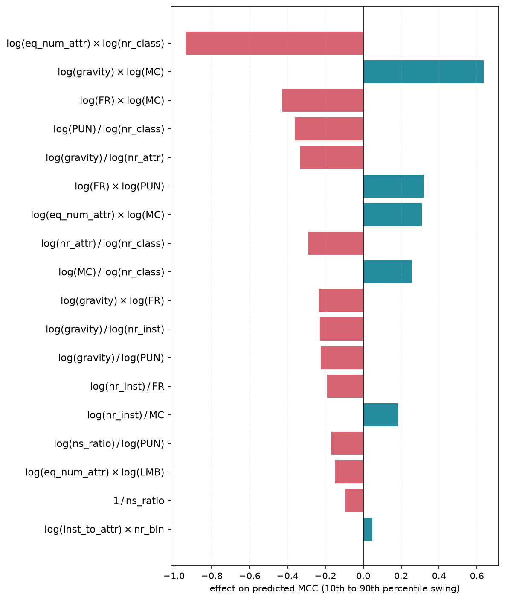
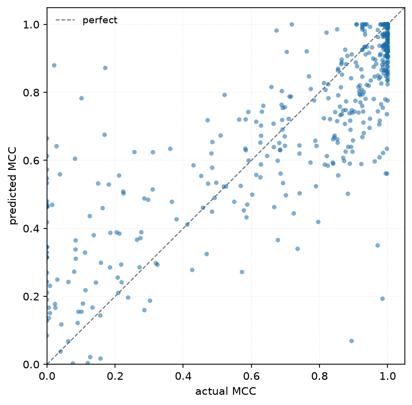

# 4. The equation

*Produced by `ml_meta_perf.experiment`; reproduce with `PYTHONPATH=src venv/bin/python -m ml_meta_perf`.*

## The three equations

The study is built around a deliberate contrast. The three equations differ **only** in
which features they may draw on, so the gaps between them measure what each half of the
meta-data is worth.

**E1 — dataset features only.** Every model evaluated on a given dataset shares one
feature vector, so many MCC values map to a single input and least squares necessarily
lands on the per-dataset mean. That is not a defect to be corrected; it is the control. E1
measures how much of MCC is explained by *the data alone*.

**E2 — model features only.** The mirror of E1, added to settle whether model choice
outweighs dataset difficulty. There are six model features, five of them constant per model,
so E2 is short by necessity rather than by design.

**E3 — dataset and model features.** One input, one output. E3 can express variation
*within* a dataset, which is exactly what E1 structurally cannot do, and it is the
equation the study publishes.

### One process, three feature sets

All three are fitted by the same function on the same 476 rows, scored on the same 476
rows, and evaluated under the same four protocols from **one** base configuration. E1 and E2
select the best four-protocol floor within their grammars; E3-Valid uses the retained plateau
rule.
`experiment.run_equation` is that function and `run_e1`, `run_e2` and `run_e3` are one
line each. The uniformity is not tidiness: the gaps between the three are only evidence
about what each half of the meta-data is worth if *nothing else* differs between them.

**All three are fitted on the 476 rows, not on aggregated group means.** Fitting E1 on the
20 per-dataset means is tempting — a predictor constant inside a group can only predict that
group's mean anyway — but it puts E1's R² on a twenty-point denominator:

| E1 fitted on | in-sample R² | LOO-dataset R² | comparable with E3? |
|---|---|---|---|
| 20 dataset means | 0.337 | 0.506 *(on 20 points)* | no |
| **476 rows** | **0.354** | **0.349** *(on 476 rows)* | yes |

Two R² values computed over different row sets share no denominator. Printed in one table
they invite the conclusion that the dataset-only control transfers *better* than the full
equation, which on the common scale it does not. Fitting on all rows costs nothing and
removes the caveat instead of requiring one.

**Aggregating E2 the same way was measured, and is worse.** The mirror move is to fit E2
on 25 per-model means:

| E2 fitted on | in-sample R² (476 rows) | best out-of-fold | terms at the optimum |
|---|---|---|---|
| **476 rows** | **0.177** | **0.090** | 6 |
| 25 model means | 0.125 | 0.112 | **1** |

<sub>**Measured before the 2026-09-05 protocol change**, unlike the E1 table above it, which
is current. Read the two rows against each other and not against any figure elsewhere in the
study: E2 on all 476 rows scores higher than 0.177 under the reported protocol — the
generated tables have the current value — and three model features that varied within a model
have since been retired, which is part of why. What the table supports is the *direction*,
and that has been re-checked: aggregating E2 to per-model means is still worse.</sub>

<sub>Both rows predate `Model Capability`; the comparison is between fitting scales, and
re-running it on the enlarged feature set would change both numbers without changing which
is larger.</sub>

Its optimum collapses to a single term and everything longer goes negative. The reason is
structural: `Processing Units Number` is a function of the dataset's shape as well as the
model, so it is **not** constant within a model.
Averaging them discards real variation, which is exactly what aggregating E1 does not do.
The two controls are not symmetric in the data even though they are symmetric in intent —
which is itself the argument for fitting both the same way and letting the optimizer
handle the difference.

## Headline comparison

Every equation is fitted on all 476 rows and scored on all 476 rows, so there is one
scale and one table:

Each equation, each equation's own ceiling, and the additive oracle are in one generated
table — on the [index page](index.md), which carries the headline, and again with the full
metric set in [chapter 5](05-evaluation.md). The figure is the same comparison drawn:


### One scale is not one ceiling

Those R² values are arithmetically comparable — same rows, same denominator. They are
still **not comparable as achievements**, and no change to the fitting could make them so.

E1 predicts one value per dataset, so **the true dataset means are the most it could ever
score**, however good its terms were: that is all the variance a per-dataset constant can
reach. E1 is not "worse than E3"; it is at its own limit while E3 is not at its. The same
applies to E2 against the true model means.

So the comparable quantity is the *fraction of its own ceiling* each equation reaches, which
is the `reached` column of the generated headline table and what the next section reads.

## Under all four protocols

All three equations are scored under every protocol
[chapter 5](05-evaluation.md#four-protocols) defines: in-sample, leave-one-dataset-out,
leave-one-model-out, and the doubly-held-out cell. The numbers are on the
[index page](index.md) and, with the full metric set, in [chapter 5](05-evaluation.md) —
this chapter does not keep a second copy of them.

What is worth stating here is what to look for in them.

**E3's transfer numbers should be close to each other and to its fit, and the gap between the
best and the worst is a reported quantity.** `selection.protocol_spread` is exactly that
gap — in-sample minus the floor over the four — and for the published equation it is 0.0684.
An equation that loses little R² when a whole dataset, a whole learner, or both are withheld
is transferring rather than memorising; a small spread says no single protocol is carrying
it. E3-Valid has a spread of 0.0684; E3-MAX is reported separately as the capability bound.

**The two controls are not symmetric, and not in the direction the design suggests.** E1
predicts a per-dataset constant, so holding out a *model* leaves its constant well estimated
while holding out a *dataset* asks it to extrapolate — the naive expectation is that E1
transfers better across models than across datasets. Measured, it is the other way round, and
E2 mirrors it. The reason is the denominator rather than the fit: pooled R² is taken against
the variance of all 476 rows under every protocol, and a fold that removes a whole model
removes rows spread across every dataset, which is a different perturbation from removing a
contiguous dataset block. Read the two controls each against its own ceiling — the `reached`
column — and not against each other across protocols.

Five of the six model features are constant within a learner, so holding out a model removes
values the equation cannot recompute from the remaining rows. That this costs so little is
the measurement; the [limitations](#limitations-of-the-equation) treat the asserted ladders
as the cost they are.

## How much was there to explain? Three ceilings

*Implemented in `ml_meta_perf.validate.additive_oracle`, `interaction_oracle` and
`oracle_ladder`, and in `ml_meta_perf.analysis.grammar_ceiling`.*

An R² means nothing on its own. Before the equation can be judged, three questions have to
be answered about what was available to explain in the first place — and all three can be
answered without fitting anything the study reports.

An **oracle** here is not a model. It is fitted with the true target values, including
those of the rows it is scored on, uses no features, and can predict nothing about a
dataset it has not seen. It answers a structural question: *if a predictor of this shape
knew everything it could possibly know, how well would it do?*

### Ceiling 1 — what group identity alone can explain

$$\hat{y}_{dm} = \bar{y} + \underbrace{(\bar{y}_{d\cdot} - \bar{y})}_{\text{dataset effect}} + \underbrace{(\bar{y}_{\cdot m} - \bar{y})}_{\text{model effect}}$$

Take the true per-dataset and per-model mean MCC and add them. Even knowing perfectly how
hard every dataset is and how good every model is, **pure addition explains only 66% of
MCC**. The remaining third is dataset×model interaction — a specific model being unusually
well or badly suited to a specific dataset.

The same construction with one group at a time gives the two ceilings that bound E1 and E2 —
knowing only which dataset it is, and knowing only which model it is. All three are in the
generated section below, under *Where the variance is, before any equation*.

**This does not bound E3-Valid, and the current E3-Valid equation exceeds it.** The additive oracle
bounds a predictor that is a per-dataset value *plus* a per-model value. Most of E3-Valid's terms
are *mixed* — each
multiplying or dividing a dataset feature by a model feature — and those express precisely
the interaction the two-way additive form cannot. E3-Valid reaches 0.679 in-sample against the
oracle's 0.661. Its direct alignment with the oracle's interaction components, reported below,
is therefore the evidence that the mixed
terms capture part of that structure.

### Ceiling 2 — what the vocabulary can reach

The oracle bounds a sum of *group* effects. A different and equally useful bound is a sum
of *per-feature* functions — what an equation could explain if it never combined two
features in one term. `analysis.grammar_ceiling` computes it as three least-squares fits
over the term library, none of which needs the search to have run. The ladder — raw columns,
the best single-feature term per feature, then every single-feature term at once — is in the
generated section below, with the fitted equations beside it. Two readings:

**No single feature carries the equation.** The strongest reaches R² of about 0.14 on its
own. There is no dominant driver to quote, which is why the equation needs many terms
rather than two, and the per-feature table in the generated section is where to check it.

**The transforms earn the gap between entering the raw columns and taking the best
single-feature term of each.** `analysis.feature_reach` reports that per feature, and it is
concentrated where a straight line was the wrong shape — `class_ent` and `inst_to_attr` are
each worth an order of magnitude more as reciprocals than raw, and `gravity` under a log. For
a good third of the features the grammar buys nothing at all: the raw column was already the
best form of it.

**E3 passes this ceiling too.**
An equation cannot exceed it by describing features one at a time, so the excess is the
work the cross-feature terms do. That is the same conclusion the additive oracle reaches,
by an entirely independent route — one argues from group means, the other from the term
library — which is worth more than either on its own.

### Ceiling 3 — how fast interaction pays

The additive oracle's residual is not noise. It is a (dataset × model) matrix of
interactions, and interaction matrices are typically dominated by a few components. So
decompose it by SVD and add the leading components back:

$$\hat{y}^{(r)}_{dm} = \bar{y} + \alpha_d + \beta_m + \sum_{j=1}^{r} \sigma_j u_{dj} v_{mj}$$

This is the **AMMI model** — additive main effects, multiplicative interaction — long used
for genotype-by-environment trials in agronomy, which is structurally the same problem: a
grid of subjects crossed with conditions where particular pairings suit each other.
Unobserved cells (24 of 500 here) contribute zero residual, so they neither distort the
decomposition nor enter any score. The ladder is in the generated section below, under
*How fast interaction pays*.

At full rank it reproduces every observed cell, so the question is not where the ladder
ends but **how fast it climbs**: the first interaction component alone is worth +0.122 R².

Does the equation reach any of it? Comparing two R² values cannot say — a number below
rank 0 is equally consistent with an equation that misses the pattern and one that finds it
but is inaccurate elsewhere. Comparing the two interaction *structures* can.
`validate.interaction_capture` lays both the truth and the equation's predictions on the
(dataset × model) grid, strips each of its own additive part, and correlates what is left:

| protocol | alignment with rank 1 | with ranks 1–2 |
|---|---|---|
| in-sample | 0.37 | 0.32 |
| leave-one-dataset-out | 0.33 | 0.26 |

The equation reaches **about a third** of the leading interaction pattern under both readings.
Interaction is 36% of
MCC's variance once the additive part is removed, and the leading component carries 38% of
*that*, so the remaining headroom is real but smaller than +0.122 makes it look.

It is also not obviously reachable. A rank-1 interaction is a product of a dataset-side
latent and a model-side latent, both free numbers; the equation's mixed terms are products
of *single raw features*, which recover that structure only where it happens to align with
one feature pair. The [limitations](#why-the-model-side-specifically) measure what is left
once each latent has to be predicted rather than handed over, and it is a small fraction of
the rank-1 gain, with the shortfall almost entirely on the model side.

## Does model choice matter more than the dataset?

Not on this meta-dataset — but the reason is more interesting than the answer.

Dataset identity explains more of MCC's variance than model identity does — the
decomposition is in the generated section above — and the equations widen the gap rather than
closing it: the dataset features recover almost all of their ceiling, the model features a
clearly smaller share of theirs. The `reached` column of the [index page](index.md)'s headline
table is that comparison in one place.

The additive oracle is the third reference, and it is **not** a ceiling for E3: ten of the
eighteen terms combine a dataset feature with a model feature, and such a term
expresses interaction a two-way additive form by construction cannot. The two group-identity
levels are hard ceilings; the oracle is a reference level that a mixed equation can pass.

**Both halves are now close to their own ceilings.** Twelve dataset meta-features exhaust what
dataset identity can explain to the reported precision, so there is essentially nothing left
for a better dataset descriptor to find. The six model features reach 92% of what model
identity can, which is the result of replacing the model side rather than a property of the
corpus as collected.

That replacement is the study's central measurement, and it is worth stating precisely.
**As originally collected, the corpus's model descriptors captured under two thirds of what
model identity explains.** They were counts of capacity and cost, and three of the five moved
with the dataset as well as the learner. What closes the gap is not more measurement — it is
**asserted taxonomy**: five ordinals placing each learner on a published ladder, none of them
observable in a training run, all of them free to write down. The conclusion is therefore
sharper than "this meta-dataset lacks model features". It lacked them, the missing information
was worth roughly a third of what model identity explains, and *nearly all of it is
recoverable from knowing what kind of learner this is* — how it randomises, what loss it
minimises, how much of the input distribution it models, and how it is fitted.

The cost of that remedy is that these columns are claims rather than observations, and the
[limitations](#model-descriptors-are-thin-and-five-of-them-are-asserted) are where that is paid
for.

Three qualifications keep that from being oversold, all of them developed there: the ladder
is asserted rather than measured, so it cannot be
evidence for the prior knowledge it encodes; the corpus agrees with it at only 6 of 9 steps,
with `generic NN` conspicuously misplaced; and it does not extend to a learner nobody has
classified, which is what the fall in leave-one-model-out records.

Collecting more meta-features of the *data* remains low priority — E1 is already within
0.003 of what perfect knowledge of dataset identity would buy.

Two things create the opposite impression and are worth stating explicitly, because both
are artefacts:

- The **within-group correlation table is dataset-centred**, which removes dataset variance
  by construction. Only model terms can score well there. It is a diagnostic for model
  effects, not a statement of relative importance.
- **Model features carry more in combination than alone.** Adding them to E1 is worth
  +0.325 R² (0.354 → 0.679), beyond the 0.259 they achieve by themselves. The surplus is
  dataset×model interaction, which is why **10 of E3's 18 terms are mixed** and carry 36.7%
  of its absolute standardised weight mass.

## One search, two roles

Both equations come from one search over grammars. `experiment.search_grammars` fits the same
corpus and the same four model descriptors once per arity under a shared configuration.

* **E3-Valid** is the equation used by the study. Across the arity-2 and arity-3 curves, it
  retains the highest Combined R² at every term count and selects the point immediately before
  the first sustained plateau. Combined R² is the median of in-sample, LODO, and LOMO R².
* **E3-MAX** is the capability measurement. It selects the best floor over in-sample, LODO,
  LOMO, and doubly held-out R².

The corrected-corpus 1-to-25-term search selects E3-Valid at arity 2 with 18 terms and E3-MAX
at arity 3 with 25 terms. Downstream prediction, threshold, and model-ranking analyses use only
E3-Valid. E3-MAX is retained to show how far the wider additive grammar can reach.

The shared settings come from the corrected-corpus sweep: 10,944
configuration-and-arity paths across descriptor subsets, penalties, z-score caps, and arities.
The retained penalty is 1.0 and the retained z-score cap is 5.0.

The model-feature pool contains four descriptors: `Model Capability`,
`Processing Units Number`, `Fitting Regime`, and `Loss Margin Behaviour`. The corpus retains
all six model descriptors for identification; both E3 roles use the subset selected during
recalibration for compression.

[Chapter 3](03-term-selection.md#stage-3-choosing-the-number-of-terms) defines the E3-Valid
plateau rule and its parameters.
## The fitted equations

E1, on all 476 rows:

```
MCC = +1.27343
      -0.154624 * [log(eq_num_attr)] * [log(nr_class)]
      -0.0525752 * [log(gravity)] / [log(nr_attr)]
      -0.00723973 * [nr_cor_attr] * [nr_outliers]
      +0.00307794 * nr_bin
      +0.00976108 * nr_norm
      -0.00165695 * [nr_norm] * [log(ns_ratio)]
      -0.769575 * [log(class_ent)] * [nr_cor_attr]
      +0.0466438 * [log(inst_to_attr)] / [log(nr_attr)]
      -0.406424 * 1/nr_class
      +0.0709637 * [log(class_ent)] / [log(eq_num_attr)]
      -0.0726724 * [nr_cor_attr] * [nr_norm]
      -0.00986331 * [log(eq_num_attr)] * [log(nr_attr)]
      +0.0362202 * [nr_cor_attr] * [log(nr_inst)]
      +0.0101211 * [log(gravity)] * [nr_cor_attr]
      -1.03774e-08 * nr_inst
      +0.000204175 * nr_class^2
```

E2, over the six model features:

```
MCC = +0.598118
      +0.0071608 * Model Capability^2
      +0.606013 * 1/Loss Margin Behaviour
      -0.0330252 * log(Processing Units Number)
      -1.066 * [log(Model Capability)] / [log(Processing Units Number)]
      -0.288408 * [log(Input Distribution Modelling)] / [Model Capability]
      +0.143363 * [log(Loss Margin Behaviour)] / [Solution Stochasticity]
```

### How much of each control survives into E3

Counting terms the published equations share *exactly*:

| | shared with E3 | which |
|---|---|---|
| E2 → E3 | **0 of 6** | — |
| E1 → E3 | **2 of 16** | `[log(eq_num_attr)] * [log(nr_class)]`; `[log(gravity)] / [log(nr_attr)]` |

**Almost nothing survives, and that is the honest reading of the controls.** E2's terms are
built to say as much as possible using *only* model features, so they lean on ratios between
the model columns themselves — `log(Model Capability) / Solution Stochasticity`, and so on.
Once a dataset feature is available to pair with, none of those pairings is the best use of a
term slot, and E3 rebuilds the model side from scratch against dataset partners.

This does not weaken the controls; it clarifies what they measure. E1 and E2 bound **how much
of MCC each half of the meta-data explains**, and they do that whether or not their particular
terms reappear. They were never evidence that E3 would phrase things the same way, and an
earlier version of this chapter over-read a 4-of-6 overlap as though they were.

What it does show is that the equation is not a concatenation of its two halves. Ten of
E3's eighteen terms are mixed, and a mixed term is not available to either control by construction.

E3, on all 476 rows, is 18 terms. It is printed in full, with its term-importance table and
its analysis, in the generated section at the end of this chapter — rewritten with the
equation on every run, so it cannot drift out of step with the code the way a hand-copied
listing would.

Its shape: 10 of the 18 terms mix dataset and model features and carry **36.7%** of the absolute
standardised weight mass; 2 are model-only (7.2%) and 6 are dataset-only (56.1%).
The weights are flat: they behave like far more equally-weighted terms than any headline
reading would suggest, and no single term carries a seventh of the mass. The generated
section below gives the current figures — an inverse Simpson index over the standardised
weight shares, and the largest term's share — rather than restating them here, because they
move with every configuration and this sentence has drifted from them before.



## Reading the equation: what interpretability buys and what it costs

The equation is not the most accurate predictor available on this meta-data — an opaque
regressor reaches R² ≈ 0.9 in-sample, and [chapter 5](05-evaluation.md) shows what happens
to that number out of fold. It is the one that can be *read*, and this section says what
reading it actually gets you, because "interpretable" is a claim that ought to be cashed
out rather than asserted.

**Three properties make the form readable, and each is a constraint the search runs under.**

*It is a sum.* Every term contributes independently and additively, so a term can be
removed, quoted, or reasoned about without re-deriving the rest. Nothing in the equation is
conditional on anything else — there is no branch, no per-family slope, no lookup table.
That is why binary indicator features are excluded ([chapter 2](02-additive-model.md)):
inside a product, an indicator is identically zero on the rows where it is off, which turns
an additive term into a per-group slope and the equation into a piecewise model.

*Every term is a named quantity.* A term is one to three raw features under a transform the
vocabulary defines, so `[log(gravity)] / [log(Processing Units Number)]` reads as "class
separation, relative to model capacity" without a loadings table or a rotation matrix. This
is the constraint that has cost the study the most: a principal-coordinate embedding of the
model taxonomy transferred better than anything else measured here and was rejected because
two of its five columns had no plain-language reading.

*One term per combination of raw features.* Added to the protocol on 2026-09-07. Without
it the equation could carry two terms over the same feature pair — `[a] * [b]` and
`[a] / [b]`, say — which read as two independent findings and are one relationship
expressed twice. It is a constraint on form rather than on fit, and it was measured to cost
nothing: paired over the twenty folds, p = 0.503 with an interval spanning zero.

### The cost, stated plainly

The weights are **flat**: the effective number of terms, by the inverse Simpson index in the
generated section below, is close to the number the equation has, and the largest carries a
small fraction of the mass. There is no headline term to quote, and the
[ceilings section](#ceiling-2-what-the-vocabulary-can-reach) says why: the strongest single
feature reaches R² 0.142 on its own. MCC on this corpus is not driven by one thing.

That is a statement about the *unit of explanation*, not a defect. It does mean the honest
way to read this equation is in blocks rather than term by term — which features the search
reached for, which operations it needed to apply to them, and which terms move together —
and the generated section below generates all three readings from the fitted object.

### Why this matters for the next chapter but one

The point of a readable equation is that its terms can be **matched against claims made
elsewhere**. [Chapter 6](06-practices.md) does exactly that: it takes best practices stated
in the tabular-ML literature — "prefer tree ensembles on tabular data", "high class
imbalance hurts", and so on — and checks each against the terms of E3, asking whether the
equation independently arrived at the same relationship, contradicted it, or is silent.

That comparison is only possible because the terms are named physical quantities in a sum.
A forest with the same accuracy admits no such check, and neither would this equation if its
features were rotated coordinates. **The interpretability constraint is not a tax paid for
presentation; it is what makes the chapter-6 evaluation exist at all** — which is the
argument for accepting the accuracy it gives up.

## Where the equation is weakest



In-sample predictions never fall below **0.01**, while 15 rows sit at exactly MCC = 0 — a short
column of points hanging above the diagonal on the left. The equation compresses toward
the middle of the range, as a shrunk linear fit will.

**This is not a claim that E3 cannot predict training failure, because the meta-dataset
contains no training failures.** Runs that failed to train were discarded when the corpus
was built, so every row is a model that trained and then scored. A row at MCC = 0 is a
classifier that converged and learned nothing useful — predicting the majority class, say
— not one that crashed. The equation is fitted on, and can only speak about, the
population of runs that completed.

What that costs is stated in [chapter 1](01-dataset.md): every prediction is implicitly
conditional on the training succeeding, and the study never measures how often that is
true. It is the main reason the go/no-go rule in the generated section below should be read
as "will this trained model be any good" rather than "should I try this at all".

The axes start at 0; the single negative row falls outside them and
`plots.count_below_floor()` returns the count for a caption.

<!-- generated: do not edit below -->

## The equation

E3-Valid uses **18 terms** over dataset and model meta-features, simplified and refitted after pruning, so it evaluates exactly as printed.

```
MCC = +1.66282
      -0.218732 * [log(eq_num_attr)] * [log(nr_class)]            # beta=-0.2788
      +0.0125923 * [log(gravity)] * [log(Model Capability)]       # beta=+0.2476
      +0.0299179 * [log(Fitting Regime)] * [log(Processing Units Number)]  # beta=+0.2060
      -0.199573 * [log(Fitting Regime)] * [log(Model Capability)]  # beta=-0.1982
      -0.0281535 * [log(Processing Units Number)] / [log(nr_class)]  # beta=-0.1596
      +0.072336 * [log(eq_num_attr)] * [log(Model Capability)]    # beta=+0.1214
      -0.0519038 * [log(nr_attr)] / [log(nr_class)]               # beta=-0.1198
      -0.0308237 * [log(gravity)] / [log(nr_attr)]                # beta=-0.1141
      -0.00920044 * [log(gravity)] * [log(Fitting Regime)]        # beta=-0.1104
      +0.0373943 * [log(nr_inst)] / [Model Capability]            # beta=+0.1070
      +0.099298 * [log(Model Capability)] / [log(nr_class)]       # beta=+0.0919
      -0.0432048 * [log(gravity)] / [log(Processing Units Number)]  # beta=-0.0892
      -0.102524 * [log(gravity)] / [log(nr_inst)]                 # beta=-0.0837
      -0.0207898 * [log(nr_inst)] / [Fitting Regime]              # beta=-0.0718
      -0.239982 * [log(ns_ratio)] / [log(Processing Units Number)]  # beta=-0.0655
      -0.0630526 * [log(eq_num_attr)] * [log(Loss Margin Behaviour)]  # beta=-0.0629
      +0.000216331 * [log(inst_to_attr)] * [nr_bin]               # beta=+0.0393
      -0.116528 * 1/ns_ratio                                      # beta=-0.0348
```

LaTeX:

```latex
\mathrm{MCC} = +1.663 -0.2187 \cdot \mathrm{[log(eq\_num\_attr)] * [log(nr\_class)]} +0.01259 \cdot \mathrm{[log(gravity)] * [log(Model Capability)]} +0.02992 \cdot \mathrm{[log(Fitting Regime)] * [log(Processing Units Number)]} -0.1996 \cdot \mathrm{[log(Fitting Regime)] * [log(Model Capability)]} -0.02815 \cdot \mathrm{[log(Processing Units Number)] / [log(nr\_class)]} +0.07234 \cdot \mathrm{[log(eq\_num\_attr)] * [log(Model Capability)]} -0.0519 \cdot \mathrm{[log(nr\_attr)] / [log(nr\_class)]} -0.03082 \cdot \mathrm{[log(gravity)] / [log(nr\_attr)]} -0.0092 \cdot \mathrm{[log(gravity)] * [log(Fitting Regime)]} +0.03739 \cdot \mathrm{[log(nr\_inst)] / [Model Capability]} +0.0993 \cdot \mathrm{[log(Model Capability)] / [log(nr\_class)]} -0.0432 \cdot \mathrm{[log(gravity)] / [log(Processing Units Number)]} -0.1025 \cdot \mathrm{[log(gravity)] / [log(nr\_inst)]} -0.02079 \cdot \mathrm{[log(nr\_inst)] / [Fitting Regime]} -0.24 \cdot \mathrm{[log(ns\_ratio)] / [log(Processing Units Number)]} -0.06305 \cdot \mathrm{[log(eq\_num\_attr)] * [log(Loss Margin Behaviour)]} +0.0002163 \cdot \mathrm{[log(inst\_to\_attr)] * [nr\_bin]} -0.1165 \cdot \mathrm{1/ns\_ratio}
```

## How far the form could reach

Two ceilings, both computed from the library alone and so available *before* an equation exists. Each is an expectation the fitted equation is then held against, rather than a number read off it.

#### How far the additive form reaches

The published equation uses the **parsimonious** grammar (arity 2). The same features under the **full** grammar (arity 3), selected by the E3-MAX floor rule, reach 25 terms at R² 0.7194 in-sample:

| | terms | in-sample | LOO-dataset | LOO-model |
|---|---|---|---|---|
| published (arity 2) | 18 | 0.6787 | 0.6517 | 0.6149 |
| capability (arity 3) | 25 | 0.7194 | 0.6911 | 0.6554 |

This is a **capability measurement, not a recommendation**. It answers the question the published equation cannot answer about itself — whether the additive form is out of room or whether this equation is short of it — and the answer is that +0.0407 of in-sample R² is still available to a longer equation over a wider grammar. What that costs is what the published equation is buying: more terms, an operation more, and a form that reselects far less often across folds.

#### What the vocabulary could reach, before any search

Three levels of what the vocabulary can explain, each a least-squares fit over the library and each computable before the search runs. They bound a *sum of per-feature functions*, which is a different question from the additive oracle above: that one bounds a per-dataset value plus a per-model value.

| level | terms | R² |
|---|---|---|
| every raw term admitted by the grammar | 17 | 0.4524 |
| the best single-feature term per feature | 18 | 0.5369 |
| every single-feature term at once | 73 | 0.6321 |
| **the fitted equation (E3-Valid)** | **18** | **0.6787** |

No individual feature carries much: the strongest is `eq_num_attr` at R² 0.142, so any accuracy beyond that is combination rather than a single dominant driver. Taking one best admissible term per feature is worth +0.085 over the admissible raw-term fit.

E3-Valid reaches 0.6787 with 18 terms, **above** the 0.6321 that all 73 single-feature terms reach together. An equation cannot pass that level by describing features one at a time, so the excess is what the cross-feature terms buy — the same conclusion the additive oracle reaches, by an independent route.

#### Where the variance is, before any equation

Variance of MCC explained by group identity alone, with no equation involved:

| knowing only | n_groups | variance_explained |
|---|---|---|
| dataset identity | 20 | 0.3539 |
| model identity | 25 | 0.2821 |

#### How fast interaction pays

The additive form cannot represent dataset-by-model interaction beyond what its mixed terms reach. The ladder below adds interaction components to an oracle that is handed the true group means, so it measures the ceiling rather than any equation:

| interaction_rank | r2 | gain |
|---|---|---|
| 0 | 0.6605 |  |
| 1 | 0.7828 | 0.1223 |
| 2 | 0.8537 | 0.0709 |
| 3 | 0.8968 | 0.0431 |
| 4 | 0.9278 | 0.0310 |
| 6 | 0.9651 | 0.0373 |
| 8 | 0.9842 | 0.0191 |

That is a ceiling, not a score. Whether the equation reaches any of it is a separate question, and the answer is that it reaches some: below, `alignment` is the squared correlation between the equation's own interaction residual and the leading components of the oracle's, over observed cells. `leading_share` is how much of the interaction variance those components carry, and `interaction_share` how much of MCC's variance is interaction at all.

| protocol | rank | alignment | leading_share | interaction_share |
|---|---|---|---|---|
| in-sample | 1 | 0.3676 | 0.3757 | 0.3647 |
| in-sample | 2 | 0.3168 | 0.5658 | 0.3647 |
| leave-one-dataset-out | 1 | 0.3340 | 0.3757 | 0.3647 |
| leave-one-dataset-out | 2 | 0.2576 | 0.5658 | 0.3647 |

## Equation analysis

The equation has 18 terms, of which **12** carry 84% of the standardised weight mass; the single largest carries 12.7%, and the weights behave like **13.8 equally-weighted terms** (inverse Simpson index of the shares).

That last number is the one to read for concentration, because it does not depend on where a threshold is drawn. At 77% of the term count the equation is **flat**: no single term dominates. That is a statement about the *unit of explanation*, not about the quality of the equation — MCC here is inferred by a set of terms acting together rather than by one or two that could be quoted on their own. Three readings follow, and the sections below give each one: read the terms in the blocks that move together, read which features the search reached for, and read which operations it needed to apply to them.

`beta` is the standardised weight — the MCC contributed per standard deviation of the term, which is what makes terms in unrelated units comparable. `effect` is the swing in predicted MCC across the middle 80% of the term's observed range. `stability` is the fraction of leave-one-dataset-out folds that selected the term.

| rank | term | group | features | weight | beta | effect | share | cumulative | major | stability | direction |
|---|---|---|---|---|---|---|---|---|---|---|---|
| 1 | [log(eq_num_attr)] * [log(nr_class)] | dataset | eq_num_attr, nr_class | -0.2187 | -0.2788 | 0.9372 | 0.1266 | 0.1266 | yes | 0.4000 | lowers MCC |
| 2 | [log(gravity)] * [log(Model Capability)] | mixed | gravity, Model Capability | 0.0126 | 0.2476 | 0.6358 | 0.1124 | 0.2391 | yes | 0.9000 | raises MCC |
| 3 | [log(Fitting Regime)] * [log(Processing Units Number)] | model | Fitting Regime, Processing Units Number | 0.0299 | 0.2060 | 0.3177 | 0.0936 | 0.3326 | yes | 0.9000 | raises MCC |
| 4 | [log(Fitting Regime)] * [log(Model Capability)] | model | Fitting Regime, Model Capability | -0.1996 | -0.1982 | 0.4266 | 0.0900 | 0.4227 | yes | 0.6000 | lowers MCC |
| 5 | [log(Processing Units Number)] / [log(nr_class)] | mixed | Processing Units Number, nr_class | -0.0282 | -0.1596 | 0.3624 | 0.0725 | 0.4951 | yes | 0.6500 | lowers MCC |
| 6 | [log(eq_num_attr)] * [log(Model Capability)] | mixed | eq_num_attr, Model Capability | 0.0723 | 0.1214 | 0.3098 | 0.0551 | 0.5503 | yes | 0.9000 | raises MCC |
| 7 | [log(nr_attr)] / [log(nr_class)] | dataset | nr_attr, nr_class | -0.0519 | -0.1198 | 0.2896 | 0.0544 | 0.6047 | yes | 0.1000 | lowers MCC |
| 8 | [log(gravity)] / [log(nr_attr)] | dataset | gravity, nr_attr | -0.0308 | -0.1141 | 0.3319 | 0.0518 | 0.6565 | yes | 0.5000 | lowers MCC |
| 9 | [log(gravity)] * [log(Fitting Regime)] | mixed | gravity, Fitting Regime | -0.0092 | -0.1104 | 0.2350 | 0.0501 | 0.7066 | yes | 0.4500 | lowers MCC |
| 10 | [log(nr_inst)] / [Model Capability] | mixed | nr_inst, Model Capability | 0.0374 | 0.1070 | 0.1833 | 0.0486 | 0.7552 | yes | 0.1000 | raises MCC |
| 11 | [log(Model Capability)] / [log(nr_class)] | mixed | Model Capability, nr_class | 0.0993 | 0.0919 | 0.2573 | 0.0417 | 0.7969 | yes | 0.4500 | raises MCC |
| 12 | [log(gravity)] / [log(Processing Units Number)] | mixed | gravity, Processing Units Number | -0.0432 | -0.0892 | 0.2251 | 0.0405 | 0.8374 | yes | 0.6000 | lowers MCC |
| 13 | [log(gravity)] / [log(nr_inst)] | dataset | gravity, nr_inst | -0.1025 | -0.0837 | 0.2292 | 0.0380 | 0.8754 | no |  | lowers MCC |
| 14 | [log(nr_inst)] / [Fitting Regime] | mixed | nr_inst, Fitting Regime | -0.0208 | -0.0718 | 0.1913 | 0.0326 | 0.9080 | no | 0.1000 | lowers MCC |
| 15 | [log(ns_ratio)] / [log(Processing Units Number)] | mixed | ns_ratio, Processing Units Number | -0.2400 | -0.0655 | 0.1689 | 0.0298 | 0.9378 | no | 0.7000 | lowers MCC |
| 16 | [log(eq_num_attr)] * [log(Loss Margin Behaviour)] | mixed | eq_num_attr, Loss Margin Behaviour | -0.0631 | -0.0629 | 0.1501 | 0.0286 | 0.9663 | no | 0.6000 | lowers MCC |
| 17 | [log(inst_to_attr)] * [nr_bin] | dataset | inst_to_attr, nr_bin | 0.0002 | 0.0393 | 0.0476 | 0.0179 | 0.9842 | no | 0.0500 | raises MCC |
| 18 | 1/ns_ratio | dataset | ns_ratio | -0.1165 | -0.0348 | 0.0934 | 0.0158 | 1.0000 | no | 0.0500 | lowers MCC |

#### The 8 largest terms, in words

(12 terms are flagged major; the leading 8 are written out, and the table above carries the rest.)

1. `[log(eq_num_attr)] * [log(nr_class)]` (dataset) lowers MCC: one standard deviation of this term is worth -0.279 MCC, it moves predicted MCC by 0.937 across the middle 80% of its observed range, it carries 12.7% of the equation's weight mass, and it was selected in 40% of folds.
2. `[log(gravity)] * [log(Model Capability)]` (mixed) raises MCC: one standard deviation of this term is worth +0.248 MCC, it moves predicted MCC by 0.636 across the middle 80% of its observed range, it carries 11.2% of the equation's weight mass, and it was selected in 90% of folds.
3. `[log(Fitting Regime)] * [log(Processing Units Number)]` (model) raises MCC: one standard deviation of this term is worth +0.206 MCC, it moves predicted MCC by 0.318 across the middle 80% of its observed range, it carries 9.4% of the equation's weight mass, and it was selected in 90% of folds.
4. `[log(Fitting Regime)] * [log(Model Capability)]` (model) lowers MCC: one standard deviation of this term is worth -0.198 MCC, it moves predicted MCC by 0.427 across the middle 80% of its observed range, it carries 9.0% of the equation's weight mass, and it was selected in 60% of folds.
5. `[log(Processing Units Number)] / [log(nr_class)]` (mixed) lowers MCC: one standard deviation of this term is worth -0.160 MCC, it moves predicted MCC by 0.362 across the middle 80% of its observed range, it carries 7.2% of the equation's weight mass, and it was selected in 65% of folds.
6. `[log(eq_num_attr)] * [log(Model Capability)]` (mixed) raises MCC: one standard deviation of this term is worth +0.121 MCC, it moves predicted MCC by 0.310 across the middle 80% of its observed range, it carries 5.5% of the equation's weight mass, and it was selected in 90% of folds.
7. `[log(nr_attr)] / [log(nr_class)]` (dataset) lowers MCC: one standard deviation of this term is worth -0.120 MCC, it moves predicted MCC by 0.290 across the middle 80% of its observed range, it carries 5.4% of the equation's weight mass, and it was selected in 10% of folds.
8. `[log(gravity)] / [log(nr_attr)]` (dataset) lowers MCC: one standard deviation of this term is worth -0.114 MCC, it moves predicted MCC by 0.332 across the middle 80% of its observed range, it carries 5.2% of the equation's weight mass, and it was selected in 50% of folds.

#### Large terms the folds disagreed on

5 of the major terms were selected by fewer than half of the folds. A large weight and a low selection frequency together mean the term is doing its work for *this* training set and would be replaced by something else on another, which the equation as printed does not show. **Do not build guidance on these.**

| rank | term | group | beta | share | stability |
|---|---|---|---|---|---|
| 1 | [log(eq_num_attr)] * [log(nr_class)] | dataset | -0.2788 | 0.1266 | 0.4000 |
| 7 | [log(nr_attr)] / [log(nr_class)] | dataset | -0.1198 | 0.0544 | 0.1000 |
| 9 | [log(gravity)] * [log(Fitting Regime)] | mixed | -0.1104 | 0.0501 | 0.4500 |
| 10 | [log(nr_inst)] / [Model Capability] | mixed | 0.1070 | 0.0486 | 0.1000 |
| 11 | [log(Model Capability)] / [log(nr_class)] | mixed | 0.0919 | 0.0417 | 0.4500 |

#### Reading the terms in blocks

An additive form invites reading one term at a time, and that works when one or two weights dominate. When they do not, the honest unit is larger than a term and smaller than the equation: terms whose per-row contributions move together say the same thing about a row and can be read as one block. Grouping is on the contributions rather than on shared features, because two terms can share no feature and still track each other.

10 blocks over 18 terms, the largest holding 6 terms and 32% of the weight mass.

| group | n_terms | share | effect | direction | shared | terms |
|---|---|---|---|---|---|---|
| 1 | 6 | 0.3191 | 1.1786 | lowers MCC | gravity | [log(gravity)] / [log(nr_attr)] ; [log(gravity)] / [log(nr_inst)] ; [log(Fitting Regime)] * [log(Model Capability)] ; [log(gravity)] * [log(Fitting Regime)] ; [log(gravity)] / [log(Processing Units Number)] ; [log(nr_inst)] / [Model Capability] |
| 2 | 2 | 0.1542 | 0.7638 | raises MCC | Model Capability | [log(gravity)] * [log(Model Capability)] ; [log(Model Capability)] / [log(nr_class)] |
| 3 | 2 | 0.1269 | 0.6395 | lowers MCC | nr_class | [log(nr_attr)] / [log(nr_class)] ; [log(Processing Units Number)] / [log(nr_class)] |
| 4 | 1 | 0.1266 | 0.9372 | lowers MCC | eq_num_attr, nr_class | [log(eq_num_attr)] * [log(nr_class)] |
| 5 | 2 | 0.1262 | 0.4661 | raises MCC | Fitting Regime | [log(Fitting Regime)] * [log(Processing Units Number)] ; [log(nr_inst)] / [Fitting Regime] |
| 6 | 1 | 0.0551 | 0.3098 | raises MCC | Model Capability, eq_num_attr | [log(eq_num_attr)] * [log(Model Capability)] |
| 7 | 1 | 0.0298 | 0.1689 | lowers MCC | Processing Units Number, ns_ratio | [log(ns_ratio)] / [log(Processing Units Number)] |
| 8 | 1 | 0.0286 | 0.1501 | lowers MCC | Loss Margin Behaviour, eq_num_attr | [log(eq_num_attr)] * [log(Loss Margin Behaviour)] |
| 9 | 1 | 0.0179 | 0.0476 | raises MCC | inst_to_attr, nr_bin | [log(inst_to_attr)] * [nr_bin] |
| 10 | 1 | 0.0158 | 0.0934 | lowers MCC | ns_ratio | 1/ns_ratio |

#### Which features the search reached for

**12 of 18** available meta-features appear in the equation. `share` sums the weight mass of every term a feature appears in, so a feature in two terms is credited both and the column does not sum to 1 — it answers how much of the equation touches this feature, not how much it owns. A feature the search declined to use after seeing every transform of it is itself a result.

| feature | meaning | n_terms | share | transforms | operations |
|---|---|---|---|---|---|
| Model Capability | learner family's capability rank in the tabular-ML literature (1-10) | 5 | 0.3479 | id, log | product, ratio |
| nr_class | number of classes | 4 | 0.2952 | log | product, ratio |
| gravity | gravity (separation between the majority and minority class centres) | 5 | 0.2929 | log | product, ratio |
| Fitting Regime | how the parameters are reached, closed form to in-context (1-5) | 4 | 0.2663 | id, log | product, ratio |
| Processing Units Number | model capacity (number of fitted processing units) | 4 | 0.2363 | log | product, ratio |
| eq_num_attr | equivalent number of attributes (effective feature count) | 3 | 0.2103 | log | product |
| nr_inst | number of instances in the source dataset (before sampling) | 3 | 0.1192 | log | ratio |
| nr_attr | number of attributes | 2 | 0.1062 | log | ratio |
| ns_ratio | noise-to-signal ratio | 2 | 0.0456 | inv, log | atom, ratio |
| Loss Margin Behaviour | how hard the loss penalises points far from the boundary (1-5) | 1 | 0.0286 | log | product |
| inst_to_attr | instances per attribute | 1 | 0.0179 | log | product |
| nr_bin | number of binary attributes | 1 | 0.0179 | id | product |
| class_ent | class entropy (how evenly the labels are spread) | 0 | 0.0000 |  |  |
| nr_cor_attr | proportion of correlated attribute pairs | 0 | 0.0000 |  |  |
| nr_norm | number of normally distributed attributes | 0 | 0.0000 |  |  |
| nr_outliers | number of attributes containing outliers | 0 | 0.0000 |  |  |
| Solution Stochasticity | how deep randomisation reaches into the fit (1-5) | 0 | 0.0000 |  |  |
| Input Distribution Modelling | how much of the input distribution the learner models (1-5) | 0 | 0.0000 |  |  |

#### Which operations the equation needed

The vocabulary offers five operations and five transforms and the search is free to ignore any of them, so a row that was offered and went unused is a shape this data turned out not to need. Rows marked `offered = no` were kept out of the library by the arity cap and say nothing about the data:

| kind | name | offered | n_terms | share |
|---|---|---|---|---|
| operation | atom | yes | 1 | 0.0158 |
| operation | ratio | yes | 9 | 0.4098 |
| operation | product | yes | 8 | 0.5744 |
| operation | sum_ratio | no | 0 | 0.0000 |
| operation | ratio_of_sums | no | 0 | 0.0000 |
| transform | id | yes | 3 | 0.0990 |
| transform | log | yes | 17 | 0.9842 |
| transform | sqrt | yes | 0 | 0.0000 |
| transform | inv | yes | 1 | 0.0158 |
| transform | sq | yes | 0 | 0.0000 |

#### Where the equation's variance comes from

- terms over dataset meta-features alone (how hard is this data): 6 terms, 56.1% of the equation's output variance.
- terms over model meta-features alone (how capable is this model): 2 terms, 7.2% of the equation's output variance.
- terms mixing dataset and model features (which model suits which data): 10 terms, 36.7% of the equation's output variance.

| group | n_terms | share | effect_sum |
|---|---|---|---|
| dataset | 6 | 0.5612 | 0.7264 |
| model | 2 | 0.0720 | 0.3212 |
| mixed | 10 | 0.3668 | 0.4897 |

## The ceiling on model descriptors

Under leave-one-dataset-out every model appears in every training fold, so the equation's residual can be averaged per model on the training rows and applied to the held-out dataset with no leak. That replaces the model descriptors with the best possible substitute -- the model's **identity**, fitted freely -- so what it adds is a ceiling on what any descriptor set could reach by telling these classifiers apart.

| correction | r2_loo_dataset | mae | gain | ci_low | ci_high | sign_p | wins | verdict |
|---|---|---|---|---|---|---|---|---|
| none (E3-Valid, 18 terms) | 0.6517 | 0.1361 | 0.0000 |  |  |  | 0 | baseline |
| per-model level | 0.6735 | 0.1334 | 0.0020 | -0.0037 | 0.0079 | 1.0000 | 10 | tie |
| per-model level and slope | 0.7074 | 0.1225 | 0.0130 | 0.0030 | 0.0249 | 1.0000 | 10 | real |

**The gap is 0.056 of leave-one-dataset-out R2**, of which a per-model *level* recovers 0.022 and the level-plus-slope form the remaining 0.034.

**Whether that is real is a paired question**, so each rung is compared with the uncorrected equation dataset by dataset, on absolute error, over the twenty held-out folds. The two rungs come back differently, and the difference is the finding:

* a per-model **level** is a **tie** -- it wins on 10 of the twenty folds and its interval spans zero. A constant shift per model, which is what a level is, adds nothing the equation does not already have.

* a per-model **slope** is **not** a tie: the bootstrap interval [+0.0030, +0.0249] lies entirely above zero, on 10 winning folds of twenty. Read it with the sign test beside it, which at p = 1.000 does **not** reach significance -- so the gain is carried by its size on the folds it wins rather than by winning nearly all of them. That is weaker evidence than the interval alone suggests, and stronger than a tie.

**So the question this chapter was written to close is not closed.** The half of the correction that survives is the one that lets a model's advantage depend on the data -- exactly what a *capability* descriptor would have to do, and exactly what none of the descriptors this corpus records does. The mixed terms were supposed to absorb that interaction and have absorbed only part of it.

Every model-side encoding the study tried and rejected was rejected for failing to recover this gap, so it is a property of the corpus rather than of the search -- and the one route to closing it that survives on the merits is measuring what a model is good at rather than asserting it.

## The dataset-only and model-only controls

E1 sees dataset meta-features only, so it can predict just one value per dataset; E2 sees model meta-features only. Together they show how much of MCC each half of the meta-data explains on its own.

**E1** (16 terms):

```
MCC = +1.27343
      -0.154624 * [log(eq_num_attr)] * [log(nr_class)]            # beta=-0.1971
      -0.0525752 * [log(gravity)] / [log(nr_attr)]                # beta=-0.1946
      -0.00723973 * [nr_cor_attr] * [nr_outliers]                 # beta=-0.0868
      +0.00307794 * nr_bin                                        # beta=+0.0866
      +0.00976108 * nr_norm                                       # beta=+0.0773
      -0.00165695 * [nr_norm] * [log(ns_ratio)]                   # beta=-0.0669
      -0.769575 * [log(class_ent)] * [nr_cor_attr]                # beta=-0.0643
      +0.0466438 * [log(inst_to_attr)] / [log(nr_attr)]           # beta=+0.0634
      -0.406424 * 1/nr_class                                      # beta=-0.0602
      +0.0709637 * [log(class_ent)] / [log(eq_num_attr)]          # beta=+0.0554
      -0.0726724 * [nr_cor_attr] * [nr_norm]                      # beta=-0.0412
      -0.00986331 * [log(eq_num_attr)] * [log(nr_attr)]           # beta=-0.0361
      +0.0362202 * [nr_cor_attr] * [log(nr_inst)]                 # beta=+0.0271
      +0.0101211 * [log(gravity)] * [nr_cor_attr]                 # beta=+0.0187
      -1.03774e-08 * nr_inst                                      # beta=-0.0165
      +0.000204175 * nr_class^2                                   # beta=+0.0068
```

**E2** (6 terms):

```
MCC = +0.598118
      +0.0071608 * Model Capability^2                             # beta=+0.2343
      +0.606013 * 1/Loss Margin Behaviour                         # beta=+0.1683
      -0.0330252 * log(Processing Units Number)                   # beta=-0.1411
      -1.066 * [log(Model Capability)] / [log(Processing Units Number)]  # beta=-0.1392
      -0.288408 * [log(Input Distribution Modelling)] / [Model Capability]  # beta=-0.1014
      +0.143363 * [log(Loss Margin Behaviour)] / [Solution Stochasticity]  # beta=+0.0494
```

#### The capability variant, in full

The same feature sets under the most capable searched grammar. This variant is reported so that the published equation's accuracy can be read against what the wider additive form can do, rather than only against oracles and baselines.

It reaches **0.7194** in-sample against the published equation's 0.6787, and **0.6911** leave-one-dataset-out against 0.6517.

**E3-MAX** (25 terms):

```
MCC = +2.02606
      -0.123856 * ([log(class_ent)] + [log(Processing Units Number)]) / [Fitting Regime]  # beta=-0.2809
      +0.0136388 * [log(gravity)] * [log(Model Capability)]       # beta=+0.2682
      -0.0900189 * ([log(eq_num_attr)] + [log(ns_ratio)]) / [log(nr_class)]  # beta=-0.2483
      +0.270247 * ([log(class_ent)] + [log(Loss Margin Behaviour)]) / [log(eq_num_attr)]  # beta=+0.2433
      -0.298778 * ([log(eq_num_attr)] + [log(gravity)]) / [log(nr_inst)]  # beta=-0.2412
      -0.0369284 * ([log(class_ent)] + [log(inst_to_attr)]) / [log(eq_num_attr)]  # beta=-0.2342
      +0.126463 * ([log(ns_ratio)] + [log(Fitting Regime)]) / [log(eq_num_attr)]  # beta=+0.2064
      -0.980086 * ([log(nr_class)] + [log(Loss Margin Behaviour)]) / [log(Processing Units Number)]  # beta=-0.1994
      +0.0443554 * ([log(class_ent)] + [log(Processing Units Number)]) / [Loss Margin Behaviour]  # beta=+0.1763
      -0.175435 * [log(class_ent)] * [log(nr_class)]              # beta=-0.1742
      -0.174447 * [log(Fitting Regime)] * [log(Model Capability)]  # beta=-0.1733
      -0.0283738 * [log(inst_to_attr)] * [log(nr_class)]          # beta=-0.1464
      -0.243182 * [nr_cor_attr] * [nr_norm]                       # beta=-0.1378
      +0.0181166 * ([log(gravity)] + [log(Loss Margin Behaviour)]) / [Fitting Regime]  # beta=+0.1347
      -10.9876 * [nr_cor_attr] / [log(Processing Units Number)]   # beta=-0.1315
      +0.00141609 * [log(nr_inst)] * [nr_norm]                    # beta=+0.1144
      +2.5664 * [nr_cor_attr] / [Fitting Regime]                  # beta=+0.1110
      +0.205716 * ([log(nr_class)] + [log(Loss Margin Behaviour)]) / [Fitting Regime]  # beta=+0.1067
      +0.0590034 * [log(eq_num_attr)] * [log(Model Capability)]   # beta=+0.0990
      -0.00827394 * [log(gravity)] * [log(Loss Margin Behaviour)]  # beta=-0.0899
      -0.308259 * ([nr_cor_attr] + [log(ns_ratio)]) / [log(Processing Units Number)]  # beta=-0.0849
      -0.0941461 * ([log(class_ent)] + [log(ns_ratio)]) / [Loss Margin Behaviour]  # beta=-0.0803
      +0.0758788 * ([log(inst_to_attr)] + [log(Model Capability)]) / [log(Processing Units Number)]  # beta=+0.0598
      +0.00349218 * [nr_norm] * [log(Model Capability)]           # beta=+0.0474
      -0.114261 * ([log(Loss Margin Behaviour)] + [log(Model Capability)]) / [Fitting Regime]  # beta=-0.0351
```

LaTeX:

```latex
\mathrm{MCC} = +2.026 -0.1239 \cdot \mathrm{([log(class\_ent)] + [log(Processing Units Number)]) / [Fitting Regime]} +0.01364 \cdot \mathrm{[log(gravity)] * [log(Model Capability)]} -0.09002 \cdot \mathrm{([log(eq\_num\_attr)] + [log(ns\_ratio)]) / [log(nr\_class)]} +0.2702 \cdot \mathrm{([log(class\_ent)] + [log(Loss Margin Behaviour)]) / [log(eq\_num\_attr)]} -0.2988 \cdot \mathrm{([log(eq\_num\_attr)] + [log(gravity)]) / [log(nr\_inst)]} -0.03693 \cdot \mathrm{([log(class\_ent)] + [log(inst\_to\_attr)]) / [log(eq\_num\_attr)]} +0.1265 \cdot \mathrm{([log(ns\_ratio)] + [log(Fitting Regime)]) / [log(eq\_num\_attr)]} -0.9801 \cdot \mathrm{([log(nr\_class)] + [log(Loss Margin Behaviour)]) / [log(Processing Units Number)]} +0.04436 \cdot \mathrm{([log(class\_ent)] + [log(Processing Units Number)]) / [Loss Margin Behaviour]} -0.1754 \cdot \mathrm{[log(class\_ent)] * [log(nr\_class)]} -0.1744 \cdot \mathrm{[log(Fitting Regime)] * [log(Model Capability)]} -0.02837 \cdot \mathrm{[log(inst\_to\_attr)] * [log(nr\_class)]} -0.2432 \cdot \mathrm{[nr\_cor\_attr] * [nr\_norm]} +0.01812 \cdot \mathrm{([log(gravity)] + [log(Loss Margin Behaviour)]) / [Fitting Regime]} -10.99 \cdot \mathrm{[nr\_cor\_attr] / [log(Processing Units Number)]} +0.001416 \cdot \mathrm{[log(nr\_inst)] * [nr\_norm]} +2.566 \cdot \mathrm{[nr\_cor\_attr] / [Fitting Regime]} +0.2057 \cdot \mathrm{([log(nr\_class)] + [log(Loss Margin Behaviour)]) / [Fitting Regime]} +0.059 \cdot \mathrm{[log(eq\_num\_attr)] * [log(Model Capability)]} -0.008274 \cdot \mathrm{[log(gravity)] * [log(Loss Margin Behaviour)]} -0.3083 \cdot \mathrm{([nr\_cor\_attr] + [log(ns\_ratio)]) / [log(Processing Units Number)]} -0.09415 \cdot \mathrm{([log(class\_ent)] + [log(ns\_ratio)]) / [Loss Margin Behaviour]} +0.07588 \cdot \mathrm{([log(inst\_to\_attr)] + [log(Model Capability)]) / [log(Processing Units Number)]} +0.003492 \cdot \mathrm{[nr\_norm] * [log(Model Capability)]} -0.1143 \cdot \mathrm{([log(Loss Margin Behaviour)] + [log(Model Capability)]) / [Fitting Regime]}
```

<!-- end generated -->

## Limitations of the equation

### Model descriptors are thin, and five of them are asserted

The five model features the corpus originally shipped captured 63% of what model identity
explains. That gap is what the asserted ordinals were added to close, and they close most of
it: E2 goes from 63% to **92%** of its ceiling.

**Five of the six model features are asserted, not measured, and that is the sharpest
limitation in this chapter.** `Processing Units Number` is computed from a trained instance.
`Model Capability` ranks the ten learner families on a ladder taken from the tabular-ML
literature (Grinsztajn et al. 2022;
Shwartz-Ziv & Armon 2022; McElfresh et al. 2023; Hollmann et al. 2023). Three consequences
follow and none should be glossed:

- **It encodes prior knowledge, so it cannot be evidence for that knowledge.** Any result
  that amounts to "capable families do better" is partly built in. What the column can
  support is the *conditional* claim — how family capability interacts with dataset
  properties — which is not something the ladder asserts.
- **The corpus contradicts it in places.** Ordering families by observed mean MCC agrees
  with the ladder at only 6 of 9 steps, and `generic NN` sits at rung 6 of 10 while holding
  the *lowest* family mean here, 0.454. The overall association is nonetheless strong
  (Spearman 0.733 conditional, 0.391 marginal).
- **It does not extend to an unclassified model.** A new learner needs a human to place it
  on the ladder. So does each of `Solution Stochasticity`, `Loss Margin Behaviour`,
  `Input Distribution Modelling` and `Fitting Regime` — all four are read off a published
  description of the algorithm, not off a training run. Five of six model features therefore
  require an act of classification before the equation can be applied to a genuinely new
  method.

The four mechanism ordinals share the first and third caveats and are **weaker than
`Model Capability` on the second**, because they were not fitted against anything: each grades
one mechanism on a stated scale, with `Loss Margin Behaviour` the least defensible of them —
placing the perceptron criterion above hinge is a choice rather than a consensus. Any term
over one of these columns is evidence about the ordering claimed here, not about a quantity
anyone observed.

Richer *measured* descriptors — inductive bias, hypothesis-space characteristics, optimiser
behaviour — would carry none of these caveats and remain the better answer.

How much more is now measured rather than guessed. Tabulating that missing third per model
instead of describing it is worth what the generated ceiling at the foot of this chapter
measures — which is at most what a *perfect* set of extra descriptors would be worth, since
free per-model numbers are the best any descriptor set could do at telling these 25 models
apart. It is also why a table is not a substitute for
descriptors: it transfers to a new dataset and not to a new model, while a descriptor would
do both.

### The bound on what better model descriptors could buy

*Implemented in `ml_meta_perf.identity`. It measures the headroom the study cannot reach with
the descriptors the corpus records, which is a limitation rather than a result.*

The chapter above measures a gap and stops there: the dataset meta-features recover almost
all of what dataset identity explains, and the model meta-features a clearly smaller share of
what model identity explains — the `reached` column of the generated headline has both. What
is left is written down
nowhere in this corpus — the features record what a model *is*, its capacity and five
asserted facts about how it is built, but nothing about what it is good at.

**That gap was a third when this chapter was written, and it is now an eighth.** The four
asserted ordinals merged on 2026-09-05 closed most of it, which is why the ceiling measured
below is much smaller than the text originally described.

The interaction ladder measures the same gap from the other side: the first interaction
component is worth substantially more than the equation reaches, and the equation recovers
about a third of that pattern in-sample and a quarter out of fold — measured, not inferred
from an R² comparison. Both numbers are in the generated section above.

Both are statements that something is missing. Neither says **how much** a better set of
model descriptors would be worth, and that is a number a reader will want before deciding
whether to go and collect them. This chapter measures it.

### The measurement

Under leave-one-dataset-out **every one of the 25 models appears in every training fold**.
So the equation's residual can be averaged per model on the training rows and applied to
the held-out dataset without any leak. Doing that replaces the model descriptors with the
best possible substitute — the model's *identity*, fitted freely — and the improvement is
therefore an upper bound on what any descriptor set could achieve at telling these 25
classifiers apart.

Two numbers per model: a level, and a slope on one dataset feature chosen inside the fold.

$$\text{correction}_m = b_m + c_m \cdot \log(\mathrm{gravity})$$

The measurement is in the generated section above — both rungs, on
this run, against the equation the study publishes. A hand-written copy stood here and had
drifted badly enough to invert the chapter's conclusion: it recorded the two rungs as
*identical*, which no run of `identity.correct_out_of_fold` can produce, and reported a gap
of +0.017 where the measurement gives roughly three times that.

**And the answer is that the question is not closed.** The gap is not merely larger than the
chapter recorded; the half of it that matters survives the study's own paired test. Split into
its two rungs and compared with the uncorrected equation dataset by dataset:

- a per-model **level** — a constant shift for each learner — is a **tie**. The equation
  already has whatever that would add.
- a per-model **slope**, which lets a learner's advantage depend on the data, is **not**. Its
  bootstrap interval lies entirely above zero.

Read the second with its sign test beside it, as the generated section does: the sign test
does not reach significance, so the gain comes from its size on the folds it wins rather than
from winning nearly all of them. That is weaker evidence than a bare "significant" implies and
clearly stronger than a tie.

The current pooled gap is 0.056 of leave-one-dataset-out R²: the level recovers 0.022 and
the level-plus-slope form the remaining 0.034. **The residual is specifically the interaction
the mixed terms were supposed to absorb**, and they have absorbed only part of it.

Free per-model numbers are the best any descriptor set could do at telling these 25 models
apart — they are model identity itself, fitted out of fold — so what they add on top of the
equation is exactly the information the descriptors are missing. The rung that matters is the
**slope**: a level shifts every one of a model's rows by the same amount, which is a
per-model constant, while a slope lets a model's advantage depend on the data. That is what a
*capability* descriptor would have to do, and it is the half of the gap the level cannot
reach. It is also why the negative results in [the limitations](#limitations-of-the-equation)
all fail the same way.

**The slope still adds more than the level does**, which is the reading that had been lost.
A per-model slope on a dataset feature is an interaction, and the hope behind the mixed terms
was that expressing it directly would leave the slope nothing to recover; the generated table
says otherwise. That is the honest statement of where the study stands: the mixed terms
capture some of this interaction, but they do not recover all of the model-specific variation.

The rank columns of this table are dropped rather than refreshed, because the ranking
comparison they fed now lives in [chapter 5](05-evaluation.md).

### Why the model side, specifically

The generated identity table isolates this directly. A free per-model level is a tie, while
a per-model slope on a dataset feature adds a measurable gain. The missing information is
therefore not just a constant ranking of learners; it is how a learner's advantage changes
with the dataset. The interaction-alignment table reaches the same conclusion from the
equation itself: its mixed terms recover part of the leading dataset-by-model pattern, with
substantial headroom remaining.

The current experiment does not fit a separate latent-covariate model, a backfitted model,
or a pairwise ranking objective. Numerical comparisons for those exploratory variants are
therefore outside the reported results.

### Why this is a measurement and not a fourth equation

The numbers are good enough to be tempting, so the reasons a per-model correction table is
not published as an equation are worth stating:

- **It is not a unified equation.** Fifty fitted numbers in a table cannot be read the way a
  term can, cannot be evaluated by hand, and support no term or term-group analysis. The
  additive form exists so that a reader can decompose the prediction; a lookup table
  refuses that at exactly the point where the study's contribution lives.
- **It yields per-model advice, not practices.** The study's unit of output is a statement
  about a *meta-feature* that generalises ([chapter 6](06-practices.md)). A table says "add
  0.24 for logistic regression on this corpus", which is a fact about these 25 runs and this
  equation's bias, not transferable guidance.
- **It cannot extrapolate to a new model.** Under leave-one-model-out the correction is
  empty and its predictions are bitwise E3's. Every number comes from rows where that model
  was already run.
What survives is the **measurement**: the generated per-model identity ceiling as the upper
bound on better model descriptors. It belongs to this chapter's argument about thin model
descriptors and is recomputed on every run.

`ml_meta_perf.identity` was for a long time tested and wired into no pipeline, and the
consequence was that the ceiling it measures was hand-copied into this chapter and went
stale by a factor of three. It is now run on every study:
`identity_ceiling` calls `identity.correct_out_of_fold` against the finished
`cross_validate_fixed_form` path, so the number costs no extra search and cannot drift from
the equation it is a ceiling for.
