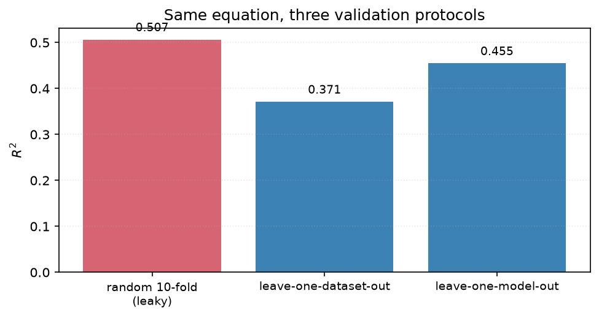
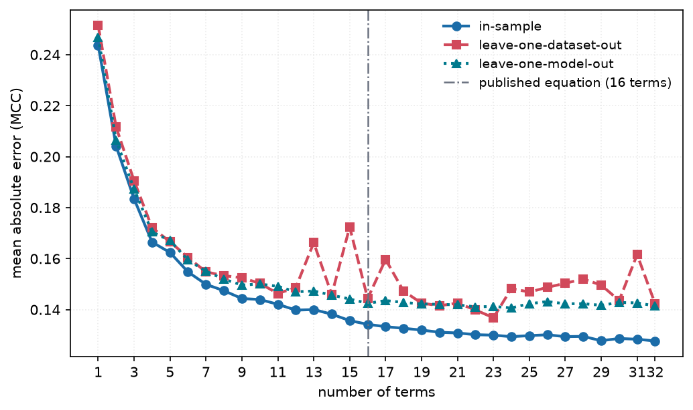
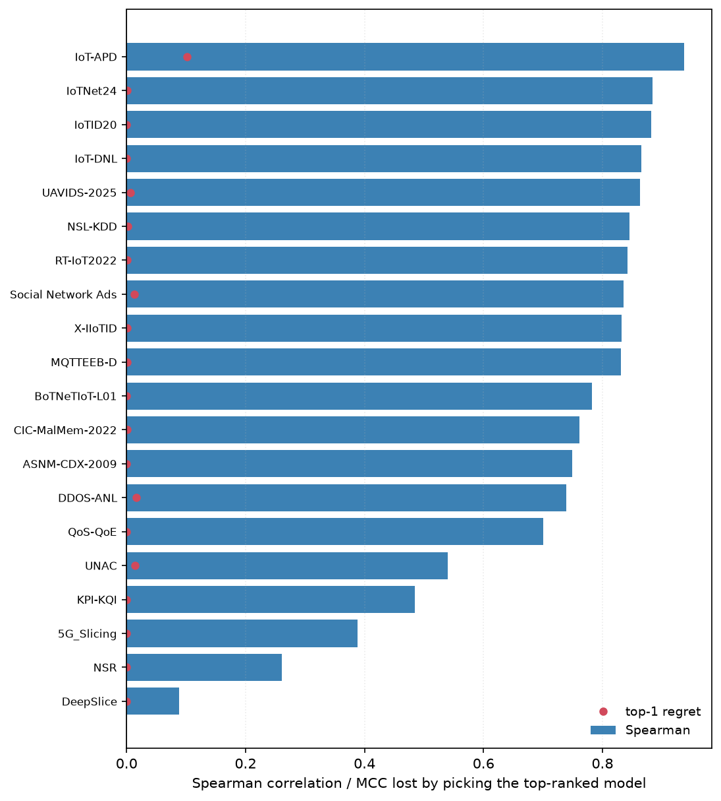
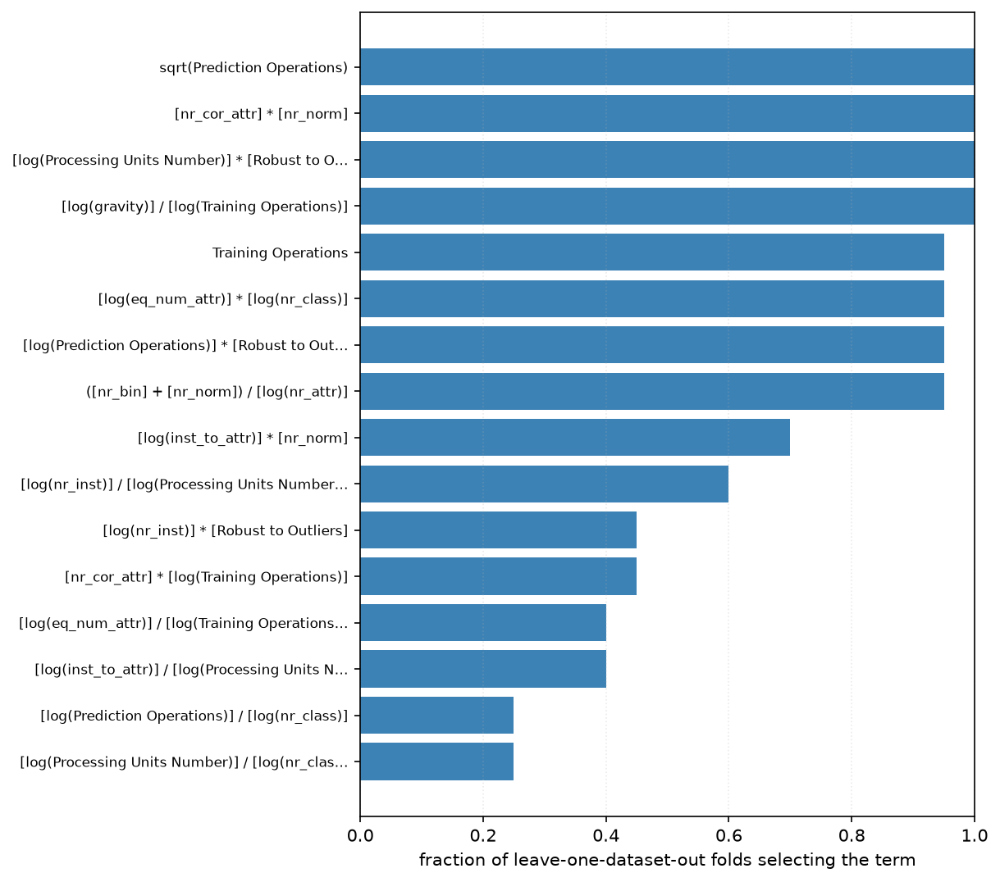

# 4. Evaluation methodology

*Implemented in `metafit.validate` and `metafit.stats`.*

## Protocols

| protocol | fitted on | scored on | question answered |
|---|---|---|---|
| **in-sample** | all 476 rows | the same 476 rows | how well does the equation *describe* the data |
| **leave-one-dataset-out** | 19 datasets | the held-out 20th, rotated | what will these models score on a dataset nobody has run |
| **leave-one-model-out** | 24 models | the held-out 25th, rotated | what will a new model score on datasets we know |

In-sample is reported as a first-class result rather than dismissed. Term count is capped
and terms are drawn from a screened pool, so this is **equation fitting, not model
fitting**: the capacity to memorise 476 rows with 14 terms is limited, and the gap between
in-sample and cross-validated columns is itself the diagnostic. For contrast, a
RandomForest reaches 0.910 in-sample and 0.067 leave-one-dataset-out on the same features.

Leave-one-dataset-out is the harder and more useful number, and is the one the study
leads with for transfer claims.

## Term selection happens inside the fold

Screening the library against the full target and then cross-validating only the weights
is a standard way to leak the held-out fold into the model. In `cross_validate_path`, the
standardiser, the screening pool, the beam search and the weights are all recomputed from
the training rows of each fold. Only the term *vocabulary* — which is a function of the
feature columns, not the target — is shared.

## Random k-fold is a leak, not a protocol

Dataset meta-features are **constant across a dataset's 25 rows**. A random split
therefore puts the same dataset on both sides of the fold, and the equation recognises the
dataset rather than generalising to it.

The **same equation**, three protocols:

| protocol | R² | MAE |
|---|---|---|
| random 10-fold | **0.514** | 0.169 |
| leave-one-dataset-out | **0.371** | 0.199 |
| leave-one-model-out | **0.455** | 0.191 |

A reported R² near 0.5 on this kind of meta-data may be describing the split rather than
the model. `metafit.validate.random_kfold_groups` exists **only** to produce this
comparison; it is never used to score a result.

This is the same concern as subject-wise splitting in clinical machine learning, and the
same recommendation made by community reporting standards (Walsh et al., 2020).

## Metrics

| metric | units | why |
|---|---|---|
| **R²** | — | variance explained; the comparable headline |
| **MAE** | MCC | the honest error headline — what a practitioner actually asks |
| RMSE | MCC | outlier-sensitive companion to MAE |
| SMAPE | % | scale-free, but see the caveat below |
| Spearman | — | rank quality, insensitive to the MCC ceiling |

### A caveat on R²

R² is computed against the mean of the **evaluated** rows, so its denominator is the
variance of whatever is being scored. An R² over the 20 aggregated dataset means and one
over the 476 raw rows share no denominator and **cannot be compared**. This is why E1 is
reported on both scales ([chapter 6](06-results.md)).

### A caveat on SMAPE

SMAPE divides by $|y| + |\hat{y}|$, and **38 of the 476 rows have MCC exactly 0**. Each
contributes the full 200% unless the prediction is also exactly 0, so the metric is
dominated by the rows the equation is already known to handle worst rather than by its
typical error. It is reported because it is scale-free and was requested, but MAE is the
honest headline for a target that legitimately passes through zero.

## Ranking quality

For model *selection* the relevant questions are rank correlation within a held-out
dataset and **top-1 regret** — how much MCC is given up by picking the model the equation
ranks first.

The mean hides a wide spread: IoT-APD ranks at 0.88, DeepSlice at 0.03.

## Baselines

An equation earns its place only by beating the obvious alternatives:

| baseline | R² | MAE |
|---|---|---|
| global mean (loo-dataset) | -0.040 | 0.293 |
| per-model mean (loo-dataset) | 0.201 | 0.238 |
| global mean (loo-model) | -0.024 | 0.290 |
| per-dataset mean (loo-model) | 0.296 | 0.213 |

E2 beats all four on its respective protocol. **One honest caveat:** for *ranking* models
on a new dataset, the trivial "average MCC of this model elsewhere" baseline achieves a
higher mean per-dataset Spearman (0.70) than E2 (0.61) at comparable top-1 regret. E2 wins
on predicting the MCC *value*; it does not dominate on ranking.

## Term stability

A fitted equation presents a term chosen in 19 of 20 folds and one chosen in 3
identically. `CrossValidation.stability()` counts selection frequency across folds, and no
extracted practice ([chapter 7](07-practices.md)) is published from a term below 50%.

