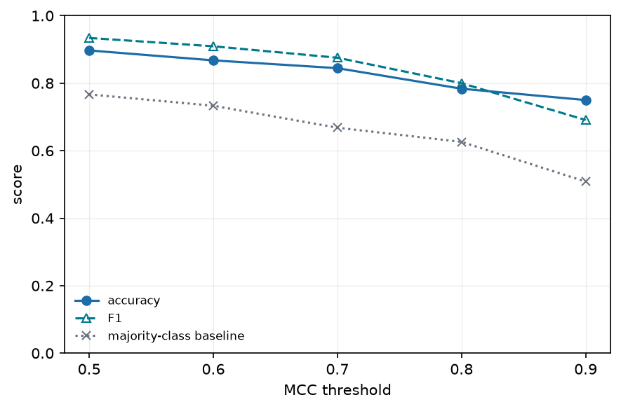
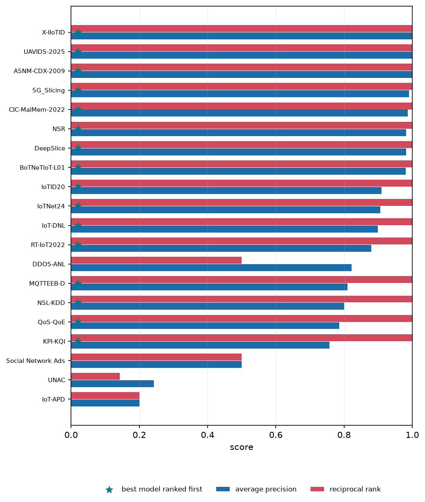

# 5. Evaluation

*Implemented in `ml_meta_perf.validate` and `ml_meta_perf.stats`.*

## Protocols

| protocol | fitted on | scored on | question answered |
|---|---|---|---|
| **in-sample** | all 476 rows | the same 476 rows | how well does the equation *describe* the data |
| **leave-one-dataset-out** | 19 datasets | the held-out 20th, rotated | what will these models score on a dataset nobody has run |
| **leave-one-model-out** | 24 models | the held-out 25th, rotated | what will a new model score on datasets we know |

In-sample is reported as a first-class result rather than dismissed. Term count is capped
and terms are drawn from a screened pool, so this is **equation fitting, not model
fitting**: the capacity to memorise 476 rows with 20 terms is limited, and the gap between
in-sample and cross-validated columns is itself the diagnostic. For contrast, a
RandomForest reaches 0.910 in-sample and 0.067 leave-one-dataset-out on the same features.

Leave-one-dataset-out is the harder and more useful number, and is the one the study
leads with for transfer claims.

## One equation, refit — not one search per fold

**The equation's form is chosen once. In every fold, only its weights are refit.** That is
`ml_meta_perf.validate.cross_validate_fixed_form`, and it is a position about what the
artefact is rather than a statistical convenience.

The form of an equation is its conceptual claim — a statement about which quantities govern
how well a learner does on a dataset. For a simpler problem one would write that form down
from domain expertise and never search for it at all. What cross-validation then asks is
whether the claim survives data it has not seen, with its constants recalibrated. It does not
ask whether a search would have rediscovered the same form, because that is a question about
the search.

Re-running selection inside every fold answers that other question, and answering it *as
though it were the first* has a cost: twenty folds fit twenty different equations, so the
pooled R² is an average over twenty models. Measured here, that made leave-one-dataset-out
move by as much as 0.3 when the requested length changed by two, while the fixed form varies
by 0.014 over the same range. The reported curve is smooth because it is one equation being
asked the same question at different lengths.

### What licenses fixing the form

A form arrived at by searching all 476 rows is only a claim about the phenomenon if a
different sample would have produced it. That is measured rather than assumed.
`ml_meta_perf.validate.fold_selections` re-runs selection in each fold and returns **term
names and no predictions** — so the re-selecting protocol cannot produce a reported score
even by accident — and `term_stability` counts how often each of the published equation's
terms comes back when a fifth of the data is removed. A form whose terms churn fold to fold
has not earned this protocol. The table is in the generated section below.

### What is still shared across folds

The term *vocabulary* — which terms exist at all — is built from the feature columns, not the
target, and is shared. That is required rather than conceded: rebuilding it per fold would
make a term *admissible* on the training rows but undefined on the held-out ones, and the
fold would score `NaN` rather than score badly. Admissibility is a property of the feature
columns and has to be decided once, globally.

## Random k-fold is a leak, not a protocol

Dataset meta-features are **constant across a dataset's 25 rows**. A random split
therefore puts the same dataset on both sides of the fold, and the equation recognises the
dataset rather than generalising to it.

The **same equation**, three protocols:

| protocol | R² | MAE |
|---|---|---|
| random 10-fold | **0.651** | 0.138 |
| leave-one-dataset-out | **0.627** | 0.144 |
| leave-one-model-out | **0.622** | 0.142 |

**The three now agree, and that is itself the finding.** A random split used to score 0.083
above leave-one-dataset-out, because putting rows from the same dataset on both sides of the
split let the equation recognise the dataset rather than generalise to it. The gap has closed
to 0.001. Two changes did it, and neither was a better search: the equation's *form* is now
fixed and only its weights are refit per fold (below), so there is far less for a leaky split
to leak into; and the model features are now constant within a learner rather than partly
functions of the dataset.

A gap of that kind is a diagnostic worth keeping even when it reads zero.
`ml_meta_perf.validate.random_kfold_groups` exists **only** to produce this comparison; it is
never used to score a result.

This is the same concern as subject-wise splitting in clinical machine learning, and the
same recommendation made by community reporting standards (Walsh et al., 2020).

## Metrics

| metric | units | why |
|---|---|---|
| **R²** | — | variance explained; the comparable headline |
| **MAE** | MCC | the honest error headline — what a practitioner actually asks |
| RMSE | MCC | outlier-sensitive companion to MAE |
| SMAPE | % | scale-free, but see the caveat below |
| Spearman | — | rank quality, insensitive to the MCC ceiling |

### The three equations on every metric, under every protocol

| | protocol | R² | MAE | SMAPE |
|---|---|---|---|---|
| E1 — dataset features | in-sample | 0.349 | 0.210 | 43.3 |
| | leave-one-dataset-out | 0.341 | 0.214 | 43.6 |
| | leave-one-model-out | 0.306 | 0.217 | 44.1 |
| E2 — model features | in-sample | 0.248 | 0.234 | 46.3 |
| | leave-one-dataset-out | 0.185 | 0.244 | 47.3 |
| | leave-one-model-out | 0.228 | 0.237 | 46.5 |
| **E3 — both** | **in-sample** | **0.658** | **0.137** | **34.5** |
| | **leave-one-dataset-out** | **0.638** | **0.142** | **34.9** |
| | **leave-one-model-out** | **0.622** | **0.145** | **35.4** |
| E3 — full grammar | in-sample | 0.707 | 0.122 | 32.5 |
| | leave-one-dataset-out | 0.678 | 0.130 | 33.8 |
| | leave-one-model-out | 0.651 | 0.133 | 34.1 |

Read against the hardest trivial predictor on each metric — which is a **different**
predictor for R² than for MAE and SMAPE, for the reason the next section gives:

| | R² | MAE | SMAPE |
|---|---|---|---|
| strongest mean baseline | 0.296 | 0.213 | 43.8 |
| strongest median baseline | 0.129 | **0.192** | **40.3** |
| **E3, leave-one-dataset-out** | **0.638** | **0.142** | **34.9** |

E3 clears both on all three. The margin is widest on R² and narrowest on SMAPE, which is
the caveat below doing its work: SMAPE is dominated by the 15 rows at exactly MCC = 0, and
a median baseline predicting near zero on a low-scoring model scores well on them.

### A caveat on R²

R² is computed against the mean of the **evaluated** rows, so its denominator is the
variance of whatever is being scored. Two R² values computed over different row sets share
no denominator and **cannot be compared**.

This used to bite here. E1 was fitted and scored on the 20 aggregated per-dataset means,
which put its 0.506 on a twenty-point denominator beside E3's on a 476-row one —
inviting exactly the comparison the caveat forbids, and in the direction that flatters the
control. All three equations are now fitted and scored on the same 476 rows
([chapter 4](04-equation.md)), so the caveat is a general warning rather than a live hazard
in this study's own tables. E1's transfer figure on the common scale is 0.341.

### A caveat on SMAPE

SMAPE divides by $|y| + |\hat{y}|$, and **15 of the 476 rows have MCC exactly 0**. Each
contributes the full 200% unless the prediction is also exactly 0, so the metric is
dominated by the rows the equation is already known to handle worst rather than by its
typical error. It is reported because it is scale-free and was requested, but MAE is the
honest headline for a target that legitimately passes through zero.

## Two questions the R² does not answer

An R² of 0.65 is a statement about how precisely the equation states an MCC. Nobody asks it
that. The two questions people actually ask are coarser, and the equation is graded on both.

### Will this model clear a bar?

Given a dataset and a threshold, does the equation put each model on the right side of it?
`ml_meta_perf.validate.decision_report` scores that at five thresholds, against the accuracy
of always answering with the larger class — the bar any such rule must clear.

| threshold | accuracy | F1 | MAP | majority-class baseline |
|---|---|---|---|---|
| 0.5 | 0.899 | 0.935 | 0.976 | 0.767 |
| 0.6 | 0.882 | 0.919 | 0.978 | 0.733 |
| 0.7 | 0.861 | 0.891 | 0.948 | 0.668 |
| 0.8 | 0.807 | 0.825 | 0.948 | 0.626 |
| 0.9 | 0.773 | 0.724 | 0.923 | 0.508 |

F1 is reported beside accuracy because the classes are unbalanced at the outer thresholds and
accuracy alone hides it: the majority rule reaches 0.51 accuracy at a threshold of 0.9 at an
F1 of exactly zero. **A regression too imprecise to state an MCC is accurate on the decision**,
because thresholding discards exactly the precision it lacks.

### Which model should I run?

Only the head of the list is ever used — a practitioner tries the top few and never sees the
tail — so the ranking is graded the way a search engine is. A model counts as a right answer
if its MCC is within 0.01 of the best on its dataset, rather than by a fixed top-k cut: 80 of
the 476 rows sit at exactly MCC 1.0, so many datasets have several genuinely tied best models
and a top-3 rule would score a correct answer as a miss.

| metric | E3 |
|---|---|
| average precision | 0.850 |
| mean reciprocal rank | 0.882 |
| hit@1 — best model ranked first | 0.800 |
| top-1 regret | 0.015 |

Regret is the one of the four stated in the target's own units, so it is worth reading on its
own: how much MCC a practitioner gives up by taking whichever model the equation ranks first.

On nine of the twenty held-out datasets the top pick is the dataset's best model to within the
relevance tolerance, so the regret is exactly zero. Three datasets carry most of the average —
KPI-KQI at 0.135, UNAC at 0.071 and IoT-APD at 0.058 — which is the spread a mean over twenty
folds hides, and the reason this is plotted per dataset rather than summarised.

**Spearman is deliberately absent from that table.** Measured on this corpus it sits between
0.63 and 0.73 for every predictor *and* every baseline, including a constant, so it cannot
separate any of the things this study compares. Average precision, reciprocal rank, hit@1 and
regret all weight the head of the list, which is where a model recommendation is read.

## Baselines

An equation earns its place only by beating the obvious alternatives, and there are more of
them than one. Every trivial predictor is reported at **two centres**, because the metrics
disagree about which is the honest opponent: the mean minimises squared error, the median
minimises absolute error. An MAE quoted against a mean baseline is quoted against a predictor
that is not minimising the metric it is being judged on.

| baseline | R² | MAE | SMAPE |
|---|---|---|---|
| global mean (loo-dataset) | -0.040 | 0.293 | 50.9 |
| per-model mean (loo-dataset) | 0.201 | 0.238 | 47.3 |
| global mean (loo-model) | -0.024 | 0.290 | 50.7 |
| per-dataset mean (loo-model) | **0.296** | 0.213 | 43.8 |
| global median (loo-dataset) | -0.303 | 0.258 | 43.6 |
| per-model median (loo-dataset) | 0.090 | 0.226 | 45.2 |
| global median (loo-model) | -0.294 | 0.256 | 43.4 |
| per-dataset median (loo-model) | 0.129 | **0.192** | **40.3** |

The two halves of that table disagree, and predictably: the strongest R² baseline is a mean
(0.296 against 0.129) and the strongest MAE and SMAPE baselines are medians (0.192 against
0.213, 40.3 against 43.8). Each metric has to be read against whichever is harder on it.
E3 clears both — 0.627 R², 0.144 MAE, 35.2 SMAPE under leave-one-dataset-out.

All of these are computed leave-one-group-out. With 17–25 rows per group, letting the row
being predicted into its own group's centre inflates the per-model mean's R² by 0.082;
`validate.baseline_group_centre` does it correctly and a naive group centre does not.

Every group-conditioned baseline also has a limit no metric shows: it is **empty under
leave-one-model-out**. A held-out model has no training row, so "how well does this model
usually do" does not exist. It is a competitor on one protocol and undefined on the other.

### On ranking, the equation does not beat "use whatever usually works"

Ranking is the one of the three questions where the equation does not clear the trivial
predictors, and reading it correctly needs the paired test rather than the means.

| | AP | MRR | hit@1 | top-1 regret |
|---|---|---|---|---|
| per-model mean (leave-one-dataset-out) | 0.798 | 0.835 | 0.750 | 0.011 |
| **E3** | 0.850 | 0.882 | 0.800 | 0.015 |
| per-model **median** (leave-one-dataset-out) | **0.837** | **0.885** | **0.850** | 0.009 |

Read as means, E3 leads the mean baseline and trails the median one on two of the four
measures. **Neither reading survives a paired test.** Compared dataset by dataset with
`validate.paired_comparison` — exact sign test plus a bootstrap over the twenty groups —
both intervals span zero: p = 0.21 against the per-model mean, p = 0.14 against the median.

**On ranking, the equation is indistinguishable from ordering the models by how well they
usually do.** Note also that `hit@1` moves only in steps of 0.05 on twenty datasets, so a
0.05 gap is one dataset changing its top pick — which is why a difference of two means over
twenty folds is not a measurement here.

That is a statement about the problem rather than a failure of the equation: knowing which
models are generally good is most of what *ranking* needs, which is why a trivial baseline is
hard to beat there. The generated section at the end of this chapter states the verdict from
the paired test rather than from the table, so it cannot drift into the optimistic reading.

### On predicting the value, and on the go/no-go decision, it wins clearly

| | R² (loo-dataset) | threshold MCC @ 0.7 |
|---|---|---|
| per-model mean | 0.201 | 0.439 |
| per-model median | 0.090 | 0.304 |
| **E3** | **0.627** | **0.683** |

Knowing *how well* a particular model will do on a particular dataset is what needs the
meta-features, and no group centre has anything to say about it. The same holds once the
prediction is thresholded into the go/no-go rule a practitioner actually asks for: against a
majority-class floor of 0.668 accuracy, E3 reaches MCC 0.683 where the trivial predictors
reach 0.439 and 0.304.

So the summary across the three questions is: **clearly better at predicting the value,
clearly better at the threshold decision, and no better at ranking.**

## Term stability

A fitted equation presents a term chosen in 19 of 20 folds and one chosen in 3
identically. `CrossValidation.stability()` counts selection frequency across folds, and no
extracted practice ([chapter 6](06-practices.md)) is published from a term below 50%.

## Flexible models do worse, not better

Standard regressors on the same raw features, under the same protocols:

| model | in-sample R² | LOO-dataset R² | LOO-model R² |
|---|---|---|---|
| RidgeCV (linear, 18 features) | 0.418 | **-2.002** | 0.328 |
| RandomForest (300 trees) | **0.910** | **0.067** | 0.465 |
| GradientBoosting | 0.820 | 0.049 | 0.354 |
| **ml-meta-perf E3 (15 terms)** | 0.658 | **0.638** | 0.622 |

Read the RandomForest row across. With 20 dataset groups a forest memorises dataset
identity almost perfectly and then transfers worse than a 15-term additive equation. This is also
the likely provenance of the R² ≈ 0.9 figures reported for opaque meta-models: an
in-sample or randomly-split forest reproduces them exactly, and the same forest is
near-useless on an unseen dataset.

> Measured with scikit-learn during exploration. It is not a dependency of the package.

<!-- generated: do not edit below -->

## How well it does

| protocol | R² | MAE | RMSE | n |
|---|---|---|---|---|
| in-sample | 0.6578 | 0.1371 | 0.2008 | 476 |
| loo-dataset | 0.6381 | 0.1417 | 0.2064 | 476 |
| loo-model | 0.6218 | 0.1449 | 0.2110 | 476 |

Cross-validated rows hold out a whole dataset or a whole model, so the equation is scored on a group it has never seen. That is the number that matters, and it is well below the in-sample one at this sample size.

Against the baselines and the ceiling that bounds any additive equation:

| equation | r2 | mae | rmse | smape | spearman | n |
|---|---|---|---|---|---|---|
| E1 (dataset only) | 0.3485 | 0.2103 | 0.2770 | 43.2650 | 0.6566 | 476 |
| E1 ceiling (true dataset means) | 0.3539 | 0.2042 | 0.2758 | 42.7254 | 0.6533 | 476 |
| E2 (model only) | 0.2485 | 0.2339 | 0.2975 | 46.2526 | 0.4594 | 476 |
| E2 ceiling (true model means) | 0.2821 | 0.2257 | 0.2908 | 45.8786 | 0.4870 | 476 |
| E3 (dataset + model) | 0.6578 | 0.1371 | 0.2008 | 34.4737 | 0.8194 | 476 |
| E3 capability (arity 3; 23 terms) | 0.7068 | 0.1224 | 0.1858 | 32.4556 | 0.8364 | 476 |
| additive oracle (ceiling) | 0.6605 | 0.1447 | 0.2000 | 35.2889 | 0.8100 | 476 |

#### The trivial predictors, at both centres

| baseline | r2 | mae | rmse | smape | spearman | n |
|---|---|---|---|---|---|---|
| global mean (loo-dataset) | -0.0396 | 0.2928 | 0.3499 | 50.9160 | -0.6527 | 476 |
| per-model mean (loo-dataset) | 0.2006 | 0.2382 | 0.3068 | 47.3028 | 0.3885 | 476 |
| global mean (loo-model) | -0.0239 | 0.2905 | 0.3473 | 50.6571 | -0.4787 | 476 |
| per-dataset mean (loo-model) | 0.2964 | 0.2132 | 0.2879 | 43.7772 | 0.5808 | 476 |
| global median (loo-dataset) | -0.3032 | 0.2580 | 0.3918 | 43.6423 | -0.6749 | 476 |
| per-model median (loo-dataset) | 0.0899 | 0.2256 | 0.3274 | 45.1719 | 0.3968 | 476 |
| global median (loo-model) | -0.2938 | 0.2556 | 0.3904 | 43.3930 | -0.4798 | 476 |
| per-dataset median (loo-model) | 0.1291 | 0.1920 | 0.3203 | 40.3032 | 0.6069 | 476 |
| additive oracle (ceiling, in-sample) | 0.6605 | 0.1447 | 0.2000 | 35.2889 | 0.8100 | 476 |

Every trivial predictor appears at its mean and at its median, because the metrics disagree about which is the honest opponent: the mean minimises squared error and the median minimises absolute error, so an MAE quoted against a mean baseline is quoted against a predictor that is not minimising the metric it is judged on. Reading the strongest baseline of each kind, per metric:

| metric | strongest mean baseline | strongest median baseline | harder |
|---|---|---|---|
| R2 | per-dataset mean (loo-model) (0.2964) | per-dataset median (loo-model) (0.1291) | **mean** |
| MAE | per-dataset mean (loo-model) (0.2132) | per-dataset median (loo-model) (0.1920) | **median** |
| SMAPE | per-dataset mean (loo-model) (43.7772) | per-dataset median (loo-model) (40.3032) | **median** |

#### How many terms, and why

The length is chosen by one rule with no threshold and no smoothing: **the argmax of the consensus curve** (`selection.best_length`), which here selects **15 terms**. Nothing about that number is written down — it falls out of the curve, and it re-derives itself if the corpus changes.

Every alternative rule is reported beside it, because a selection rule is only defensible if what it beats is on the page:

| rule | n_terms | r2_in_sample | r2_loo_dataset |
|---|---|---|---|
| pareto front, closest to ideal | 4 | 0.5390 | 0.5053 |
| pareto front, furthest from nadir | 4 | 0.5390 | 0.5053 |
| pareto front, furthest from chord | 4 | 0.5390 | 0.5053 |
| best loo-dataset | 15 | 0.6578 | 0.6381 |
| best consensus (the rule) | 15 | 0.6578 | 0.6381 |
| published | 15 | 0.6578 | 0.6381 |

The geometric rules — the Pareto-front knee by its three standard forms — choose far shorter equations, and **11 of the 32 lengths searched are significantly worse** than the selected one when paired fold by fold over the held-out datasets. A knee finds where the *marginal* return per term collapses, which on a saturating curve is early; it does not ask whether the accuracy still being added is real.

The parsimony alternative is **10 terms** — the shortest length whose paired interval against the selected one spans zero. It is reported and not adopted: the accuracy it gives up is measurable (0.6151 against 0.6381 leave-one-dataset-out) even where it is not significant.

#### How far the additive form reaches

The published equation is the **parsimonious** grammar (arity 2). The same features under the **full** grammar (arity 3), with the length chosen by the same rule, reach 23 terms at R² 0.7068 in-sample:

| | terms | in-sample | LOO-dataset | LOO-model |
|---|---|---|---|---|
| published (arity 2) | 15 | 0.6578 | 0.6381 | 0.6218 |
| capability (arity 3) | 23 | 0.7068 | 0.6781 | 0.6512 |

This is a **capability measurement, not a recommendation**. It answers the question the published equation cannot answer about itself — whether the additive form is out of room or whether this equation is short of it — and the answer is that +0.0490 of in-sample R² is still available to a longer equation over a wider grammar. What that costs is what the published equation is buying: more terms, an operation more, and a form that reselects far less often across folds.

#### What the vocabulary could reach, before any search

Three levels of what the vocabulary can explain, each a least-squares fit over the library and each computable before the search runs. They bound a *sum of per-feature functions*, which is a different question from the additive oracle above: that one bounds a per-dataset value plus a per-model value.

| level | terms | R² |
|---|---|---|
| every raw feature, untransformed | 18 | 0.4763 |
| the best single-feature term per feature | 18 | 0.5445 |
| every single-feature term at once | 75 | 0.6437 |
| **the fitted equation (E3)** | **15** | **0.6578** |

No individual feature carries much: the strongest is `eq_num_attr` at R² 0.142, so any accuracy beyond that is combination rather than a single dominant driver. Transforming the features is worth +0.068 over entering them raw.

E3 reaches 0.6578 with 15 terms, **above** the 0.6437 that all 75 single-feature terms reach together. An equation cannot pass that level by describing features one at a time, so the excess is what the cross-feature terms buy — the same conclusion the additive oracle reaches, by an independent route.

## Acting on it

R² is the wrong question for a practitioner, who asks whether a model will work on some data rather than what its MCC will be to three decimals. Thresholding both the prediction and the truth turns the equation into a go/no-go rule, scored here on held-out datasets:

| threshold | accuracy | majority | precision | recall | mcc | f1 | map | n_positive |
|---|---|---|---|---|---|---|---|---|
| 0.5000 | 0.8950 | 0.7668 | 0.9178 | 0.9479 | 0.6967 | 0.9326 | 0.9738 | 365 |
| 0.6000 | 0.8887 | 0.7332 | 0.9205 | 0.9284 | 0.7133 | 0.9244 | 0.9763 | 349 |
| 0.7000 | 0.8676 | 0.6681 | 0.9381 | 0.8585 | 0.7193 | 0.8966 | 0.9480 | 318 |
| 0.8000 | 0.8109 | 0.6261 | 0.9444 | 0.7416 | 0.6471 | 0.8308 | 0.9492 | 298 |
| 0.9000 | 0.7584 | 0.5084 | 0.9205 | 0.5744 | 0.5619 | 0.7074 | 0.9123 | 242 |

`majority` is the floor any such rule has to clear. The harder comparison is a predictor that answers "how well does this model usually do", thresholded the same way — at both centres, for the reason the error metrics report both:

| predictor | threshold | accuracy | majority | precision | recall | mcc | f1 | map | n_positive |
|---|---|---|---|---|---|---|---|---|---|
| equation (E3) | 0.5000 | 0.8950 | 0.7668 | 0.9178 | 0.9479 | 0.6967 | 0.9326 | 0.9738 | 365 |
| equation (E3) | 0.6000 | 0.8887 | 0.7332 | 0.9205 | 0.9284 | 0.7133 | 0.9244 | 0.9763 | 349 |
| equation (E3) | 0.7000 | 0.8676 | 0.6681 | 0.9381 | 0.8585 | 0.7193 | 0.8966 | 0.9480 | 318 |
| equation (E3) | 0.8000 | 0.8109 | 0.6261 | 0.9444 | 0.7416 | 0.6471 | 0.8308 | 0.9492 | 298 |
| equation (E3) | 0.9000 | 0.7584 | 0.5084 | 0.9205 | 0.5744 | 0.5619 | 0.7074 | 0.9123 | 242 |
| per-model mean | 0.5000 | 0.7395 | 0.7668 | 0.8005 | 0.8795 | 0.1842 | 0.8381 | 0.9788 | 365 |
| per-model mean | 0.6000 | 0.6828 | 0.7332 | 0.8113 | 0.7393 | 0.2506 | 0.7736 | 0.9567 | 349 |
| per-model mean | 0.7000 | 0.7227 | 0.6681 | 0.8550 | 0.7044 | 0.4391 | 0.7724 | 0.9645 | 318 |
| per-model mean | 0.8000 | 0.7122 | 0.6261 | 0.8368 | 0.6711 | 0.4374 | 0.7449 | 0.9332 | 298 |
| per-model mean | 0.9000 | 0.6450 | 0.5084 | 0.7744 | 0.4256 | 0.3314 | 0.5493 | 0.9408 | 242 |
| per-model median | 0.5000 | 0.7206 | 0.7668 | 0.7829 | 0.8795 | 0.0950 | 0.8284 | 0.9779 | 365 |
| per-model median | 0.6000 | 0.7416 | 0.7332 | 0.8038 | 0.8567 | 0.3018 | 0.8294 | 0.9432 | 349 |
| per-model median | 0.7000 | 0.6933 | 0.6681 | 0.7671 | 0.7767 | 0.3040 | 0.7719 | 0.9636 | 318 |
| per-model median | 0.8000 | 0.7437 | 0.6261 | 0.8121 | 0.7685 | 0.4635 | 0.7897 | 0.9301 | 298 |
| per-model median | 0.9000 | 0.6933 | 0.5084 | 0.6967 | 0.7025 | 0.3863 | 0.6996 | 0.9368 | 242 |

Ranking models within a held-out dataset:

- mean top-1 regret **0.015** MCC — what you give up by taking the model the equation ranks first

| predictor | ap | mrr | hit_at_1 | regret | datasets | ap_vs_e3_p | ap_vs_e3_significant |
|---|---|---|---|---|---|---|---|
| equation (E3) | 0.8502 | 0.8821 | 0.8000 | 0.0145 | 20 |  |  |
| per-model mean | 0.7980 | 0.8350 | 0.7500 | 0.0111 | 20 | 0.2101 | no |
| per-model median | 0.8375 | 0.8850 | 0.8500 | 0.0088 | 20 | 0.1435 | no |

**None of these differences survives a paired test.** Against per-model mean, per-model median the sign test and the bootstrap interval over datasets both include zero, so on ranking the equation is indistinguishable from ordering the models by how well they usually do. Read the means in the table above as ties, not as a ranking of the predictors — including where a baseline's mean is the larger one.

## What bounds the result

The additive form cannot represent dataset-by-model interaction beyond what its mixed terms reach. The ladder below adds interaction components to an oracle that is handed the true group means, so it measures the ceiling rather than any equation:

| interaction_rank | r2 | gain |
|---|---|---|
| 0 | 0.6605 |  |
| 1 | 0.7828 | 0.1223 |
| 2 | 0.8537 | 0.0709 |
| 3 | 0.8968 | 0.0431 |
| 4 | 0.9278 | 0.0310 |
| 6 | 0.9651 | 0.0373 |
| 8 | 0.9842 | 0.0191 |

That is a ceiling, not a score. Whether the equation reaches any of it is a separate question, and the answer is that it reaches some: below, `alignment` is the squared correlation between the equation's own interaction residual and the leading components of the oracle's, over observed cells. `leading_share` is how much of the interaction variance those components carry, and `interaction_share` how much of MCC's variance is interaction at all.

| protocol | rank | alignment | leading_share | interaction_share |
|---|---|---|---|---|
| in-sample | 1 | 0.3285 | 0.3757 | 0.3647 |
| in-sample | 2 | 0.2590 | 0.5658 | 0.3647 |
| leave-one-dataset-out | 1 | 0.3186 | 0.3757 | 0.3647 |
| leave-one-dataset-out | 2 | 0.2243 | 0.5658 | 0.3647 |

Variance of MCC explained by group identity alone, with no equation involved:

| knowing only | n_groups | variance_explained |
|---|---|---|
| dataset identity | 20 | 0.3539 |
| model identity | 25 | 0.2821 |

Validation protocol, same equation, different splits:

| protocol | r2 | mae | rmse | smape | spearman | n |
|---|---|---|---|---|---|---|
| random 10-fold (leaky) | 0.6378 | 0.1424 | 0.2065 | 34.9614 | 0.8052 | 476 |
| leave-one-dataset-out | 0.6381 | 0.1417 | 0.2064 | 34.8803 | 0.8095 | 476 |
| leave-one-model-out | 0.6218 | 0.1449 | 0.2110 | 35.4201 | 0.8072 | 476 |

<!-- end generated -->

## Limitations of the evaluation

### Ranking: the equation caught up with the trivial baseline, and no further

Before `Model Capability` joined the model side, the trivial per-model-mean baseline
out-ranked E3 outright — mean Spearman 0.703 against 0.648, top-1 regret 0.011 against 0.019
— while E3 won on predicting the MCC *value*. Two responses were tried and one worked, but
"worked" needs stating carefully.

A learning-to-rank objective was the obvious response and it **failed**. Squared error over
within-dataset pairs is ordinary least squares after centring both the design and the target
inside each dataset, so it costs one extra step and stays closed-form; it ranked *worse* than
the objective it was meant to beat, 0.532 against 0.625 (below). The loss function was never
the limitation.

Adding `Model Capability` to the model side is what moved it. On the means E3 now leads the
per-model **mean** baseline on every head-weighted metric — average precision 0.850 against
0.798, reciprocal rank 0.882 against 0.835, hit@1 0.800 against 0.750 — and **none of those
margins survives pairing over the twenty held-out datasets** (average precision p = 0.21,
interval spanning zero).

**And the mean is not the hardest baseline.** The per-model **median** is a different ordering
and a better one on two of the four measures: average precision 0.837, reciprocal rank 0.885,
hit@1 0.850 against E3's 0.800, top-1 regret 0.009 against 0.015. That comparison does not
survive pairing either (p = 0.14). Reporting only the mean baseline made the equation look
like it had won a contest it had drawn.

| | AP | MRR | hit@1 | top-1 regret |
|---|---|---|---|---|
| per-model mean | 0.798 | 0.835 | 0.750 | 0.011 |
| **E3** | **0.850** | 0.882 | 0.800 | 0.015 |
| per-model median | 0.837 | **0.885** | **0.850** | **0.009** |

So the honest statement is that **the equation caught up with the trivial baselines and did
not pass them**. That is still the diagnosis confirming itself — a per-model centre
out-ranked the equation because it knew something the equation did not, roughly which models
are good, and the fix was to tell the equation rather than to change how it was fitted. But a
study that stops at "E3 wins on all four" is reading four means over twenty folds, which is
what [`validate.paired_comparison`](../../src/ml_meta_perf/validate.py) exists to prevent,
and hit@1 moves only in steps of 0.05 on twenty datasets.

Where the equation does clear the trivial predictors, and clearly, is the two questions that
are not ranking: predicting the MCC value (0.638 leave-one-dataset-out against 0.201) and the
go/no-go threshold decision (MCC 0.683 against 0.439 and 0.304 at a threshold of 0.7).
[Chapter 5](05-evaluation.md) reports all three together.

Spearman does not enter any of this. It sits between 0.63 and 0.73 for every predictor and
every baseline on this corpus, including a constant.

### What would change the conclusions

| if | then |
|---|---|
| more datasets (OpenML-scale) | would settle whether the 0.6605 additive ceiling is a property of this sample or of the approach |
| richer model descriptors | would test whether the 42% unexplained model capability is reachable |
| an interaction-aware but interpretable term family | would test whether the +0.122 rank-1 gap can be closed without abandoning readability |
| a learning-to-rank objective | would test whether the ranking gap against the per-model-mean baseline closes |
| refitting across a configuration grid | would separate evidence that describes the data from evidence that describes one equation |
| recording failed training runs | would let the study speak about whether to try a model at all, not only about how good a trained one will be |
| training without the 100k sampling cap, or recording the sampled size | would make training-set size a variable the study can reason about at all |
