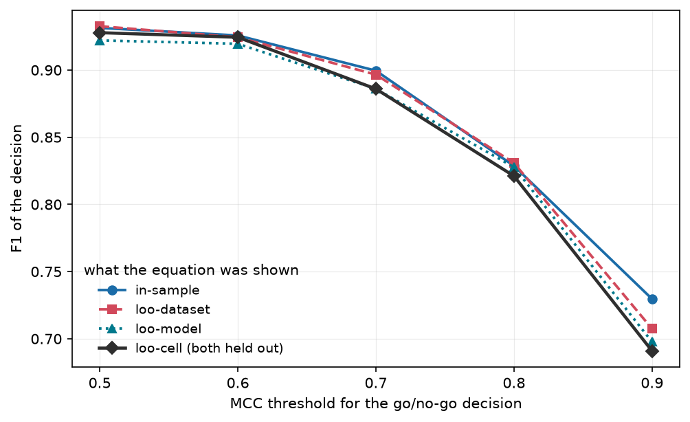
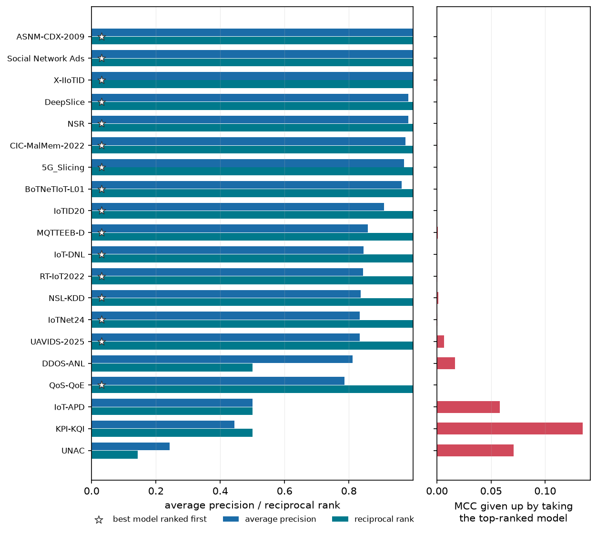

# 5. Evaluation

*Implemented in `ml_meta_perf.validate` and `ml_meta_perf.stats`.*

## Four protocols

| protocol | fitted on | scored on | question answered |
|---|---|---|---|
| **in-sample** | all 476 rows | the same 476 rows | how well does the equation *describe* the data |
| **leave-one-dataset-out** | 19 datasets | the held-out 20th, rotated | what will these models score on a dataset nobody has run |
| **leave-one-model-out** | 24 models | the held-out 25th, rotated | what will a new model score on datasets we know |
| **doubly-held-out cell** | every row sharing neither the dataset nor the model | one observed (dataset, model) cell, rotated over all 476 | what will *this* model score on *this* dataset, when neither has been run |

**The fourth is the question the study is actually for**, and it is the strictest of the
four: leave-one-dataset-out still shows a predictor the held-out learner on nineteen other
problems, and leave-one-model-out still shows it the held-out dataset. Only the cell protocol
denies both, which makes it the one place an equation and an opaque regressor are denied the
same things. `ml_meta_perf.validate.cross_validate_doubly_held_out` implements it, one refit
per observed cell rather than per group.

It is also where the study's decisions are settled. `selection.floor_curve` takes the
**minimum over all four**, so a length and a grammar are judged by their worst showing rather
than their best; the ranking and threshold tables in the generated sections below report the
equation under it; and the strictest column is the one the arity comparison in
[chapter 2](02-additive-model.md#the-arity-is-searched-not-set) is decided on.

In-sample is reported as a first-class result rather than dismissed. Term count is capped
and terms are drawn from a screened pool, so this is **equation fitting, not model
fitting**: the capacity to memorise 476 rows with 15 terms is limited, and the gap between
in-sample and the other three is itself the diagnostic. For contrast, a RandomForest on the
same eighteen raw columns reaches 0.9586 in-sample, 0.0802 leave-one-dataset-out and
**-0.0083** with both held out — the table is in the generated
[opaque section](#what-an-opaque-model-reaches-and-does-not) below, and that ordering is the
whole of the argument this study makes for a readable form.

## One equation, refit — not one search per fold

**The equation's form is chosen once. In every fold, only its weights are refit.** That is
`ml_meta_perf.validate.cross_validate_fixed_form`, and it is a position about what the
artefact is rather than a statistical convenience.

The form of an equation is its conceptual claim — a statement about which quantities govern
how well a learner does on a dataset. For a simpler problem one would write that form down
from domain expertise and never search for it at all. What cross-validation then asks is
whether the claim survives data it has not seen, with its constants recalibrated. It does not
ask whether a search would have rediscovered the same form, because that is a question about
the search.

Re-running selection inside every fold answers that other question, and answering it *as
though it were the first* has a cost: twenty folds fit twenty different equations, so the
pooled R² is an average over twenty models. Measured here, that made leave-one-dataset-out
move by as much as 0.3 when the requested length changed by two, while the fixed form varies
by 0.014 over the same range. The reported curve is smooth because it is one equation being
asked the same question at different lengths.

### What licenses fixing the form

A form arrived at by searching all 476 rows is only a claim about the phenomenon if a
different sample would have produced it. That is measured rather than assumed.
`ml_meta_perf.validate.fold_selections` re-runs selection in each fold and returns **term
names and no predictions** — so the re-selecting protocol cannot produce a reported score
even by accident — and `term_stability` counts how often each of the published equation's
terms comes back when a fifth of the data is removed. A form whose terms churn fold to fold
has not earned this protocol. The table is in the generated section below.

### What is still shared across folds

The term *vocabulary* — which terms exist at all — is built from the feature columns, not the
target, and is shared. That is required rather than conceded: rebuilding it per fold would
make a term *admissible* on the training rows but undefined on the held-out ones, and the
fold would score `NaN` rather than score badly. Admissibility is a property of the feature
columns and has to be decided once, globally.

## Random k-fold is a leak, not a protocol

Dataset meta-features are **constant across a dataset's 25 rows**. A random split
therefore puts the same dataset on both sides of the fold, and the equation recognises the
dataset rather than generalising to it.

The same equation under all three splits is the generated
[Why a random split is not a protocol](#why-a-random-split-is-not-a-protocol) table below —
this section does not keep a second copy, for the reason given
[above](#where-the-numbers-are).

**The three now agree, and that is itself the finding.** A random split used to score 0.083
above leave-one-dataset-out, because putting rows from the same dataset on both sides of the
split let the equation recognise the dataset rather than generalise to it. The gap has closed
to 0.001. Two changes did it, and neither was a better search: the equation's *form* is now
fixed and only its weights are refit per fold (below), so there is far less for a leaky split
to leak into; and the model features are now constant within a learner rather than partly
functions of the dataset.

A gap of that kind is a diagnostic worth keeping even when it reads zero.
`ml_meta_perf.validate.random_kfold_groups` exists **only** to produce this comparison; it is
never used to score a result.

This is the same concern as subject-wise splitting in clinical machine learning, and the
same recommendation made by community reporting standards (Walsh et al., 2020).

## Metrics

| metric | units | why |
|---|---|---|
| **R²** | — | variance explained; the comparable headline |
| **MAE** | MCC | the honest error headline — what a practitioner actually asks |
| RMSE | MCC | outlier-sensitive companion to MAE |
| SMAPE | % | scale-free, but see the caveat below |
| Spearman | — | rank quality over all 476 rows, insensitive to the MCC ceiling |

Spearman is reported for the regression task and **not** used to compare rankings. On this
corpus it sits between 0.63 and 0.73 for every predictor *and* every baseline, including a
constant, so it separates none of the things the ranking section compares; average precision,
reciprocal rank, hit@1 and regret weight the head of the list, which is where a model
recommendation is actually read.

### Where the numbers are

Every equation on every metric under every protocol, and every trivial predictor beside them,
is in the generated [How well it does](#how-well-it-does) section below. **This chapter used
to carry its own copy of that table and it went stale twice** — once when the fourth protocol
was added and the copy still showed three, and once when the three equations were put on one
configuration and E1 and E2 both moved. A hand-written table beside a generated one is a
second source of truth for numbers that have exactly one.

Two things about it are worth saying in prose, because they are not visible in the table.

**The hardest trivial predictor is a different one for R² than for MAE and SMAPE.** MAE is
minimised by the median and R² by the mean, so a comparison that reports only mean baselines
is not reading each metric against the predictor that is hardest to beat on it. Both centres
are reported, which is what the `at both centres` sub-table below is for.

**E3's margin is widest on R² and narrowest on SMAPE**, and that is the SMAPE caveat below
doing its work rather than a weakness: the metric is dominated by the 15 rows at exactly
MCC = 0, where a median baseline predicting near zero scores well.

### A caveat on R²

R² is computed against the mean of the **evaluated** rows, so its denominator is the
variance of whatever is being scored. Two R² values computed over different row sets share
no denominator and **cannot be compared**.

This used to bite here. E1 was fitted and scored on the 20 aggregated per-dataset means,
which put its 0.506 on a twenty-point denominator beside E3's on a 476-row one —
inviting exactly the comparison the caveat forbids, and in the direction that flatters the
control. All three equations are now fitted and scored on the same 476 rows
([chapter 4](04-equation.md)), so the caveat is a general warning rather than a live hazard
in this study's own tables. E1's transfer figure on the common scale is in the table below.

### A caveat on SMAPE

SMAPE divides by $|y| + |\hat{y}|$, and **15 of the 476 rows have MCC exactly 0**. Each
contributes the full 200% unless the prediction is also exactly 0, so the metric is
dominated by the rows the equation is already known to handle worst rather than by its
typical error. It is reported because it is scale-free and was requested, but MAE is the
honest headline for a target that legitimately passes through zero.

## Two questions the R² does not answer

An R² of 0.65 is a statement about how precisely the equation states an MCC. Nobody asks it
that. The two questions people actually ask are coarser, and the equation is graded on both.

### Will this model clear a bar?

Given a dataset and a threshold, does the equation put each model on the right side of it?
`ml_meta_perf.validate.decision_report` scores that at five thresholds, against the accuracy
of always answering with the larger class — the bar any such rule must clear.

The table is in the generated section below, at all five thresholds and with precision,
recall and MCC beside the three columns named here. It is not repeated at this point in the
chapter: a hand-copied version stood here until 2026-09-07 and had drifted from the generated
one 240 lines further down the same file.

F1 is reported beside accuracy because the classes are unbalanced at the outer thresholds and
accuracy alone hides it: the majority rule reaches 0.51 accuracy at a threshold of 0.9 at an
F1 of exactly zero. **A regression too imprecise to state an MCC is accurate on the decision**,
because thresholding discards exactly the precision it lacks.

### Which model should I run?

Only the head of the list is ever used — a practitioner tries the top few and never sees the
tail — so the ranking is graded the way a search engine is. A model counts as a right answer
if its MCC is within 0.01 of the best on its dataset, rather than by a fixed top-k cut: 80 of
the 476 rows sit at exactly MCC 1.0, so many datasets have several genuinely tied best models
and a top-3 rule would score a correct answer as a miss.

The equation and every competitor are in the generated [Acting on it](#acting-on-it) tables
below, **each row naming the protocol it was scored under** — which matters more here than
anywhere else in the chapter, because a ranking scored in-sample and a ranking scored with
both the dataset and the model held out are not the same claim. The four E3 rows differ by
0.019 of average precision across the four protocols, and the strictest one, `loo-cell`, is
what this section's conclusions are read from.

On nine of the twenty held-out datasets the top pick is the dataset's best model to within the
relevance tolerance, so the regret is exactly zero. Three datasets carry most of the average —
KPI-KQI at 0.135, UNAC at 0.071 and IoT-APD at 0.058 — which is the spread a mean over twenty
folds hides, and the reason this is plotted per dataset rather than summarised.

## Baselines

An equation earns its place only by beating the obvious alternatives, and there are more of
them than one. Every trivial predictor is reported at **two centres**, because the metrics
disagree about which is the honest opponent: the mean minimises squared error, the median
minimises absolute error. An MAE quoted against a mean baseline is quoted against a predictor
that is not minimising the metric it is being judged on.

The table is generated: [The trivial predictors, at both
centres](#the-trivial-predictors-at-both-centres), with the strongest of each kind picked out
per metric beneath it.

The two halves of it disagree, and predictably: the strongest R² baseline is a mean and the
strongest MAE and SMAPE baselines are medians. Each metric has to be read against whichever
is harder on it, and E3 clears both on all three.

All of these are computed leave-one-group-out. With 17–25 rows per group, letting the row
being predicted into its own group's centre inflates the per-model mean's R² by 0.082;
`validate.baseline_group_centre` does it correctly and a naive group centre does not.

Every group-conditioned baseline also has a limit no metric shows: it is **empty under
leave-one-model-out**. A held-out model has no training row, so "how well does this model
usually do" does not exist. It is a competitor on one protocol and undefined on the other.

### On ranking, the equation does not beat "use whatever usually works"

Ranking is the one of the three questions where the equation does not clear the trivial
predictors, and reading it correctly needs the paired test rather than the means.

The comparison is in the generated section below, and it carries **four rows for the equation
and two for the baselines**. The four are the four protocols — in-sample, dataset held out,
model held out, and both held out — because a ranking comparison is only a comparison if
every side is scored under the same one, and this went wrong twice: the ranking was once
scored in-sample against leave-one-out baselines, and the leave-one-out baselines then turned
out to be handed the model identity the equation is denied. Every row names its protocol.

Read as means, E3 leads the per-model **mean** baseline on every head-weighted metric and
trails the per-model **median** on two of four. **Neither reading survives a paired test.**
Compared dataset by dataset with `validate.paired_comparison` — an exact sign test plus a
bootstrap over the twenty groups — both intervals span zero, and the generated section states
the verdict from that test rather than from the table so it cannot drift into the optimistic
reading.

**On ranking, the equation is indistinguishable from ordering the models by how well they
usually do.** Note also that `hit@1` moves only in steps of 0.05 on twenty datasets, so a
0.05 gap is one dataset changing its top pick — which is why a difference of two means over
twenty folds is not a measurement here.

That is a statement about the problem rather than a failure of the equation: knowing which
models are generally good is most of what *ranking* needs, which is why a trivial baseline is
hard to beat there.

**The figures show the strictest protocol; the tables show all four.** A figure has room for
one line per dataset and the honest one to draw is the leave-one-cell protocol, where neither
the dataset nor the model was in the fit. The tables keep every protocol beside it, because
the spread between them is itself the measurement — it is the cost of generalisation on this
task, and it cannot be read off a single line.

### On predicting the value, and on the go/no-go decision, it wins clearly

Knowing *how well* a particular model will do on a particular dataset is what needs the
meta-features, and no group centre has anything to say about it: the trivial predictors sit
far below the equation on R², and the generated tables below give both, each row naming its
protocol. The same holds once the prediction is thresholded into the go/no-go rule a
practitioner actually asks for — the decision table reports the equation and both trivial
centres at every threshold, against the majority-class floor any such rule has to clear.

So the summary across the three questions is: **clearly better at predicting the value,
clearly better at the threshold decision, and no better at ranking.**

## Term stability

A fitted equation presents a term chosen in 19 of 20 folds and one chosen in 3
identically. `CrossValidation.stability()` counts selection frequency across folds, and no
extracted practice ([chapter 6](06-practices.md)) is published from a term below 50%.

## Flexible models do worse, not better

This is the other half of the trade the study is making, and it has to be priced rather than
asserted. Three standard regressors — a cross-validated ridge, a random forest and a gradient
boosting ensemble — are fitted on the same eighteen raw columns and scored under the same
protocols, with the same clip to the training fold's range. **The table is generated on every
run**, in the section below; it was measured once by hand until 2026-09-07, which for a study
whose argument is that its analysis is generated was the wrong way round, and the hand-copied
numbers had drifted.

The shape of the result is stable and is the point:

**A forest fits this meta-data almost perfectly and cannot generalise across datasets.** With
twenty dataset groups and dataset features constant within a group, it identifies the dataset
and looks the answer up. Identification is worth nothing on a dataset nobody has run, which
is why the in-sample and leave-one-dataset-out columns of that row have to be read together.

**Every protocol is reported, and the ordering of the four columns is the finding.** Removing
a whole model costs the forest little; removing a whole dataset costs it almost everything;
removing both leaves it at or below what predicting the corpus mean would score. That is the
signature of a model that learned which dataset a row came from rather than a relationship.

**The leave-one-cell column is the like-for-like comparison, and the only one.** Under
leave-one-dataset-out a forest still has the held-out learner on nineteen other problems;
under leave-one-model-out it still has the held-out dataset. Only with both removed is it
denied what the equation is denied — and it is also the protocol on which the trivial
per-model baselines cannot be computed at all, since a model held out of every fold has no
rows to average. A feature-based predictor still predicts.

**And it loses on the two decisions as well, to the equation *and* to the trivial
predictors.** This is the part that was never measured before. On the go/no-go decision at a
0.7 threshold the opaque models reach an MCC around 0.27, against the equation's 0.70 under
the same leave-one-cell protocol and 0.44 for a per-model mean scored under an easier one —
so a forest is worse at deciding whether a model will clear a bar than "how well does this
model usually do". On ranking they do not reach the equation either, and again fall short of
the per-model median. Both comparisons are in the generated ranking and decision tables, with
**every row naming its protocol** and every opaque estimator appearing under all four.

The honest summary is not that opaque models are bad at this. It is that **the accuracy this
study traded away was not there to be had** under a protocol where the dataset is genuinely
unseen, so the trade cost less than the R² gap in-sample suggests.

<!-- generated: do not edit below -->

## How well it does

| protocol | R² | MAE | RMSE | n |
|---|---|---|---|---|
| in-sample | 0.6578 | 0.1371 | 0.2008 | 476 |
| loo-dataset | 0.6381 | 0.1417 | 0.2064 | 476 |
| loo-model | 0.6218 | 0.1449 | 0.2110 | 476 |
| loo-cell | 0.6162 | 0.1481 | 0.2126 | 476 |

Cross-validated rows hold out a whole dataset or a whole model, so the equation is scored on a group it has never seen. That is the number that matters, and it is well below the in-sample one at this sample size.

Against the baselines and the ceiling that bounds any additive equation:

| equation | n_terms | r2 | mae | rmse | smape | spearman | n |
|---|---|---|---|---|---|---|---|
| E1, dataset only (10 terms) | 10 | 0.3506 | 0.2094 | 0.2766 | 43.1850 | 0.6580 | 476 |
| E1 reference: true dataset means |  | 0.3539 | 0.2042 | 0.2758 | 42.7254 | 0.6533 | 476 |
| E2, model only (6 terms) | 6 | 0.2515 | 0.2345 | 0.2969 | 46.3101 | 0.4539 | 476 |
| E2 reference: true model means |  | 0.2821 | 0.2257 | 0.2908 | 45.8786 | 0.4870 | 476 |
| E3, dataset + model (15 terms) | 15 | 0.6578 | 0.1371 | 0.2008 | 34.4737 | 0.8194 | 476 |
| E3 capability, arity 3 (23 terms) | 23 | 0.6751 | 0.1324 | 0.1956 | 33.6903 | 0.8288 | 476 |
| reference: additive oracle |  | 0.6605 | 0.1447 | 0.2000 | 35.2889 | 0.8100 | 476 |

#### The trivial predictors, at both centres

| baseline | r2 | mae | rmse | smape | spearman | n |
|---|---|---|---|---|---|---|
| global mean (loo-dataset) | -0.0396 | 0.2928 | 0.3499 | 50.9160 | -0.6527 | 476 |
| per-model mean (loo-dataset) | 0.2006 | 0.2382 | 0.3068 | 47.3028 | 0.3885 | 476 |
| global mean (loo-model) | -0.0239 | 0.2905 | 0.3473 | 50.6571 | -0.4787 | 476 |
| per-dataset mean (loo-model) | 0.2964 | 0.2132 | 0.2879 | 43.7772 | 0.5808 | 476 |
| global median (loo-dataset) | -0.3032 | 0.2580 | 0.3918 | 43.6423 | -0.6749 | 476 |
| per-model median (loo-dataset) | 0.0899 | 0.2256 | 0.3274 | 45.1719 | 0.3968 | 476 |
| global median (loo-model) | -0.2938 | 0.2556 | 0.3904 | 43.3930 | -0.4798 | 476 |
| per-dataset median (loo-model) | 0.1291 | 0.1920 | 0.3203 | 40.3032 | 0.6069 | 476 |
| additive oracle (ceiling, in-sample) | 0.6605 | 0.1447 | 0.2000 | 35.2889 | 0.8100 | 476 |

Every trivial predictor appears at its mean and at its median, because the metrics disagree about which is the honest opponent: the mean minimises squared error and the median minimises absolute error, so an MAE quoted against a mean baseline is quoted against a predictor that is not minimising the metric it is judged on. Reading the strongest baseline of each kind, per metric:

| metric | strongest mean baseline | strongest median baseline | harder |
|---|---|---|---|
| R2 | per-dataset mean (loo-model) (0.2964) | per-dataset median (loo-model) (0.1291) | **mean** |
| MAE | per-dataset mean (loo-model) (0.2132) | per-dataset median (loo-model) (0.1920) | **median** |
| SMAPE | per-dataset mean (loo-model) (43.7772) | per-dataset median (loo-model) (40.3032) | **median** |

## Acting on it

R² is the wrong question for a practitioner, who asks whether a model will work on some data rather than what its MCC will be to three decimals. Thresholding both the prediction and the truth turns the equation into a go/no-go rule, scored here on held-out datasets:

| threshold | accuracy | majority | precision | recall | mcc | f1 | map | n_positive |
|---|---|---|---|---|---|---|---|---|
| 0.5000 | 0.8866 | 0.7668 | 0.9060 | 0.9507 | 0.6680 | 0.9278 | 0.9722 | 365 |
| 0.6000 | 0.8887 | 0.7332 | 0.9205 | 0.9284 | 0.7133 | 0.9244 | 0.9755 | 349 |
| 0.7000 | 0.8550 | 0.6681 | 0.9338 | 0.8428 | 0.6954 | 0.8860 | 0.9476 | 318 |
| 0.8000 | 0.8004 | 0.6261 | 0.9356 | 0.7315 | 0.6265 | 0.8211 | 0.9395 | 298 |
| 0.9000 | 0.7500 | 0.5084 | 0.9301 | 0.5496 | 0.5527 | 0.6909 | 0.9050 | 242 |

`majority` is the floor any such rule has to clear. The harder comparison is a predictor that answers "how well does this model usually do", thresholded the same way — at both centres, for the reason the error metrics report both:

| predictor | threshold | accuracy | majority | precision | recall | mcc | f1 | map | n_positive |
|---|---|---|---|---|---|---|---|---|---|
| equation (in-sample) | 0.5000 | 0.8929 | 0.7668 | 0.9153 | 0.9479 | 0.6899 | 0.9314 | 0.9753 | 365 |
| equation (in-sample) | 0.6000 | 0.8908 | 0.7332 | 0.9231 | 0.9284 | 0.7194 | 0.9257 | 0.9779 | 349 |
| equation (in-sample) | 0.7000 | 0.8718 | 0.6681 | 0.9446 | 0.8585 | 0.7301 | 0.8995 | 0.9501 | 318 |
| equation (in-sample) | 0.8000 | 0.8088 | 0.6261 | 0.9442 | 0.7383 | 0.6439 | 0.8286 | 0.9510 | 298 |
| equation (in-sample) | 0.9000 | 0.7773 | 0.5084 | 0.9533 | 0.5909 | 0.6037 | 0.7296 | 0.9149 | 242 |
| equation (loo-dataset) | 0.5000 | 0.8950 | 0.7668 | 0.9178 | 0.9479 | 0.6967 | 0.9326 | 0.9738 | 365 |
| equation (loo-dataset) | 0.6000 | 0.8887 | 0.7332 | 0.9205 | 0.9284 | 0.7133 | 0.9244 | 0.9763 | 349 |
| equation (loo-dataset) | 0.7000 | 0.8676 | 0.6681 | 0.9381 | 0.8585 | 0.7193 | 0.8966 | 0.9480 | 318 |
| equation (loo-dataset) | 0.8000 | 0.8109 | 0.6261 | 0.9444 | 0.7416 | 0.6471 | 0.8308 | 0.9492 | 298 |
| equation (loo-dataset) | 0.9000 | 0.7584 | 0.5084 | 0.9205 | 0.5744 | 0.5619 | 0.7074 | 0.9123 | 242 |
| equation (loo-model) | 0.5000 | 0.8782 | 0.7668 | 0.9050 | 0.9397 | 0.6460 | 0.9220 | 0.9687 | 365 |
| equation (loo-model) | 0.6000 | 0.8824 | 0.7332 | 0.9222 | 0.9169 | 0.7008 | 0.9195 | 0.9713 | 349 |
| equation (loo-model) | 0.7000 | 0.8550 | 0.6681 | 0.9338 | 0.8428 | 0.6954 | 0.8860 | 0.9417 | 318 |
| equation (loo-model) | 0.8000 | 0.8067 | 0.6261 | 0.9364 | 0.7416 | 0.6361 | 0.8277 | 0.9332 | 298 |
| equation (loo-model) | 0.9000 | 0.7542 | 0.5084 | 0.9310 | 0.5579 | 0.5595 | 0.6977 | 0.9065 | 242 |
| equation (loo-cell: both held out) | 0.5000 | 0.8866 | 0.7668 | 0.9060 | 0.9507 | 0.6680 | 0.9278 | 0.9722 | 365 |
| equation (loo-cell: both held out) | 0.6000 | 0.8887 | 0.7332 | 0.9205 | 0.9284 | 0.7133 | 0.9244 | 0.9755 | 349 |
| equation (loo-cell: both held out) | 0.7000 | 0.8550 | 0.6681 | 0.9338 | 0.8428 | 0.6954 | 0.8860 | 0.9476 | 318 |
| equation (loo-cell: both held out) | 0.8000 | 0.8004 | 0.6261 | 0.9356 | 0.7315 | 0.6265 | 0.8211 | 0.9395 | 298 |
| equation (loo-cell: both held out) | 0.9000 | 0.7500 | 0.5084 | 0.9301 | 0.5496 | 0.5527 | 0.6909 | 0.9050 | 242 |
| per-model mean (loo-dataset) | 0.5000 | 0.7395 | 0.7668 | 0.8005 | 0.8795 | 0.1842 | 0.8381 | 0.9788 | 365 |
| per-model mean (loo-dataset) | 0.6000 | 0.6828 | 0.7332 | 0.8113 | 0.7393 | 0.2506 | 0.7736 | 0.9567 | 349 |
| per-model mean (loo-dataset) | 0.7000 | 0.7227 | 0.6681 | 0.8550 | 0.7044 | 0.4391 | 0.7724 | 0.9645 | 318 |
| per-model mean (loo-dataset) | 0.8000 | 0.7122 | 0.6261 | 0.8368 | 0.6711 | 0.4374 | 0.7449 | 0.9332 | 298 |
| per-model mean (loo-dataset) | 0.9000 | 0.6450 | 0.5084 | 0.7744 | 0.4256 | 0.3314 | 0.5493 | 0.9408 | 242 |
| per-model median (loo-dataset) | 0.5000 | 0.7206 | 0.7668 | 0.7829 | 0.8795 | 0.0950 | 0.8284 | 0.9779 | 365 |
| per-model median (loo-dataset) | 0.6000 | 0.7416 | 0.7332 | 0.8038 | 0.8567 | 0.3018 | 0.8294 | 0.9432 | 349 |
| per-model median (loo-dataset) | 0.7000 | 0.6933 | 0.6681 | 0.7671 | 0.7767 | 0.3040 | 0.7719 | 0.9636 | 318 |
| per-model median (loo-dataset) | 0.8000 | 0.7437 | 0.6261 | 0.8121 | 0.7685 | 0.4635 | 0.7897 | 0.9301 | 298 |
| per-model median (loo-dataset) | 0.9000 | 0.6933 | 0.5084 | 0.6967 | 0.7025 | 0.3863 | 0.6996 | 0.9368 | 242 |
| RidgeCV (linear) (in-sample) | 0.5000 | 0.8466 | 0.7668 | 0.8596 | 0.9562 | 0.5285 | 0.9053 | 0.9724 | 365 |
| RidgeCV (linear) (in-sample) | 0.6000 | 0.8445 | 0.7332 | 0.8986 | 0.8883 | 0.6067 | 0.8934 | 0.9432 | 349 |
| RidgeCV (linear) (in-sample) | 0.7000 | 0.7815 | 0.6681 | 0.8993 | 0.7579 | 0.5573 | 0.8225 | 0.9538 | 318 |
| RidgeCV (linear) (in-sample) | 0.8000 | 0.7374 | 0.6261 | 0.9436 | 0.6174 | 0.5467 | 0.7465 | 0.9375 | 298 |
| RidgeCV (linear) (in-sample) | 0.9000 | 0.6807 | 0.5084 | 0.8947 | 0.4215 | 0.4337 | 0.5730 | 0.9297 | 242 |
| RidgeCV (linear) (loo-dataset) | 0.5000 | 0.7332 | 0.7668 | 0.8306 | 0.8192 | 0.2656 | 0.8248 | 0.9374 | 365 |
| RidgeCV (linear) (loo-dataset) | 0.6000 | 0.6954 | 0.7332 | 0.8168 | 0.7536 | 0.2732 | 0.7839 | 0.9027 | 349 |
| RidgeCV (linear) (loo-dataset) | 0.7000 | 0.6492 | 0.6681 | 0.7766 | 0.6667 | 0.2672 | 0.7174 | 0.9225 | 318 |
| RidgeCV (linear) (loo-dataset) | 0.8000 | 0.6345 | 0.6261 | 0.7870 | 0.5705 | 0.3033 | 0.6615 | 0.8889 | 298 |
| RidgeCV (linear) (loo-dataset) | 0.9000 | 0.6366 | 0.5084 | 0.7413 | 0.4380 | 0.3052 | 0.5506 | 0.9070 | 242 |
| RidgeCV (linear) (loo-model) | 0.5000 | 0.8277 | 0.7668 | 0.8564 | 0.9315 | 0.4751 | 0.8924 | 0.9380 | 365 |
| RidgeCV (linear) (loo-model) | 0.6000 | 0.8193 | 0.7332 | 0.8812 | 0.8711 | 0.5429 | 0.8761 | 0.9140 | 349 |
| RidgeCV (linear) (loo-model) | 0.7000 | 0.7521 | 0.6681 | 0.8906 | 0.7170 | 0.5098 | 0.7944 | 0.9205 | 318 |
| RidgeCV (linear) (loo-model) | 0.8000 | 0.6996 | 0.6261 | 0.9282 | 0.5638 | 0.4891 | 0.7015 | 0.9076 | 298 |
| RidgeCV (linear) (loo-model) | 0.9000 | 0.6618 | 0.5084 | 0.8857 | 0.3843 | 0.4015 | 0.5360 | 0.8990 | 242 |
| RidgeCV (linear) (loo-cell: both held out) | 0.5000 | 0.7206 | 0.7668 | 0.8277 | 0.8027 | 0.2452 | 0.8150 | 0.9049 | 365 |
| RidgeCV (linear) (loo-cell: both held out) | 0.6000 | 0.6954 | 0.7332 | 0.8187 | 0.7507 | 0.2771 | 0.7833 | 0.8753 | 349 |
| RidgeCV (linear) (loo-cell: both held out) | 0.7000 | 0.6471 | 0.6681 | 0.7885 | 0.6447 | 0.2805 | 0.7093 | 0.8907 | 318 |
| RidgeCV (linear) (loo-cell: both held out) | 0.8000 | 0.6218 | 0.6261 | 0.7921 | 0.5369 | 0.2946 | 0.6400 | 0.8593 | 298 |
| RidgeCV (linear) (loo-cell: both held out) | 0.9000 | 0.6176 | 0.5084 | 0.7239 | 0.4008 | 0.2698 | 0.5160 | 0.8710 | 242 |
| RandomForest (300 trees) (in-sample) | 0.5000 | 0.9769 | 0.7668 | 0.9810 | 0.9890 | 0.9349 | 0.9850 | 0.9995 | 365 |
| RandomForest (300 trees) (in-sample) | 0.6000 | 0.9790 | 0.7332 | 0.9913 | 0.9799 | 0.9471 | 0.9856 | 0.9990 | 349 |
| RandomForest (300 trees) (in-sample) | 0.7000 | 0.9622 | 0.6681 | 0.9747 | 0.9686 | 0.9150 | 0.9716 | 0.9926 | 318 |
| RandomForest (300 trees) (in-sample) | 0.8000 | 0.9643 | 0.6261 | 0.9930 | 0.9497 | 0.9264 | 0.9708 | 0.9949 | 298 |
| RandomForest (300 trees) (in-sample) | 0.9000 | 0.9307 | 0.5084 | 0.9953 | 0.8678 | 0.8690 | 0.9272 | 0.9885 | 242 |
| RandomForest (300 trees) (loo-dataset) | 0.5000 | 0.7416 | 0.7668 | 0.8087 | 0.8685 | 0.2139 | 0.8375 | 0.9773 | 365 |
| RandomForest (300 trees) (loo-dataset) | 0.6000 | 0.7311 | 0.7332 | 0.8113 | 0.8252 | 0.3024 | 0.8182 | 0.9564 | 349 |
| RandomForest (300 trees) (loo-dataset) | 0.7000 | 0.6975 | 0.6681 | 0.7843 | 0.7547 | 0.3312 | 0.7692 | 0.9525 | 318 |
| RandomForest (300 trees) (loo-dataset) | 0.8000 | 0.6765 | 0.6261 | 0.8103 | 0.6309 | 0.3714 | 0.7094 | 0.9241 | 298 |
| RandomForest (300 trees) (loo-dataset) | 0.9000 | 0.6534 | 0.5084 | 0.7852 | 0.4380 | 0.3484 | 0.5623 | 0.9158 | 242 |
| RandomForest (300 trees) (loo-model) | 0.5000 | 0.8676 | 0.7668 | 0.9103 | 0.9178 | 0.6265 | 0.9141 | 0.9533 | 365 |
| RandomForest (300 trees) (loo-model) | 0.6000 | 0.8571 | 0.7332 | 0.9169 | 0.8854 | 0.6468 | 0.9009 | 0.9582 | 349 |
| RandomForest (300 trees) (loo-model) | 0.7000 | 0.8508 | 0.6681 | 0.9158 | 0.8553 | 0.6777 | 0.8846 | 0.9267 | 318 |
| RandomForest (300 trees) (loo-model) | 0.8000 | 0.8466 | 0.6261 | 0.9344 | 0.8121 | 0.6961 | 0.8689 | 0.9239 | 298 |
| RandomForest (300 trees) (loo-model) | 0.9000 | 0.8508 | 0.5084 | 0.9524 | 0.7438 | 0.7207 | 0.8353 | 0.8848 | 242 |
| RandomForest (300 trees) (loo-cell: both held out) | 0.5000 | 0.7269 | 0.7668 | 0.8021 | 0.8548 | 0.1763 | 0.8276 | 0.9486 | 365 |
| RandomForest (300 trees) (loo-cell: both held out) | 0.6000 | 0.6912 | 0.7332 | 0.7902 | 0.7880 | 0.2126 | 0.7891 | 0.9381 | 349 |
| RandomForest (300 trees) (loo-cell: both held out) | 0.7000 | 0.6618 | 0.6681 | 0.7661 | 0.7107 | 0.2658 | 0.7374 | 0.9292 | 318 |
| RandomForest (300 trees) (loo-cell: both held out) | 0.8000 | 0.6450 | 0.6261 | 0.8028 | 0.5738 | 0.3288 | 0.6693 | 0.9206 | 298 |
| RandomForest (300 trees) (loo-cell: both held out) | 0.9000 | 0.6113 | 0.5084 | 0.7436 | 0.3595 | 0.2686 | 0.4847 | 0.8922 | 242 |
| GradientBoosting (100 stages) (in-sample) | 0.5000 | 0.9559 | 0.7668 | 0.9599 | 0.9836 | 0.8744 | 0.9716 | 0.9940 | 365 |
| GradientBoosting (100 stages) (in-sample) | 0.6000 | 0.9475 | 0.7332 | 0.9629 | 0.9656 | 0.8654 | 0.9642 | 0.9945 | 349 |
| GradientBoosting (100 stages) (in-sample) | 0.7000 | 0.9265 | 0.6681 | 0.9609 | 0.9277 | 0.8382 | 0.9440 | 0.9782 | 318 |
| GradientBoosting (100 stages) (in-sample) | 0.8000 | 0.8887 | 0.6261 | 0.9658 | 0.8523 | 0.7802 | 0.9055 | 0.9579 | 298 |
| GradientBoosting (100 stages) (in-sample) | 0.9000 | 0.8676 | 0.5084 | 0.9735 | 0.7603 | 0.7550 | 0.8538 | 0.9481 | 242 |
| GradientBoosting (100 stages) (loo-dataset) | 0.5000 | 0.7563 | 0.7668 | 0.8120 | 0.8877 | 0.2434 | 0.8482 | 0.9566 | 365 |
| GradientBoosting (100 stages) (loo-dataset) | 0.6000 | 0.7416 | 0.7332 | 0.8247 | 0.8223 | 0.3412 | 0.8235 | 0.9387 | 349 |
| GradientBoosting (100 stages) (loo-dataset) | 0.7000 | 0.6996 | 0.6681 | 0.7888 | 0.7516 | 0.3392 | 0.7697 | 0.9225 | 318 |
| GradientBoosting (100 stages) (loo-dataset) | 0.8000 | 0.6933 | 0.6261 | 0.8016 | 0.6779 | 0.3848 | 0.7345 | 0.9080 | 298 |
| GradientBoosting (100 stages) (loo-dataset) | 0.9000 | 0.6534 | 0.5084 | 0.7550 | 0.4711 | 0.3362 | 0.5802 | 0.9192 | 242 |
| GradientBoosting (100 stages) (loo-model) | 0.5000 | 0.8782 | 0.7668 | 0.9137 | 0.9288 | 0.6532 | 0.9212 | 0.9459 | 365 |
| GradientBoosting (100 stages) (loo-model) | 0.6000 | 0.8550 | 0.7332 | 0.9217 | 0.8768 | 0.6471 | 0.8987 | 0.9345 | 349 |
| GradientBoosting (100 stages) (loo-model) | 0.7000 | 0.8361 | 0.6681 | 0.9138 | 0.8333 | 0.6516 | 0.8717 | 0.9135 | 318 |
| GradientBoosting (100 stages) (loo-model) | 0.8000 | 0.7836 | 0.6261 | 0.9185 | 0.7181 | 0.5918 | 0.8060 | 0.8975 | 298 |
| GradientBoosting (100 stages) (loo-model) | 0.9000 | 0.7857 | 0.5084 | 0.9375 | 0.6198 | 0.6107 | 0.7463 | 0.8869 | 242 |
| GradientBoosting (100 stages) (loo-cell: both held out) | 0.5000 | 0.7353 | 0.7668 | 0.8041 | 0.8658 | 0.1918 | 0.8338 | 0.9342 | 365 |
| GradientBoosting (100 stages) (loo-cell: both held out) | 0.6000 | 0.7080 | 0.7332 | 0.8088 | 0.7880 | 0.2704 | 0.7983 | 0.9435 | 349 |
| GradientBoosting (100 stages) (loo-cell: both held out) | 0.7000 | 0.6618 | 0.6681 | 0.7735 | 0.6981 | 0.2759 | 0.7339 | 0.9093 | 318 |
| GradientBoosting (100 stages) (loo-cell: both held out) | 0.8000 | 0.6513 | 0.6261 | 0.8084 | 0.5805 | 0.3406 | 0.6758 | 0.8791 | 298 |
| GradientBoosting (100 stages) (loo-cell: both held out) | 0.9000 | 0.6345 | 0.5084 | 0.7537 | 0.4174 | 0.3072 | 0.5372 | 0.8873 | 242 |

The ranking and the go/no-go decision are reported with **both the dataset and the model of every cell held out of the fit**. Neither single-group protocol answers the question those tasks pose: leave-one-dataset-out has seen the learner on the other nineteen problems, and leave-one-model-out has seen the dataset. A recommendation is asked about a pair that has not been run.

| what the equation was shown | AP | MRR | hit@1 | regret | F1 @ 0.7 | MCC @ 0.7 |
|---|---|---|---|---|---|---|
| in-sample — nothing held out | 0.850 | 0.882 | 0.80 | 0.015 | 0.900 | 0.730 |
| leave-one-dataset-out — the dataset unseen, the model known | 0.847 | 0.882 | 0.80 | 0.015 | 0.897 | 0.719 |
| leave-one-model-out — the model unseen, the dataset known | 0.838 | 0.907 | 0.85 | 0.008 | 0.886 | 0.695 |
| **leave-one-cell-out** — **both unseen** | 0.831 | 0.882 | 0.80 | 0.015 | 0.886 | 0.695 |

The trivial predictors are in the tables below at leave-one-dataset-out, which is the only protocol under which they exist. **Under the strictest one they cannot be computed at all**: a model held out of every fold has no rows to average, so "how well does this model usually do" has no value. The best of them reaches AP 0.837 and F1 0.772 while being shown the model identity the strictest row of the equation is denied.

Ranking models within a held-out dataset:

- mean top-1 regret **0.015** MCC — what you give up by taking the model the equation ranks first

| predictor | ap | mrr | hit_at_1 | regret | datasets | ap_vs_e3_p | ap_vs_e3_significant |
|---|---|---|---|---|---|---|---|
| equation (in-sample) | 0.8502 | 0.8821 | 0.8000 | 0.0145 | 20 | 0.6250 | no |
| equation (loo-dataset) | 0.8467 | 0.8821 | 0.8000 | 0.0145 | 20 |  |  |
| equation (loo-model) | 0.8382 | 0.9071 | 0.8500 | 0.0078 | 20 | 0.2266 | no |
| equation (loo-cell: both held out) | 0.8313 | 0.8821 | 0.8000 | 0.0145 | 20 | 0.3877 | yes |
| per-model mean (loo-dataset) | 0.7980 | 0.8350 | 0.7500 | 0.0111 | 20 | 0.2101 | no |
| per-model median (loo-dataset) | 0.8375 | 0.8850 | 0.8500 | 0.0088 | 20 | 0.1435 | no |
| RidgeCV (linear) (in-sample) | 0.8179 | 0.8458 | 0.7500 | 0.0158 | 20 | 0.3323 | no |
| RidgeCV (linear) (loo-dataset) | 0.7205 | 0.7578 | 0.6500 | 0.0175 | 20 | 1.0000 | yes |
| RidgeCV (linear) (loo-model) | 0.7767 | 0.8458 | 0.7500 | 0.0158 | 20 | 0.1671 | no |
| RidgeCV (linear) (loo-cell: both held out) | 0.6758 | 0.7353 | 0.6000 | 0.0919 | 20 | 0.0414 | yes |
| RandomForest (300 trees) (in-sample) | 0.9541 | 1.0000 | 1.0000 | 0.0008 | 20 | 0.0005 | yes |
| RandomForest (300 trees) (loo-dataset) | 0.7840 | 0.8183 | 0.7500 | 0.0214 | 20 | 0.4807 | no |
| RandomForest (300 trees) (loo-model) | 0.7224 | 0.7405 | 0.6000 | 0.0285 | 20 | 0.0963 | yes |
| RandomForest (300 trees) (loo-cell: both held out) | 0.7057 | 0.7308 | 0.6000 | 0.0378 | 20 | 0.0192 | yes |
| GradientBoosting (100 stages) (in-sample) | 0.8447 | 0.9042 | 0.8500 | 0.0048 | 20 | 0.8145 | no |
| GradientBoosting (100 stages) (loo-dataset) | 0.7798 | 0.8508 | 0.8000 | 0.0179 | 20 | 0.2379 | no |
| GradientBoosting (100 stages) (loo-model) | 0.7168 | 0.7821 | 0.6500 | 0.0432 | 20 | 0.0013 | yes |
| GradientBoosting (100 stages) (loo-cell: both held out) | 0.7330 | 0.7810 | 0.7000 | 0.0199 | 20 | 0.0636 | no |

Paired over the datasets, the equation differs significantly from: equation (loo-cell: both held out), RidgeCV (linear) (loo-dataset), RidgeCV (linear) (loo-cell: both held out), RandomForest (300 trees) (in-sample), RandomForest (300 trees) (loo-model), RandomForest (300 trees) (loo-cell: both held out), GradientBoosting (100 stages) (loo-model). The remaining comparisons are ties.

## What an opaque model reaches, and does not

The other side of the trade, priced. Three standard regressors on the same eighteen raw columns, under the same protocols, with the same clip to the training fold's range that every reported number uses.

| model | features | r2_in_sample | mae_in_sample | r2_loo_dataset | mae_loo_dataset | r2_loo_model | mae_loo_model | r2_loo_cell | mae_loo_cell |
|---|---|---|---|---|---|---|---|---|---|
| RidgeCV (linear) | 18 | 0.4727 | 0.1809 | -0.5837 | 0.2918 | 0.4011 | 0.1954 | -0.6179 | 0.2989 |
| RandomForest (300 trees) | 18 | 0.9586 | 0.0404 | 0.0802 | 0.2418 | 0.5975 | 0.1274 | -0.0083 | 0.2584 |
| GradientBoosting (100 stages) | 18 | 0.8617 | 0.0786 | 0.1437 | 0.2299 | 0.5712 | 0.1445 | 0.0094 | 0.2526 |

**Read the RandomForest (300 trees) row across.** It fits this meta-data at R2 0.9586; holding out a whole model leaves it at 0.5975; holding out a whole dataset drops it to 0.0802; and with **both** held out it reaches -0.0083. The published equation is at 0.6578 and 0.6381 on the first and third of those.

The ordering of those four columns is the whole finding. A flexible model on twenty dataset groups, with dataset features constant inside a group, does not learn a relationship -- it learns which dataset a row came from and looks the answer up. Every column that removes an identity removes some of that, and the column that removes both leaves almost nothing.

**Under full leakage prevention the best opaque estimator reaches 0.0094** (GradientBoosting (100 stages)), which is at or below what predicting the corpus mean would score. This is the like-for-like comparison in the study: leave-one-dataset-out still hands a forest the held-out learner on nineteen other problems, and leave-one-model-out still hands it the held-out dataset. Only here is it denied what the equation is denied -- and it is also the protocol on which the trivial per-model baselines cannot be computed at all, since a model held out of every fold has no rows to average. A feature-based predictor still predicts.

This is the likely provenance of the R2 near 0.9 figures reported for opaque meta-models: an in-sample or randomly-split forest reproduces them exactly. **None of these is tuned**, and tuning them would answer a different objection -- the failure is that the sample has twenty dataset groups, which no amount of tuning changes. What the table licenses is that the accuracy this study traded away was not there to be had under a protocol where the dataset is genuinely unseen.

## Why a random split is not a protocol

The same equation under three splits. A random k-fold puts rows of one dataset on both sides of the fold, and since the dataset features are constant within a dataset the equation can memorise dataset identity rather than predict from features. The gap between the first row and the other two is what that memorisation is worth:

| protocol | r2 | mae | rmse | smape | spearman | n |
|---|---|---|---|---|---|---|
| random 10-fold (leaky) | 0.6388 | 0.1412 | 0.2063 | 35.1309 | 0.8115 | 476 |
| leave-one-dataset-out | 0.6381 | 0.1417 | 0.2064 | 34.8803 | 0.8095 | 476 |
| leave-one-model-out | 0.6218 | 0.1449 | 0.2110 | 35.4201 | 0.8072 | 476 |

<!-- end generated -->

## Limitations of the evaluation

### Ranking: the equation caught up with the trivial baseline, and no further

The current standing is above and in the generated tables; what belongs here is **how it got
there**, because two of the three steps were failures and the successful one is easy to
oversell.

Before `Model Capability` joined the model side, the trivial per-model-mean baseline
out-ranked E3 outright while E3 won on predicting the MCC *value*. Two responses were tried.

A learning-to-rank objective was the obvious one, and it **failed**. Squared error over
within-dataset pairs is ordinary least squares after centring both the design and the target
inside each dataset, so it costs one extra step and stays closed-form; it ranked *worse* than
the objective it was meant to beat. The loss function was never the limitation.

Adding `Model Capability` to the model side is what moved it — but it moved it to a draw, not
to a win. **None of the resulting margins survives pairing over the twenty held-out
datasets**, and the per-model **median** is a different and harder baseline than the mean,
better than E3 on two of the four measures. Reporting only the mean baseline made the
equation look like it had won a contest it had drawn.

So the honest statement is that **the equation caught up with the trivial baselines and did
not pass them**. That is the diagnosis confirming itself: a per-model centre out-ranked the
equation because it knew something the equation did not — roughly which models are good — and
the fix was to tell the equation rather than to change how it was fitted.

### What would change the conclusions

| if | then |
|---|---|
| more datasets (OpenML-scale) | would settle whether the 0.6605 additive ceiling is a property of this sample or of the approach |
| richer model descriptors | would test whether the 42% unexplained model capability is reachable |
| an interaction-aware but interpretable term family | would test whether the +0.122 rank-1 gap can be closed without abandoning readability |
| a learning-to-rank objective | would test whether the ranking gap against the per-model-mean baseline closes |
| refitting across a configuration grid | would separate evidence that describes the data from evidence that describes one equation |
| recording failed training runs | would let the study speak about whether to try a model at all, not only about how good a trained one will be |
| training without the 100k sampling cap, or recording the sampled size | would make training-set size a variable the study can reason about at all |
