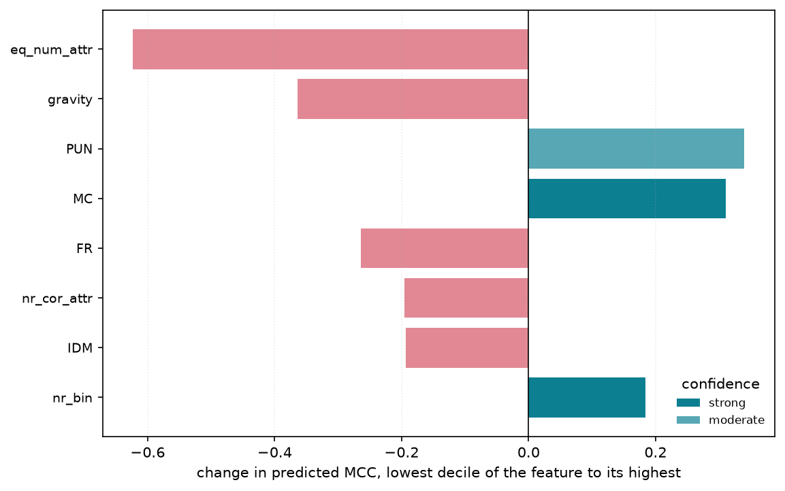

# 6. Best practices against the equation

*Implemented in `ml_meta_perf.attribution`, `ml_meta_perf.practices`, `ml_meta_perf.report` and
`ml_meta_perf.guidance`.*

This is what the accuracy was traded for. An equation nobody can turn into guidance has
bought nothing over a black box.

But the step from equation to guidance is two steps, and collapsing them was a mistake this
chapter used to make.

**A best practice is not a property of an equation.** It is general, transferable advice —
short enough to remember, cheap enough to apply — that already circulates in the field and
that evidence can support, qualify or challenge. "Higher `nr_norm` went with lower MCC on
these twenty datasets" is not that. It is a *measurement*: it names a column rather than an
action, it is true only of this corpus, and [chapter 4](04-equation.md) shows that its
sign can change when the equation changes — the [limitations](#limitations-of-the-practice-comparison)
record a column that flipped sign between two equations fitted on the same data.

So the chapter runs in two layers:

| layer | what it produces | module |
|---|---|---|
| **evidence** | what the fitted equation does as each feature and each term moves | `ml_meta_perf.practices`, `ml_meta_perf.report` |
| **practice** | recommendations taken from the literature, each weighed against that evidence | `ml_meta_perf.guidance` |

And then a third thing, which is the one this study is uniquely placed to do. A verdict drawn
from family means says the advice holds on this corpus, and any study with this data could
compute it. **A practice can also be checked against the published equation itself** — does
it appear in named terms, with the sign and the strength the practice predicts? That check is
in the generated section under *Each practice against the equation's own terms*, and it is
what the fifteen readable terms were bought for.

The second layer is where the study earns its keep. Twenty datasets from one domain is a
narrow base from which to *invent* advice and a perfectly reasonable base from which to
*test* it, so `ml_meta_perf.guidance` starts from ten practices the tabular machine-learning
literature already recommends and asks what this corpus says about each. The statements and
citations are written by hand — a fitting procedure does not produce a citation — and every
verdict and every number inside it is computed, against a stated threshold, so other data
can overturn any of them.

Verdicts are **supported**, **qualified**, **challenged** or **not tested**. The tally is
deliberately not written here: it moves whenever the equation does, and the generated section
opens with the current one. What is worth stating is
the *shape* of it — most practices are supported, two or three sit at `not tested`, and
that last group is the one to read first.

`not tested` is a real verdict rather than a gap. Two kinds of thing land there. The
balanced-metric practice is untested because the study adopts MCC and never compares it to
accuracy or F1, so it cannot be evidence about the choice. The outlier-robustness practice
is untested because the column that recorded a *learner's* robustness was retired from the
corpus, and the nearest surviving column, `nr_outliers`, describes the data instead —
answering it with that number would produce a verdict that read as though the practice had
been tested. Marking both rather than quietly counting them as wins is the point of having
the verdict at all.

**A high supported count is a weak-looking result and should be read carefully.** It is not
that the catalogue was chosen to pass: each check has a stated threshold and returns
`qualified` or `challenged` when the numbers say so, and some do.
It is that the practices selected are ones a corpus of this shape *can* speak to. The
honest reading is that this study corroborates established tabular-ML guidance on an
independent corpus, not that it discovered anything the field disagreed about.

One practice was **withdrawn** rather than reported. *"Neural architectures catch up once
the dataset is large enough"* looked testable and is not: every model here was trained on a
stratified sample capped at 100,000 rows, so splitting the corpus by `nr_inst` splits it by
*source* size while every training set above the cap is identical in size. The withdrawal is
recorded in [chapter 1](01-dataset.md#training-set-size-is-not-a-variable-here) because
the near-miss is instructive — the split produced a clean-looking number, and the number
meant nothing.

The assessment itself follows immediately, regenerated on every run. The method behind it —
how each measurement is derived and filtered — is *after* it rather than before: a reader who
accepts the method can read the verdicts and stop.

<!-- generated: do not edit below -->

## Best practices

A best practice is general, transferable advice that already circulates in the field — not a property of this equation. So the practices below are taken from the literature and this study is used to *weigh* them: each verdict, and the numbers inside it, are computed from this run by `ml_meta_perf.guidance`, against a stated threshold, so other data can overturn any of them.

10 practices assessed: 3 not tested, 2 qualified, 5 supported.

#### 1. Characterise the dataset before choosing a model. What the data is like bounds what any model can reach, and that bound is usually the larger effect.

**Verdict: supported.** Knowing only which dataset a row came from explains 35.4% of MCC variance; knowing only which model, 28.2%. The dataset side is also the better described: 12 dataset meta-features reach 98% of what dataset identity explains, while 6 model meta-features reach 88% of theirs. Both the effect and our ability to measure it favour the data.

*Practice from:* Zha et al., 'Data-centric Artificial Intelligence: A Survey', ACM Computing Surveys 57(5) (2025). The data-centric position holds that returns from improving data exceed returns from swapping architectures. It is an argument about where to spend effort.

#### 2. On tabular data, start from tree ensembles. Reach for a neural architecture only when a tree ensemble has been tried and found wanting.

**Verdict: supported.** On the 17 datasets where every model ran, tree-based families average MCC 0.927 against 0.660 for neural ones. The neural side splits sharply: architectures built for tabular data reach 0.797 while a plain MLP or DNN reaches 0.454, last of the ten families. The advice holds, and it holds most strongly against exactly the architectures that are not designed for this kind of data.

*Practice from:* Grinsztajn, Oyallon & Varoquaux, NeurIPS 2022 Datasets and Benchmarks Track; Shwartz-Ziv & Armon, 'Tabular Data: Deep Learning is Not All You Need', Information Fusion 81, 84-90 (2022). Trees handle irregular, non-smooth target functions and uninformative features, which is what tabular data usually contains.

#### 3. Include a pretrained tabular model (TabPFN, TabICL) in the first round of candidates: it costs one fit and is frequently competitive with a tuned ensemble.

**Verdict: supported.** Pretrained tabular models average MCC 0.953, against 0.951 for the best tree family, and place 1 and 3 of 25 models. They match the strongest tree ensembles here without a tuning budget, which is the whole of the claim.

*Practice from:* Hollmann et al., 'Accurate predictions on small data with a tabular foundation model' (TabPFN), Nature 637, 319-326 (2025); Qu, Holzmuller, Varoquaux & Le Morvan, 'TabICL', ICML 2025. In-context learning on tabular data removes the tuning budget that usually separates a quick baseline from a competitive one.

#### 4. When rows share a group -- a subject, a site, a dataset -- validate by holding out whole groups. A random split reports a number that will not survive deployment.

**Verdict: qualified.** The same equation scores R² 0.639 under a random 10-fold split and 0.638 when whole datasets are held out -- 0.001 of pure protocol. Dataset meta-features are constant within a dataset, so a random fold shows the equation rows from a dataset it is being scored on.

*Practice from:* Walsh et al., 'Machine learning reporting standards', Nature Methods 18 (2021). Any feature constant within a group lets the model recognise the group rather than generalise to it, and a random split puts the group on both sides.

#### 5. Spend the first effort on reducing noise in the data, not on a larger model. Noise sets a ceiling that capacity cannot lift.

**Verdict: not tested.** No noise-to-signal practice survived the extraction filters in this run.

*Practice from:* Zha et al., 'Data-centric AI: Perspectives and Challenges', SIAM International Conference on Data Mining (SDM) 2023, 945-948. Irreducible error from noisy features or labels bounds every model on that data, so capacity spent against it buys nothing.

#### 6. On real-world data that has not been carefully curated, prefer a learner with built-in robustness to outliers.

**Verdict: not tested.** This corpus cannot weigh it. The practice is about a property of the learner, and the column that recorded one -- `Robust to Outliers` -- was retired because it varied within a model and was undefined under every transform in the grammar but two. `nr_outliers` counts outliers in the data, not resistance to them in the model, so it answers a different question. Reported as untested rather than answered with the nearest available number.

*Practice from:* Grinsztajn, Oyallon & Varoquaux, NeurIPS 2022 Datasets and Benchmarks Track, on non-smooth targets and outliers. Real tabular data carries outliers that a squared-error learner chases and a split-based or margin-based one largely ignores.

#### 7. Match capacity to the problem. A larger, more expensive model is not a safer default; on small tabular problems it is usually a worse one.

**Verdict: supported.** The highest-capacity family here is also the worst: generic neural networks average MCC 0.454 against 0.927 for tree ensembles. The equation says it conditionally rather than flatly: `Processing Units Number` carries 5 of its terms, mostly against a dataset property, so what raises MCC is capacity *matched to* the problem rather than capacity itself.

*Practice from:* Shwartz-Ziv & Armon, Information Fusion 81, 84-90 (2022). Capacity beyond what the sample supports fits noise, and the cost is paid twice: in accuracy and in the tuning budget needed to recover it.

#### 8. Before adopting a meta-learner to choose models, check it against 'use whatever usually works'. Ranking is an easier problem than prediction and often needs less.

**Verdict: qualified.** Tested against this study's own equation and the two cannot be separated -- which is the practice being right, since it claims the trivial baseline is competitive rather than that it wins. Ranking models within a held-out dataset, against the per-model-mean baseline -- ap 0.831 against 0.798, equation better on 7 of 18 datasets that differ, 95% CI [-0.066, +0.159]; mrr 0.882 against 0.835, equation better on 3 of 6 datasets that differ, 95% CI [-0.076, +0.185]; hit_at_1 0.800 against 0.750, equation better on 3 of 5 datasets that differ, 95% CI [-0.150, +0.250]; regret 0.015 against 0.011, equation better on 12 of 17 datasets that differ, 95% CI [-0.021, +0.010]. Every interval is a paired bootstrap over the twenty held-out datasets, because a difference of two means over twenty folds is not yet a measurement.

*Practice from:* Rice, 'The Algorithm Selection Problem' (1976); standard meta-learning practice. A per-model mean over previous datasets carries most of the ranking signal at zero modelling cost, and is the baseline any selection method has to clear.

#### 9. Report which (dataset, model) runs were excluded and why. Aggregate comparisons over an incomplete grid compare different models on different problems.

**Verdict: supported.** 24 of 500 (dataset, model) cells are absent -- 5% -- and they are not absent at random: eight models are missing from the same three datasets. Measuring the bias rather than assuming it is small: restricting to the 17 complete datasets moves the model ranking by Spearman 0.975, so the ordering survives, but a mean over all rows still compares eight of the models on a different set of problems from the rest. Every family figure quoted here uses the complete subset for that reason.

*Practice from:* Walsh et al., Nature Methods 18 (2021); benchmarking reporting standards. Runs usually go missing where a model struggles or will not fit, so exclusions are correlated with the outcome being measured.

#### 10. Score imbalanced classification with a metric that accounts for all four confusion-matrix cells -- MCC rather than accuracy or F1.

**Verdict: not tested.** This study adopts MCC as its target and never measures an alternative, so it is not evidence for the practice. What it does show is the shape MCC has: 15 of 476 rows sit at exactly 0, which is a classifier that has learned nothing being scored as having learned nothing. Accuracy would not have said that.

*Practice from:* Chicco & Jurman, BMC Genomics 21:6 (2020). Accuracy and F1 can both look strong on a classifier that has learned only the majority class; MCC cannot.


At a glance:

| practice | verdict | magnitude |
|---|---|---|
| Characterise the dataset before choosing a model. What the data is like bounds what any model can reach, and that bound is usually the larger effect. | supported | 0.0718 |
| On tabular data, start from tree ensembles. Reach for a neural architecture only when a tree ensemble has been tried and found wanting. | supported | 0.2675 |
| Include a pretrained tabular model (TabPFN, TabICL) in the first round of candidates: it costs one fit and is frequently competitive with a tuned ensemble. | supported | 0.0028 |
| When rows share a group -- a subject, a site, a dataset -- validate by holding out whole groups. A random split reports a number that will not survive deployment. | qualified | 0.0007 |
| Spend the first effort on reducing noise in the data, not on a larger model. Noise sets a ceiling that capacity cannot lift. | not tested |  |
| On real-world data that has not been carefully curated, prefer a learner with built-in robustness to outliers. | not tested |  |
| Match capacity to the problem. A larger, more expensive model is not a safer default; on small tabular problems it is usually a worse one. | supported | -0.4727 |
| Before adopting a meta-learner to choose models, check it against 'use whatever usually works'. Ranking is an easier problem than prediction and often needs less. | qualified | 0.0333 |
| Report which (dataset, model) runs were excluded and why. Aggregate comparisons over an incomplete grid compare different models on different problems. | supported | 0.0480 |
| Score imbalanced classification with a metric that accounts for all four confusion-matrix cells -- MCC rather than accuracy or F1. | not tested | 0.0315 |

#### Each practice against the equation's own terms

The verdicts above are drawn from corpus averages -- family means, variance shares, paired tests -- which any study with this corpus could compute. This table asks the stronger question, and the one an interpretability-first study is uniquely able to ask: **does the published equation encode the practice, in named terms, with a sign and a strength a reader can look up?**

| practice | feature | expected | terms | direction | effect | stability | agrees |
|---|---|---|---|---|---|---|---|
| clean-noise-before-adding-capacity | ns_ratio | lowers | 0 |  |  |  | not selected |
| prefer-outlier-robust-learners | nr_outliers | lowers | 1 |  |  |  | no direction |
| capacity-is-not-free | Processing Units Number | lowers | 5 | raises | 0.3396 | 0.7100 | no |
| capacity-is-not-free | Model Capability | raises | 2 | raises | 0.3104 | 0.9250 | yes |

`expected` is what the practice predicts as the feature rises; `direction` is what the equation does, measured on the data rather than read off a weight sign, because a feature can sit in several terms and inside denominators. `effect` is the size of that move across the feature's deciles -- **agreement in sign with a negligible effect is agreement without evidence**, which is why the two are printed together. `not selected` means the search never took the feature, so the equation is silent on that practice rather than supporting it; `no direction` means the feature is in the equation but moves MCC too weakly or too non-monotonically for a direction to be stated.

Only practices that make a claim about a raw feature appear here. A protocol rule, a metric choice or a statement about model families has no coefficient to check it against, and mapping one onto a term would be inventing a connection.

## The measurements underneath

What the fitted equation says about each raw feature it uses, kept only when the feature moves predicted MCC enough to matter, does so monotonically enough for a sentence to be true of it, and does so through terms that survived most folds. Directions are measured on the data rather than read off weight signs, because a feature can appear in several terms and inside denominators.

**These are associations across 20 datasets, not causal claims, and not practices on their own** — a statement about a meta-feature column is a measurement. Section 5 is where they become advice, by supporting or failing to support something a practitioner could already have been told.

 1. [moderate] Higher equivalent number of attributes (effective feature count) went with lower MCC (about 0.62 MCC between its lowest and highest decile).
 2. [moderate] Higher gravity (separation between the majority and minority class centres) went with lower MCC (about 0.36 MCC between its lowest and highest decile).
 3. [moderate] Higher model capacity (log processing units) went with higher MCC (about 0.34 MCC between its lowest and highest decile).
 4. [strong  ] Higher learner family's capability rank in the tabular-ML literature (1-10) went with higher MCC (about 0.31 MCC between its lowest and highest decile).
 5. [moderate] Higher how the parameters are reached, closed form to in-context (1-5) went with lower MCC (about 0.26 MCC between its lowest and highest decile).
 6. [moderate] Higher proportion of correlated attribute pairs went with lower MCC (about 0.20 MCC between its lowest and highest decile).
 7. [moderate] Higher how much of the input distribution the learner models (1-5) went with lower MCC (about 0.19 MCC between its lowest and highest decile).
 8. [strong  ] Higher number of binary attributes went with higher MCC (about 0.18 MCC between its lowest and highest decile).

Evidence:

| feature | meaning | n_terms | direction | effect | stability | confidence |
|---|---|---|---|---|---|---|
| eq_num_attr | equivalent number of attributes (effective feature count) | 2 | -0.8560 | -0.6230 | 0.7750 | moderate |
| gravity | gravity (separation between the majority and minority class centres) | 5 | -0.5511 | -0.3641 | 0.8300 | moderate |
| Processing Units Number | model capacity (log processing units) | 5 | 0.4387 | 0.3396 | 0.7100 | moderate |
| Model Capability | learner family's capability rank in the tabular-ML literature (1-10) | 2 | 0.5623 | 0.3104 | 0.9250 | strong |
| Fitting Regime | how the parameters are reached, closed form to in-context (1-5) | 3 | -0.7870 | -0.2639 | 0.7167 | moderate |
| nr_cor_attr | proportion of correlated attribute pairs | 1 | -0.9284 | -0.1961 | 0.5000 | moderate |
| Input Distribution Modelling | how much of the input distribution the learner models (1-5) | 1 | -0.9978 | -0.1937 | 0.8000 | moderate |
| nr_bin | number of binary attributes | 1 | 0.8439 | 0.1845 | 0.8500 | strong |

#### These are conditional statements, not marginal ones

A practice states what the *equation* does as a feature rises, with every other term present. A marginal correlation states what the feature does alone. They are different quantities, and here **7 of 8 agree** on the sign:

| feature | meaning | marginal | conditional | practice_says | agrees |
|---|---|---|---|---|---|
| eq_num_attr | equivalent number of attributes (effective feature count) | -0.1781 | -0.8560 | lower | yes |
| gravity | gravity (separation between the majority and minority class centres) | -0.2863 | -0.5511 | lower | yes |
| Processing Units Number | model capacity (log processing units) | 0.3080 | 0.4387 | higher | yes |
| Model Capability | learner family's capability rank in the tabular-ML literature (1-10) | 0.3908 | 0.5623 | higher | yes |
| Fitting Regime | how the parameters are reached, closed form to in-context (1-5) | 0.0502 | -0.7870 | lower | no |
| nr_cor_attr | proportion of correlated attribute pairs | -0.1966 | -0.9284 | lower | yes |
| Input Distribution Modelling | how much of the input distribution the learner models (1-5) | -0.1889 | -0.9978 | lower | yes |
| nr_bin | number of binary attributes | 0.0368 | 0.8439 | higher | yes |

Disagreement is what conditioning does, not a defect. A marginal correlation mixes a feature's effect with everything it travels with; inside the equation the terms carrying those companions are already present, so what is left for this feature is what it adds beyond them. The practical consequence: **these statements describe what to expect once the other factors are accounted for, not what a scatter plot of that one feature will show** — and the scatter plot is what a reader will accidentally check against.

## Reading a single prediction

The same equation on one row, term by term. The column adds up, and a reader can check that it does, which is the interpretability payoff in its most direct form -- and the row is chosen arithmetically, at the equation's **median absolute error**, so the example is a typical prediction rather than a flattering one somebody picked.

```
dataset  : ASNM-CDX-2009
model    : PassiveAggressive
actual   : +0.0624
predicted: +0.1656

contribution breakdown:
    +1.3586   intercept
    -0.5545   [log(nr_class)] * [nr_outliers]
    -0.3106   [log(eq_num_attr)] / [log(Processing Units Number)]
    -0.2315   [log(gravity)] / [log(Processing Units Number)]
    +0.2114   [log(gravity)] * [log(Model Capability)]
    -0.1974   [log(gravity)] * [log(Fitting Regime)]
    -0.1411   [log(Processing Units Number)] / [log(nr_class)]
    +0.0307   the remaining 9 terms
  = +0.1656   sum
```

<!-- end generated -->

## How the evidence underneath was measured

Everything above rests on two derived quantities and three filters. They are here rather
than before the verdicts because they are *how the check was made*, not what it found — a
reader who accepts the method can stop at the table.

The term-by-term reading of the equation itself is [chapter 4](04-equation.md)'s job and is
not repeated here: which terms are major, which features the search reached for, which
grammar operations it needed, and how flat the weights are all belong to the equation, and
this chapter uses them without restating them.

### Making terms comparable

Raw weights cannot be compared — they are in the units of whatever the term computes. Two
comparable quantities are derived instead.

**Effect** is the swing in predicted MCC produced by moving a term from its 10th to its
90th percentile. Stated in MCC units, it is comparable across terms and against the target
itself. Percentiles rather than min-to-max, so a single extreme row cannot define the
headline.

**Share** attributes the variance of the equation's output to groups of terms, labelled by
the features they use — dataset-only, model-only, or mixed. Shares are computed as

$$\text{share}_g = \frac{\operatorname{cov}(\textstyle\sum_{i \in g} c_i,\; \sum_i c_i)}{\operatorname{var}(\sum_i c_i)}$$

which sums to exactly 1 even when groups are correlated — and they are, since three model
features are functions of dataset size. A naive $\operatorname{var}(g)/\operatorname{var}(\text{total})$
does not. Population covariance is used throughout to match `np.var`; mixing `np.cov`'s
default `ddof=1` with `np.var`'s `ddof=0` inflates every share by $n/(n-1)$.

### Deriving direction empirically

Reading a sign off a weight is wrong as soon as a feature appears in more than one term,
appears inside a denominator, or appears under a transform that flips its monotonicity.
**This is why the practice table's `direction` column is measured and not read off the
equation**, and it is the single most important thing to understand about that table.

So the derivation is empirical: every term's contribution is evaluated over the real data,
contributions are summed **per raw feature**, and

- **direction** is the rank correlation between the feature and the total it drives;
- **effect** is the mean contribution in the feature's top decile minus that in its bottom
  decile — signed, and ordered *by the feature*, which is what makes it a response rather
  than a spread.

A feature sharing a term with another is credited the whole term, since the term cannot be
split between them. `effect` therefore reads as "how much MCC moves across this feature's
range", not "how much this feature owns".

### Filters

A measured association reaches the table only if all three hold:

| filter | threshold | why |
|---|---|---|
| effect | ≥ 0.02 MCC | below this it is not worth writing down |
| monotonicity | \|ρ\| ≥ 0.15 | a non-monotone feature has no true directional sentence |
| fold stability | ≥ 0.50 | a term chosen in 4 of 20 folds is an artefact of the split |

Features failing any test are **dropped, not hedged** — which is why a practice's feature can
be *in* the equation and still carry no direction in the table above. A statement nobody
should act on is better left unwritten.

`confidence` combines effect size with fold stability: *strong* is ≥0.85 stability and
≥0.10 effect; *moderate* is ≥0.50 and ≥0.05; anything else is *weak*.



### What the measurements are not

**They are not best practices.** Each names a meta-feature column, which is a thing to
measure rather than a thing to do, and each is true of one equation on one corpus. That is
the whole reason this chapter starts from the literature and uses the measurements as
evidence, rather than reading advice out of the weights.

The defensible claim is directional, and the measurement tables should be read as a set of
signed statements rather than as a ranking. Any write-up that orders these associations by
effect size is claiming more than the evidence supports.

**Associations across 20 datasets, not causal claims.** "Higher training cost went with
lower MCC" does not mean that cheaper models are better; it means that among the models run
here, the expensive ones were not the ones that scored well on the datasets where they were
expensive — and training cost is partly a function of dataset size, so it carries data
difficulty as well as model capacity.

**One feature carries a caveat wherever it is quoted.** `Model Capability` is the one
column in the set that was *asserted* rather than measured, so "higher capability rank went
with higher MCC" is partly the ladder being read back out. [Chapter 4](04-equation.md) sets
out the three costs of that in full, and the practice it bears on is the one to read most
sceptically.

Twenty datasets from one domain is a narrow evidential base. Every statement in this chapter
should be read as a hypothesis this data is consistent with, not a finding established by it.

## The analysis is generated, not authored

There is a failure mode this chapter has to avoid. If the fitted equation is printed and
somebody then sits down to explain which terms matter and what they imply, the explanation
is the product and the equation is only its raw material — and the claim "this model is
interpretable" quietly becomes "this model was interpreted by an expert, once".

So `ml_meta_perf.report` derives the written analysis arithmetically, and the generated
section above is its output. The same equation always produces the same sentences, and every
sentence maps onto a row of a table printed next to it. The worked single-row breakdown in
that section is the most direct form of it: the contributions add up, and a reader can check
that they do.

**Terms are ranked by standardised weight.** The target is centred but never scaled during
fitting, so a standardised weight `beta` is already in MCC units: how far predicted MCC
moves when that term moves by one standard deviation of itself. That is what makes a term
over instance counts comparable with a term over class entropy. Ranking on the raw weights
instead would rank the terms by the size of their units.

**Effect is reported next to every weight**, because a large weight on a term that barely
varies is not important. The two disagree often enough to be worth printing together: a
term can rank third by `beta` and first by `effect`.

**The sentences make no claim about the features inside a term**, only about the term. A
feature's direction depends on every term it appears in, and is `best_practices`' job —
derived empirically, as above, rather than read off a sign.
## Limitations of the practice comparison

### A per-feature association can flip sign between equations

`Training Operations` is the worked example. It is the reason the study treats per-feature
associations as evidence rather than as advice — and, in the end, the reason the column was
removed from the corpus altogether. The measurement below is retained because the retirement
does not make the lesson go away; it is what the lesson cost.

| equation | association | effect | confidence |
|---|---|---|---|
| earlier default (14 terms, arity 2, λ=20) | higher training cost → **higher** MCC | 0.16 | moderate |
| a later default (24 terms, arity 3, λ=5) | higher training cost → **lower** MCC | 0.38 | moderate |

Same data, same extraction procedure, same confidence rating, opposite sign — and the later
equation is the better one on every metric, so this is not a case of a bad equation being
corrected by a good one.

**Neither reading is an error.** Each correctly describes the equation it was extracted
from. The problem is the feature: `Training Operations` moves with two things at once. It
rises with model capacity, which raises MCC, and it rises with dataset size, which is where
the hard datasets are. Which of the two an equation ends up expressing depends on what
*other* terms it has available to absorb the other half — and that depends on the grammar,
the penalty and the length, none of which the practitioner reading the practice can see.

**The feature was eventually retired for exactly this.** A column that moves with model
capacity and dataset size at once is not a model descriptor, and two of the other three
retired columns had the same defect. That is a resolution of this particular case, not of the
general problem: nothing guarantees the six current features are free of it, and the mitigations
below are still what stands between a fitted weight and a stated practice.

This generalises past this one feature, and it is the reason the study does not present
per-feature associations as advice. A measurement like "higher training cost went with
lower MCC" is **evidence**, and evidence whose sign depends on the equation it came from is
weak evidence. It is not, on its own, a best practice: a practice is a general
recommendation that a body of evidence can support, and no single fitted equation is that
body.

That is why the generated section below states its practices at the level of received
guidance from the literature and uses this study to weigh each one, rather than reading new
guidance out of the weights. A recommendation that survives being weighed against several
independent measurements is worth something; one extracted from a single equation inherits
that equation'"'"'s instabilities, of which this is a worked example.

Three mitigations are in place and none of them is sufficient:

- terms selected in fewer than half the folds produce no practice, which catches
  instability *within* one configuration but says nothing about instability *across*
  configurations — `Training Operations` sat at 0.66 fold stability in the equation
  published at the time, which was not low enough to suppress it;
- the marginal correlation is printed beside the conditional direction
  (the generated section below), so a reader can at least see when the two disagree, as they
  do here;
- features whose rank direction and decile effect disagree in sign are dropped outright.

What would actually settle it is refitting across a grid of configurations and reporting
only the practices whose sign is stable across all of them. That is a sign-stability
analogue of the fold-stability filter, it is affordable, and it has not been done.
