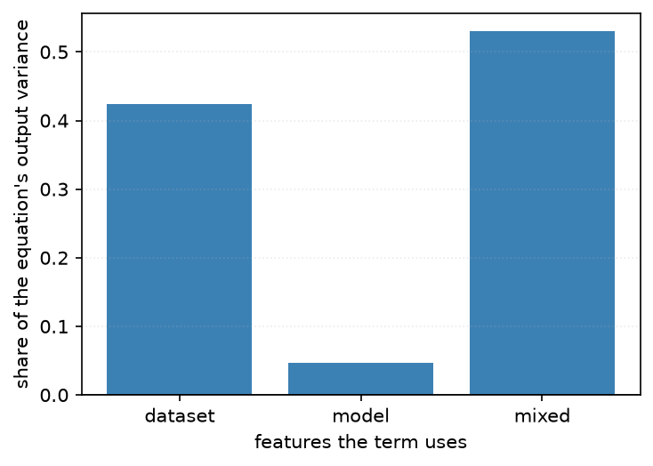
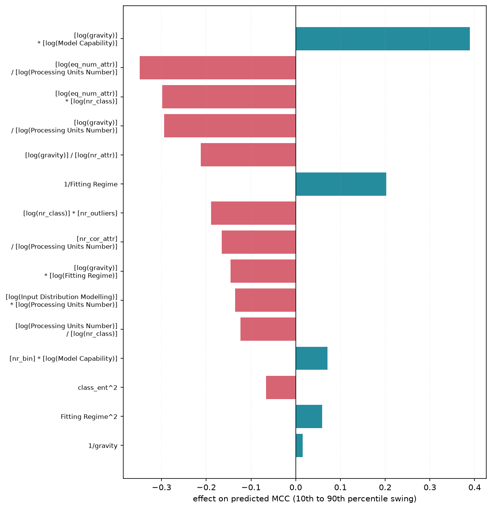
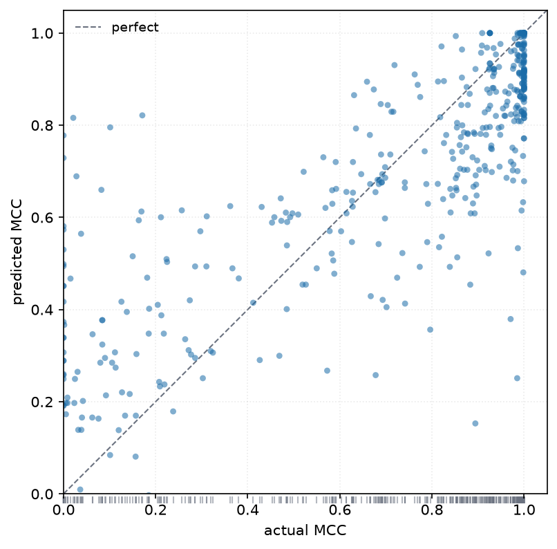

# 6. Results

*Produced by `metafit.experiment`; reproduce with `PYTHONPATH=src venv/bin/python -m metafit`.*

## The three equations

The study is built around a deliberate contrast.

**E1 — dataset features only.** Every model evaluated on a given dataset shares one
feature vector, so many MCC values map to a single input and least squares necessarily
lands on the per-dataset mean. That is not a defect to be corrected; it is the control. E1
measures how much of MCC is explained by *the data alone*. It is fitted on the 20
aggregated per-dataset means, which makes that structure explicit and keeps the fold count
honest.

**E2 — dataset and model features.** One input, one output. E2 can express variation
*within* a dataset, which is exactly what E1 structurally cannot do.

**EM — model features only.** The mirror of E1, added to settle whether model choice
outweighs dataset difficulty. There are only five model features and one is constant per
model, so EM is short by necessity rather than by design.

## Headline comparison, on one scale

R² denominators differ between the 20 aggregated means and the 476 raw rows, so all
equations are evaluated on **every row**:

| | R² | MAE | Spearman |
|---|---|---|---|
| E1 (dataset only, 5 terms) | 0.337 | 0.215 | 0.640 |
| *E1's ceiling — the true dataset means* | *0.354* | *0.204* | *0.653* |
| EM (model only, 9 terms) | 0.164 | 0.251 | 0.356 |
| *EM's ceiling — the true model means* | *0.282* | *0.226* | *0.487* |
| **E2 (dataset + model, 24 terms)** | **0.600** | **0.154** | **0.786** |
| *additive oracle* | *0.6605* | *0.145* | *0.810* |


## On their own scales

| | terms | in-sample R² | LOO-dataset R² | LOO-model R² |
|---|---|---|---|---|
| E1 (20 dataset means) | 5 | 0.953 | 0.506 | — |
| EM (476 rows) | 9 | 0.164 | 0.055 | — |
| **E2 (476 rows)** | **24** | **0.600** | **0.466** | **0.489** |

E1's in-sample R² of 0.953 on 20 points is a fit statistic on 20 observations with 5
parameters and should be read as such; its cross-validated 0.506 is the meaningful number,
and it is unstable (negative at 1–2 terms).

## Does model choice matter more than the dataset?

Not on this meta-dataset — but the reason is more interesting than the answer.

Dataset identity explains **0.354** of MCC variance against model identity's **0.282**, and
the equations widen the gap rather than closing it:

| | equation | own ceiling | captured |
|---|---|---|---|
| dataset features | 0.337 | 0.354 | **95%** |
| model features | 0.164 | 0.282 | **58%** |

**The meta-features describe datasets far better than they describe models.** Twelve
dataset meta-features nearly exhaust what dataset identity can explain; five model
features capture barely half of what model identity can. The remaining 42% of model
capability is real and simply not written down anywhere in this data — the strongest
argument in the study for richer model descriptors.

Two things create the opposite impression and are worth stating explicitly, because both
are artefacts:

- The **within-group correlation table is dataset-centred**, which removes dataset variance
  by construction. Only model terms can score well there. It is a diagnostic for model
  effects, not a statement of relative importance.
- **Model features carry more in combination than alone.** Adding them to E1 is worth
  +0.263 R² (0.337 → 0.600), well beyond the 0.164 they achieve by themselves. The surplus
  is dataset×model interaction, which is why mixed terms dominate both equations: 12 of the
  default's 24 terms and **24 of the accuracy-leaning equation's 32**.



## The two configurations

`DEFAULT_E2` and `ACCURATE_E2` are the *same equation family* — same vocabulary, same
search, same solver — differing in two knobs:

| | `max_arity` | `max_abs_zscore` | `penalty` | headline terms |
|---|---|---|---|---|
| `DEFAULT_E2` | 3 (281-term library) | 3.0 | 5 | 24 |
| `ACCURATE_E2` | 4 (4610-term library) | 4.0 | 5 | 32 |

| configuration | terms | in-sample R² | LOO-dataset | LOO-model |
|---|---|---|---|---|
| `DEFAULT_E2` | 24 | **0.5998** | **0.4658** | **0.4887** |
| `ACCURATE_E2` | 32 | **0.6677** | 0.2863 | 0.4714 |

The default now clears 0.6 *and* holds the best transfer figure in the study. That is not
the trade the earlier configurations offered, and the reason is the grammar fix rather
than the tuning: symmetric `sum_ratio` gave the search 126 mixed dataset×model terms
where it previously had 19.

Both are fitted and reported by every run.

**Why 24 terms and not 14?** Fourteen was the optimum of the *old* grammar and stopped
being one. Re-sweeping arity, penalty and length together over 54 configurations moves the
joint optimum into the mid-twenties, and the previous headline is now dominated on every
axis:

| | in-sample | LOO-dataset | LOO-model |
|---|---|---|---|
| old (arity 2 implicit, 14 terms, λ=20) | 0.5582 | 0.4429 | 0.4561 |
| **new (arity 3, 24 terms, λ=5)** | **0.5998** | **0.4658** | **0.4887** |

Twenty-four rather than 26 because the selection table's *best cross-validated* rule picks
it, and following the stated rule matters more than the 0.0035 of in-sample it costs. The
two are within fold noise of each other; the reported figure is 0.600, not "clears 0.6".

The length was re-derived rather than carried over, which is the general lesson: a term
budget tuned against one grammar is not evidence about another.

## The fitted equations

E1, on the 20 dataset means:

```
MCC = +1.21681
      -0.160398   * [log(eq_num_attr)] * [log(nr_class)]
      -0.0601461  * ([nr_cor_attr] + [log(ns_ratio)]) / [log(nr_class)]
      -0.0286345  * ([log(class_ent)] + [log(gravity)]) / [log(nr_attr)]
      +0.00728631 * [log(eq_num_attr)] * [log(inst_to_attr)]
      +0.000217397* [log(inst_to_attr)] * [nr_norm]
```

E2, on all 476 rows, is 24 terms and is **not reproduced here**. It is printed in full,
with its term-importance table and its analysis, in [chapter 9](09-report.md) — which is
regenerated with the equation on every run, so it cannot drift out of step with the code
the way a copy in this chapter would. An earlier draft of this chapter carried a 14-term
E2 that had stopped being the published equation several configurations earlier, which is
why the listing now lives on the generated side.

The shape of it, from that chapter: 12 of the 24 terms mix dataset and model features and
drive **76%** of the output variance; 7 are model-only (14%) and 5 are dataset-only (10%).
The weights are flat — they behave like **20.2 equally-weighted terms**, and the largest
carries under 9% of the mass.



## Where the equation fails



Predictions never fall below **0.17**, while 38 rows sit at exactly MCC = 0 — a column of
points hanging well above the diagonal on the left. **E2 cannot identify the cases where a
model will simply fail on a dataset.** It is a usable estimator in the range where models
work and a poor detector of the range where they do not, which must be stated before
anyone uses it to screen candidates.

The axes start at 0; the single negative row falls outside them and
`plots.count_below_floor()` returns the count for a caption.

## What was tried to push past 0.558, and failed

> **These were measured against the previous grammar**, whose default reached 0.5582 —
> before `sum_ratio` was made symmetric and the term budget re-tuned. They are reported
> unchanged rather than silently rebased, because none of them was re-run afterwards. What
> did beat 0.5582 was the grammar fix, not any of the six.

That earlier default was attacked from six directions. All keep the equation form
`MCC = Σ wᵢtᵢ` intact, and none beats it:

| attempt | in-sample R² |
|---|---|
| **baseline (ordinary least squares, uniform weights)** | **0.5582** |
| downweight the rows at MCC ∈ {0, 1} by 0.5 | 0.5380 |
| downweight them by 0.25 | 0.4147 |
| Huber IRLS, 8 iterations | 0.5526 |
| equal weight per dataset | 0.5509 |
| two-stage: 7 dataset terms, then 7 on the residual | 0.5532 |
| adding `f^3`, `1/sqrt(f)`, `f^0.25` to the vocabulary | 0.5582 (unchanged) |

Widening the operator set deserves its own note, since `f^2` and `sqrt(f)` are **already**
in the vocabulary. Adding `f^3`, `1/sqrt(f)` and `f^0.25` grows the library from 172 terms
to 182 — most of the 51 new candidates fail admissibility — and the beam then selects
**none of the ten that survive**. In-sample R² is identical to four decimal places at both
8, 14 and 20 terms. Under the accuracy-leaning configuration the same extension is
actively harmful, dropping 20-term R² from 0.647 to 0.632. Higher powers are
near-duplicates of the ones already present, and the collinearity guard treats them as
such.

Reweighting was the most promising idea and is the clearest failure: R² is reported on all
476 rows with uniform weight, so any reweighting optimises a *different* objective and
necessarily scores worse on the one being reported. Downweighting the saturated rows in
particular removes 118 of 476 observations' worth of influence — the pile-ups at 0 and 1
are a third of the data, not outliers to be discounted.

Together with the earlier negatives — search strength ([chapter 3](03-search-and-fitting.md)),
transform vocabulary and feature scaling ([chapter 2](02-equation-form.md)), agglomerative
construction, and marginal-impact filtering — the additive form at this configuration is
exhausted.

**Two things do work, and both are already reported.** Loosening the library and the
shrinkage reaches **0.647** (`ACCURATE_E2`, 20 terms), at a cost of 0.156 in transfer. And
the interaction the equation cannot reach is worth **+0.122** on its own
([chapter 5](05-oracles.md)).

For that last gap the literature points at **GA2M / Explainable Boosting Machines** —
generalised additive models with explicit pairwise interaction terms (Lou et al., 2013;
GAMI-Net, arXiv:2003.07132) — which are exactly the model class that adds interaction while
staying inspectable. Billa et al. (arXiv:2601.00428) find EBMs and symbolic regression
dominate interpretable tabular regression. The trade is real: an EBM is a set of shape
functions rather than a closed-form equation, so it can be plotted but not written down.

## Flexible models do worse, not better

Standard regressors on the same raw features, under the same protocols:

| model | in-sample R² | LOO-dataset R² | LOO-model R² |
|---|---|---|---|
| RidgeCV (linear, 17 features) | 0.418 | **-2.002** | 0.328 |
| RandomForest (300 trees) | **0.910** | **0.067** | 0.465 |
| GradientBoosting | 0.820 | 0.049 | 0.354 |
| **metafit E2 (24 terms)** | 0.600 | **0.466** | 0.489 |

Read the RandomForest row across. With 20 dataset groups a forest memorises dataset
identity almost perfectly and then transfers worse than a 24-term additive equation. This is also
the likely provenance of the R² ≈ 0.9 figures reported for opaque meta-models: an
in-sample or randomly-split forest reproduces them exactly, and the same forest is
near-useless on an unseen dataset.

> Measured with scikit-learn during exploration. It is not a dependency of the package.
