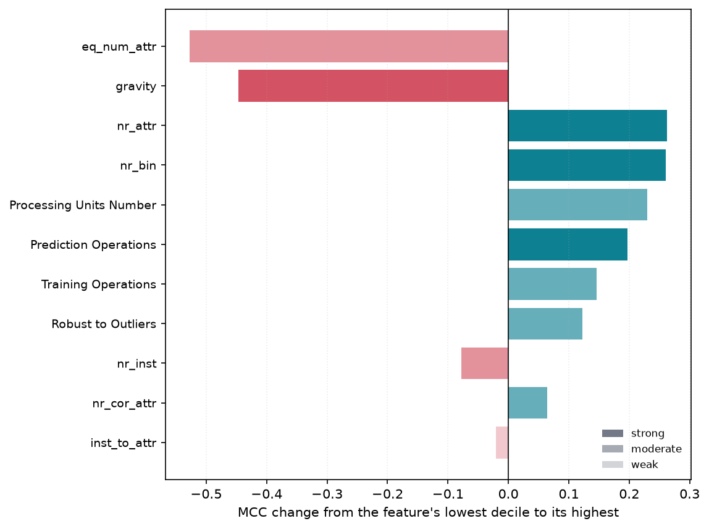

# 7. From equation to evidence to practice

*Implemented in `metafit.attribution`, `metafit.practices`, `metafit.report` and
`metafit.guidance`.*

This is what the accuracy was traded for. An equation nobody can turn into guidance has
bought nothing over a black box.

But the step from equation to guidance is two steps, and collapsing them was a mistake this
chapter used to make.

**A best practice is not a property of an equation.** It is general, transferable advice —
short enough to remember, cheap enough to apply — that already circulates in the field and
that evidence can support, qualify or challenge. "Higher `nr_norm` went with lower MCC on
these twenty datasets" is not that. It is a *measurement*: it names a column rather than an
action, it is true only of this corpus, and [chapter 8](08-limitations.md) shows that its
sign can change when the equation changes.

So the chapter runs in two layers:

| layer | what it produces | module |
|---|---|---|
| **evidence** | what the fitted equation does as each feature and each term moves | `metafit.practices`, `metafit.report` |
| **practice** | recommendations taken from the literature, each weighed against that evidence | `metafit.guidance` |

The second layer is where the study earns its keep. Twenty datasets from one domain is a
narrow base from which to *invent* advice and a perfectly reasonable base from which to
*test* it, so `metafit.guidance` starts from ten practices the tabular machine-learning
literature already recommends and asks what this corpus says about each. The statements and
citations are written by hand — a fitting procedure does not produce a citation — and every
verdict and every number inside it is computed, against a stated threshold, so other data
can overturn any of them.

Verdicts are **supported**, **qualified**, **challenged** or **not tested**. Eight of the
ten are supported, one is not tested — the balanced-metric practice, because the study
adopts MCC and never compares it to accuracy or F1 — and one is **qualified**: the practice
of checking a meta-learner against "use whatever usually works" now returns a verdict
saying the equation clears that baseline, where in earlier runs it did not. Marking both
rather than quietly counting them as wins is the point of having the verdict at all.

**Eight of ten supported is a weak-looking result and should be read carefully.** It is not
that the catalogue was chosen to pass: each check has a stated threshold and returns
`qualified` or `challenged` when the numbers say so, and one now does.
It is that the practices selected are ones a corpus of this shape *can* speak to. The
honest reading is that this study corroborates established tabular-ML guidance on an
independent corpus, not that it discovered anything the field disagreed about.

One practice was **withdrawn** rather than reported. *"Neural architectures catch up once
the dataset is large enough"* looked testable and is not: every model here was trained on a
stratified sample capped at 100,000 rows, so splitting the corpus by `nr_inst` splits it by
*source* size while every training set above the cap is identical in size. The withdrawal is
recorded in [chapter 8](08-limitations.md#training-set-size-is-not-a-variable-here) because
the near-miss is instructive — the split produced a clean-looking number, and the number
meant nothing.

[Chapter 10](10-report.md) carries the full assessment, regenerated on every run.

## Making terms comparable

Raw weights cannot be compared — they are in the units of whatever the term computes. Two
comparable quantities are derived instead.

**Effect** is the swing in predicted MCC produced by moving a term from its 10th to its
90th percentile. Stated in MCC units, it is comparable across terms and against the target
itself. Percentiles rather than min-to-max, so a single extreme row cannot define the
headline.

**Share** attributes the variance of the equation's output to groups of terms, labelled by
the features they use — dataset-only, model-only, or mixed. Shares are computed as

$$\text{share}_g = \frac{\operatorname{cov}(\textstyle\sum_{i \in g} c_i,\; \sum_i c_i)}{\operatorname{var}(\sum_i c_i)}$$

which sums to exactly 1 even when groups are correlated — and they are, since three model
features are functions of dataset size. A naive $\operatorname{var}(g)/\operatorname{var}(\text{total})$
does not. Population covariance is used throughout to match `np.var`; mixing `np.cov`'s
default `ddof=1` with `np.var`'s `ddof=0` inflates every share by $n/(n-1)$.

## Deriving direction empirically

Reading a sign off a weight is wrong as soon as a feature appears in more than one term,
appears inside a denominator, or appears under a transform that flips its monotonicity.

So the derivation is empirical: every term's contribution is evaluated over the real data,
contributions are summed **per raw feature**, and

- **direction** is the rank correlation between the feature and the total it drives;
- **effect** is the mean contribution in the feature's top decile minus that in its bottom
  decile — signed, and ordered *by the feature*, which is what makes it a response rather
  than a spread.

A feature sharing a term with another is credited the whole term, since the term cannot be
split between them. `effect` therefore reads as "how much MCC moves across this feature's
range", not "how much this feature owns".

## Filters

A practice is published only if all three hold:

| filter | threshold | why |
|---|---|---|
| effect | ≥ 0.02 MCC | below this it is not worth writing down |
| monotonicity | \|ρ\| ≥ 0.15 | a non-monotone feature has no true directional sentence |
| fold stability | ≥ 0.50 | a term chosen in 4 of 20 folds is an artefact of the split |

Features failing any test are **dropped, not hedged**. A practice nobody should act on is
better left unwritten.

`confidence` combines effect size with fold stability: *strong* is ≥0.85 stability and
≥0.10 effect; *moderate* is ≥0.50 and ≥0.05; anything else is *weak*.

## The measured associations

The evidence layer. Reproduced from the published 20-term E3; [chapter 10](10-report.md) is
the generated version and is regenerated with the equation, so it is the one to trust if
the two ever disagree.

| # | association | effect (MCC) | confidence |
|---|---|---|---|
| 1 | Higher **equivalent number of attributes** → **lower** MCC | 0.37 | moderate |
| 2 | Higher **model capacity** (log processing units) → **higher** MCC | 0.30 | moderate |
| 3 | Higher **learner-family capability rank** → **higher** MCC | 0.29 | moderate |
| 4 | Higher **number of attributes** → **higher** MCC | 0.24 | strong |
| 5 | Higher **number of binary attributes** → **higher** MCC | 0.23 | strong |
| 6 | Higher **noise-to-signal ratio** → **lower** MCC | 0.23 | strong |
| 7 | Higher **number of classes** → **lower** MCC | 0.14 | moderate |
| 8 | Higher **built-in outlier robustness** → **higher** MCC | 0.07 | moderate |
| 9 | Higher **source-dataset size** → **higher** MCC | 0.06 | moderate |
| 10 | Higher **count of active regularisation mechanisms** → **lower** MCC | 0.03 | weak |

Row 3 needs its caveat carried with it wherever it is quoted. `Model Capability` is the one
feature here that was *asserted* rather than measured, so "higher capability rank went with
higher MCC" is partly the ladder being read back out. What is not built in is the
conditional part — how family capability interacts with dataset properties — and
[chapter 8](08-limitations.md) sets out the three costs in full.



Read together these point somewhere — *prefer a capable, high-capacity model; expect
trouble on noisy data and on data spread across many classes* — but the pointing
is the reader's inference, not the table's content. Turning it into advice, and checking
that advice against something other than this one equation, is the next section's job.

## What these are not

**They are not best practices.** Each names a meta-feature column, which is a thing to
measure rather than a thing to do, and each is true of one equation on one corpus. The
practices are in [chapter 10](10-report.md), taken from the literature and weighed against
these numbers among others.

The defensible claim is directional, and the tables in this chapter should be read as a
set of signed statements rather than as a ranking. Any write-up that orders these
associations by effect size is claiming more than the evidence supports.

**Associations measured across 20 datasets, not causal claims.** "Higher training cost
went with lower MCC" does not mean that cheaper models are better; it means that among the
models run here, the expensive ones were not the ones that scored well on the datasets
where they were expensive — and training cost is partly a function of dataset size, so it
is carrying data difficulty as well as model capacity.

`Training Operations` in particular flips sign between the earlier 14-term equation and the
published one, and should not be acted on. It is written up as a limitation in
[chapter 8](08-limitations.md#a-per-feature-association-can-flip-sign-between-equations), because the
caveat it raises applies to the whole extraction rather than to that one row.

### These are conditional statements, not marginal ones

A practice states what the *equation* does as a feature rises, with every other term
present. That is not the same as what the feature does on its own, and on this data the two
mostly disagree. Rank correlation of each raw feature against MCC, against the direction
its practice states:

| feature | marginal ρ with MCC | practice says | agree |
|---|---|---|---|
| built-in outlier robustness | +0.298 | higher | ✓ |
| noise-to-signal ratio | -0.395 | lower | ✓ |
| training cost | +0.205 | lower | ✗ |
| class entropy | +0.089 | lower | ✗ |
| normally distributed attributes | +0.054 | lower | ✗ |
| correlated attribute pairs | -0.197 | higher | ✗ |
| number of instances | +0.056 | lower | ✗ |

**Two of seven agree.** This is not a contradiction and not a bug — it is what conditioning
does. A feature's marginal correlation mixes its own effect with everything it travels
with; inside a fitted equation, the terms that carry those companions are already present,
so what is left for this feature is what it adds beyond them. Class entropy is the clearest
case: on its own it is faintly positive, but in the equation it appears in ratios against
`log(Processing Units Number)`, so what its practice describes is entropy *relative to the
capacity thrown at it*, and that is negative.

The consequence for a reader is concrete. **These statements are advice about what to
expect once the other factors are accounted for, not about what a scatter plot of that one
feature will show.** Where the two disagree, the marginal view is the one a practitioner
will accidentally verify against, and be confused by. Both numbers are printed above for
exactly that reason.

Twenty datasets from one domain is a narrow evidential base. Every statement above should
be read as a hypothesis this data is consistent with, not a finding established by it.

## Three ways to read a flat equation

The published equation's 24 weights behave like **20.2 equally-weighted terms** (inverse
Simpson index of the standardised-weight shares, $1/\sum_i s_i^2$), and the largest single
term carries 8.9% of the mass. Sixteen terms are needed to reach 80%.

The additive form $f(X) = w_0t_0 + w_1t_1 + \dots$ invites reading one term at a time, and
a flat equation refuses that. **This is a statement about the unit of explanation, not
about the quality of the equation.** MCC here is inferred by a *set* of terms acting
together, and the right response is to change the unit rather than to conclude that the
equation cannot be read. Three units work, and `metafit.report` generates all three into
[chapter 10](10-report.md).

### 1. Blocks of terms that move together

Terms whose per-row contributions correlate say the same thing about a row and can be read
as one. Grouping is on the *contributions* rather than on shared features — two terms can
share no feature and still track each other, and two terms over the same feature can move
independently once their transforms differ.

The 24 terms collapse to **11 blocks**, and the top three hold five terms each. `shared`
names the features a strict majority of a block's terms contain — a genuine question, since
the grouping never looked at what the terms contained:

| block | terms | share | direction | shared features |
|---|---|---|---|---|
| 1 | 5 | 22% | **raises** MCC | `Processing Units Number` |
| 2 | 5 | 22% | **lowers** MCC | `Processing Units Number`, `Prediction Operations` |
| 3 | 5 | 20% | **lowers** MCC | *(none)* |
| 4–11 | 1–2 each | 39% between them | mixed | assorted |

**Three blocks carry 64% of the equation**, and they read as three movements rather than 24
fragments:

1. **Capacity helps.** Every term in block 1 rises with `Processing Units Number` — some
   with it in the numerator, some as a divisor with a negative weight, which is why
   grouping on *contributions* rather than on features finds them together.
2. **Capacity spent on inference hurts.** Block 2 shares capacity *and* inference cost and
   moves the other way. It is largely products of the two — where a model is both large and
   expensive to run, MCC falls.
3. **Block 3 has no shared feature at all.** Five terms over class entropy, effective
   feature count, attribute counts and instance counts that nonetheless move together and
   pull MCC down: dataset difficulty, expressed through no single feature. It is the block
   that most justifies the method, because no feature-based grouping would have found it.

That structure is invisible in the term-by-term table and is not recoverable by reading the
printed equation.

### 2. Which features the search reached for

Asked of the vocabulary rather than of the weights, so a spread of weights does not blunt
it. **15 of the 17 available meta-features appear in the equation.** Two do not:
`nr_outliers` and `Active Regularization Mechanisms` — both were offered under every
transform and neither earned a place, which is a result about the meta-data rather than
about the search.

`Processing Units Number` appears in 10 of 24 terms and `Training Operations` in 8; the
dataset features are spread thinner, 2–4 terms each. The full table, with the transforms
and operations each feature was used under, is in [chapter 10](10-report.md).

### 3. Which operations the equation needed

| operation | terms | share |
|---|---|---|
| `sum_ratio` — $(f_1+f_2)/f_3$ | 11 | 50% |
| `product` — $f_1 \cdot f_2$ | 8 | 31% |
| `atom` — $f$ | 4 | 16% |
| `ratio` — $f_1/f_2$ | 1 | 3% |

| transform | terms | share |
|---|---|---|
| `log` | 19 | 79% |
| `id` | 12 | 41% |
| `sqrt` | 1 | 6% |
| `inv`, `sq` | **0** | **0%** |

Two things worth stating. **The three-feature operation carries half the equation**, which
is the direct evidence for the arity design point argued in
[chapter 2](02-equation-form.md) — a two-feature grammar would have had to express that
half some other way. And **`1/f` and `f²` were offered and never used**: the search
preferred `log` for compression and had no use for inversion or squaring at all.

`ratio_of_sums` is absent because `max_arity = 3` kept it out of the library, not because
the data declined it. The generated table marks that distinction with an `offered` column,
since reading a configuration choice as a finding is exactly the mistake this section is
built to avoid.

### And one thing that does temper the guidance

**Four of the sixteen major terms were selected by fewer than half of the folds**,
including the very largest. A large standardised weight with a low selection frequency
means the term is doing its work for *this* training set and would be replaced on another;
printed as a coefficient it looks exactly like a stable one. `report.unstable_majors`
extracts them so they cannot be quietly read as findings. On the published equation the
rank-1 term — `(log(gravity) + log(ns_ratio)) / log(Training Operations)`, 8.9% of the mass
— appears in only 20% of folds, which is why no practice in the table above rests on
`gravity`.

## Reading a single prediction

`metafit.attribution.contributions` gives the per-term breakdown for one row, which is the
interpretability payoff in its most direct form:

```
dataset : 5G_Slicing
model   : AdaBoost
actual  : +1.0000
predicted: +0.9602

contribution breakdown:
     +0.8295   intercept
     +0.3296   Training Operations
     -0.3094   [log(eq_num_attr)] * [log(nr_class)]
     +0.2032   sqrt(Prediction Operations)
     ...
```

## The analysis is generated, not authored

There is a failure mode this chapter has to avoid. If the fitted equation is printed and
somebody then sits down to explain which terms matter and what they imply, the explanation
is the product and the equation is only its raw material — and the claim "this model is
interpretable" quietly becomes "this model was interpreted by an expert, once".

So `metafit.report` derives the written analysis arithmetically, and
[chapter 10](10-report.md) is its output. The same equation always produces the same
sentences, and every sentence maps onto a row of a table printed next to it.

**Terms are ranked by standardised weight.** The target is centred but never scaled during
fitting, so a standardised weight `beta` is already in MCC units: how far predicted MCC
moves when that term moves by one standard deviation of itself. That is what makes a term
over instance counts comparable with a term over class entropy. Ranking on the raw weights
instead would rank the terms by the size of their units.

**Major terms are the leading ones carrying 80% of the weight mass.** `term_importance`
reports each term's `|beta|` as a share of the total and the running sum down the ranking,
so the threshold is visible rather than buried; a reader who wants a different cut can read
one off the `cumulative` column. The term that crosses the line is kept, so the flagged
group always accounts for at least the stated mass.

**Effect is reported next to every weight**, because a large weight on a term that barely
varies is not important. The two disagree often enough to be worth printing together: a
term can rank third by `beta` and first by `effect`.

**The sentences make no claim about the features inside a term**, only about the term. A
feature's direction depends on every term it appears in, and is `best_practices`' job —
derived empirically, as the section above describes, rather than read off a sign.
